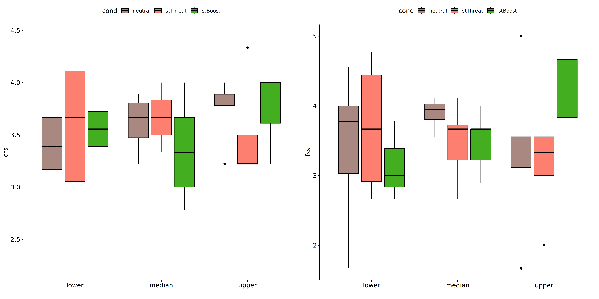

Non-Parametric ANCOVA tests for for assess flow state in global cond
================
Geiser C. Challco <geiser@alumni.usp.br>

- [Setting Initial Variables](#setting-initial-variables)
- [Descriptive Statistics of Initial
  Data](#descriptive-statistics-of-initial-data)
- [One-way factor analysis for: *flow ~
  cond*](#one-way-factor-analysis-for-flow--cond)
  - [Pre-test and Post-test PairWise comparisons for: *flow ~
    cond*](#pre-test-and-post-test-pairwise-comparisons-for-flow--cond)
  - [Kruskal and Wilcoxon PairWise comparisons for: *flow ~
    cond*](#kruskal-and-wilcoxon-pairwise-comparisons-for-flow--cond)
- [Two-way factor analysis for: *flow ~
  cond:Meaning*](#two-way-factor-analysis-for-flow--condmeaning)
  - [Pre-test and Post-test PairWise comparisons for: *flow ~
    cond:Meaning*](#pre-test-and-post-test-pairwise-comparisons-for-flow--condmeaning)
  - [Scheirer and Wilcoxon PairWise comparisons for: *flow ~
    cond:Meaning*](#scheirer-and-wilcoxon-pairwise-comparisons-for-flow--condmeaning)
- [Two-way factor analysis for: *flow ~
  cond:Presence*](#two-way-factor-analysis-for-flow--condpresence)
  - [Pre-test and Post-test PairWise comparisons for: *flow ~
    cond:Presence*](#pre-test-and-post-test-pairwise-comparisons-for-flow--condpresence)
  - [Scheirer and Wilcoxon PairWise comparisons for: *flow ~
    cond:Presence*](#scheirer-and-wilcoxon-pairwise-comparisons-for-flow--condpresence)
- [Two-way factor analysis for: *flow ~
  cond:Search*](#two-way-factor-analysis-for-flow--condsearch)
  - [Pre-test and Post-test PairWise comparisons for: *flow ~
    cond:Search*](#pre-test-and-post-test-pairwise-comparisons-for-flow--condsearch)
  - [Scheirer and Wilcoxon PairWise comparisons for: *flow ~
    cond:Search*](#scheirer-and-wilcoxon-pairwise-comparisons-for-flow--condsearch)

# Setting Initial Variables

``` r
dv = "flow"
dv.pos = "fss"
dv.pre = "dfs"
dv.dif = "dif.flow"

fatores2 <- c("gender","Meaning","Presence","Search")
lfatores2 <- as.list(fatores2)
names(lfatores2) <- fatores2

fatores1 <- c("cond", fatores2)
lfatores1 <- as.list(fatores1)
names(lfatores1) <- fatores1

lfatores <- c(lfatores1)

color <- list()
color[["prepost"]] = c("#ffee65","#f28e2B")
color[["env"]] = c("#a2b6c3","#1054b1","#fc2c8c")
color[["cond"]] = c("#aa8882","#fd7f6f","#42ae20")
color[["gender"]] = c("#FF007F","#4D4DFF")
color[["Meaning"]] = c("#c4ab34","#17cbe1","#f88208")
color[["Presence"]] = c("#c4ab34","#17cbe1","#f88208")
color[["Search"]] = c("#c4ab34","#17cbe1","#f88208")

color[["gender.Meaning"]] = c("#feb1d8","#b1b1fe","#FF007F","#4D4DFF","#dc006d","#3737ff")
color[["gender.Presence"]] = c("#feb1d8","#b1b1fe","#FF007F","#4D4DFF","#dc006d","#3737ff")
color[["gender.Search"]] = c("#feb1d8","#b1b1fe","#FF007F","#4D4DFF","#dc006d","#3737ff")


level <- list()
level[["env"]] = c("neutral","stM","stF")
level[["cond"]] = c("neutral","stThreat","stBoost")
level[["gender"]] = c("F","M")
level[["Meaning"]] = c("lower","median","upper")
level[["Presence"]] = c("lower","median","upper")
level[["Search"]] = c("lower","median","upper")

level[["gender.Meaning"]] = c("F.lower","M.lower","F.median","M.median","F.upper","M.upper")
level[["gender.Presence"]] = c("F.lower","M.lower","F.median","M.median","F.upper","M.upper")
level[["gender.Search"]] = c("F.lower","M.lower","F.median","M.median","F.upper","M.upper")


gdat <- read_excel("../data/data.xlsx", sheet = "results")
gdat <- gdat[!is.na(gdat[[dv.pre]]) & !is.na(gdat[[dv.pos]]),]
if (!dv.dif %in% colnames(gdat))
  gdat[[dv.dif]] <- gdat[[dv.pos]] - gdat[[dv.pre]]


dat <- gdat
dat$cond <- factor(dat[["cond"]], level[["cond"]])
for (coln in c(names(lfatores))) {
  if (length(level[[coln]]) > 0)
    plevel = level[[coln]][level[[coln]] %in% unique(dat[[coln]])]
  else
    plevel = unique(dat[[coln]])[!is.na(unique(dat[[coln]]))]
  
  dat[[coln]] <- factor(dat[[coln]], plevel)
}

dat <- dat[,c("userId", names(lfatores), dv.pre, dv.pos, dv.dif)]

dat.long <- rbind(dat, dat)
dat.long$time <- c(rep("pre", nrow(dat)), rep("pos", nrow(dat)))
dat.long$time <- factor(dat.long$time, c("pre","pos"))
dat.long[[dv]] <- c(dat[[dv.pre]], dat[[dv.pos]])


for (f in c("cond", names(lfatores))) {
  if (is.null(color[[f]]) && length(unique(dat[[f]])) > 0) 
      color[[f]] <- distinctColorPalette(length(unique(dat[[f]])))
}

for (f in c(fatores2)) {
  if (is.null(color[[paste0("cond:",f)]]) && length(unique(dat[[f]])) > 0)
    color[[paste0("cond:",f)]] <- distinctColorPalette(
      length(unique(dat[["cond"]]))*length(unique(dat[[f]])))
}

ldat <- list()
laov <- list()
lpwc <- list()
lemms <- list()
```

# Descriptive Statistics of Initial Data

``` r
df <- get.descriptives(dat, c(dv.pre, dv.pos, dv.dif), c("cond"),
                       symmetry.test = T, normality.test = F)
df <- plyr::rbind.fill(
  df, do.call(plyr::rbind.fill, lapply(lfatores2, FUN = function(f) {
    if (nrow(dat) > 0 && sum(!is.na(unique(dat[[f]]))) > 1)
      get.descriptives(dat, c(dv.pre,dv.pos), c("cond", f), include.global = F,
                       symmetry.test = T, normality.test = F)
    }))
)
df <- df[,c("variable",fatores1[fatores1 %in% colnames(df)],
            colnames(df)[!colnames(df) %in% c(fatores1,"variable")])]
```

| variable | cond | gender | Meaning | Presence | Search | n | mean | median | min | max | sd | se | ci | iqr | symmetry | skewness | kurtosis |
|:---|:---|:---|:---|:---|:---|---:|---:|---:|---:|---:|---:|---:|---:|---:|:---|---:|---:|
| dfs | neutral |  |  |  |  | 17 | 3.523 | 3.667 | 2.778 | 4.000 | 0.344 | 0.083 | 0.177 | 0.556 | NO | -0.5483789 | -0.8603284 |
| dfs | stThreat |  |  |  |  | 15 | 3.578 | 3.556 | 2.222 | 4.444 | 0.546 | 0.141 | 0.303 | 0.667 | NO | -0.5666898 | 0.2914557 |
| dfs | stBoost |  |  |  |  | 15 | 3.452 | 3.333 | 2.778 | 4.000 | 0.421 | 0.109 | 0.233 | 0.667 | YES | -0.0186257 | -1.5372513 |
| dfs |  |  |  |  |  | 25 | 3.067 | 3.111 | 1.444 | 4.000 | 0.709 | 0.142 | 0.292 | 1.111 | YES | -0.3398256 | -0.7544436 |
| fss | neutral |  |  |  |  | 17 | 3.497 | 3.667 | 1.667 | 5.000 | 0.903 | 0.219 | 0.464 | 0.889 | NO | -0.6583444 | -0.3027827 |
| fss | stThreat |  |  |  |  | 15 | 3.467 | 3.556 | 2.000 | 4.778 | 0.740 | 0.191 | 0.410 | 1.000 | YES | -0.1363545 | -0.8536787 |
| fss | stBoost |  |  |  |  | 15 | 3.563 | 3.667 | 2.667 | 4.667 | 0.596 | 0.154 | 0.330 | 0.722 | YES | 0.4034484 | -0.8260960 |
| fss |  |  |  |  |  | 25 | 3.640 | 3.667 | 2.222 | 5.000 | 0.665 | 0.133 | 0.275 | 0.778 | YES | 0.0763721 | -0.2291508 |
| dif.flow | neutral |  |  |  |  | 17 | -0.026 | 0.333 | -2.111 | 1.778 | 1.013 | 0.246 | 0.521 | 1.000 | NO | -0.5185327 | -0.2762499 |
| dif.flow | stThreat |  |  |  |  | 15 | -0.111 | -0.111 | -1.333 | 1.444 | 0.792 | 0.205 | 0.439 | 0.944 | YES | -0.0077202 | -0.8966271 |
| dif.flow | stBoost |  |  |  |  | 15 | 0.111 | 0.333 | -1.222 | 0.667 | 0.516 | 0.133 | 0.286 | 0.611 | NO | -1.0619969 | 0.4438899 |
| dif.flow |  |  |  |  |  | 25 | 0.573 | 0.444 | -0.667 | 3.000 | 0.983 | 0.197 | 0.406 | 0.889 | NO | 1.2313149 | 0.7813636 |
| dfs | neutral | F |  |  |  | 4 | 3.361 | 3.278 | 3.222 | 3.667 | 0.210 | 0.105 | 0.335 | 0.194 | few data | 0.0000000 | 0.0000000 |
| dfs | neutral | M |  |  |  | 13 | 3.573 | 3.667 | 2.778 | 4.000 | 0.368 | 0.102 | 0.222 | 0.333 | NO | -0.8734891 | -0.5656898 |
| dfs | stThreat | F |  |  |  | 3 | 3.333 | 3.222 | 3.222 | 3.556 | 0.192 | 0.111 | 0.478 | 0.167 | few data | 0.0000000 | 0.0000000 |
| dfs | stThreat | M |  |  |  | 12 | 3.639 | 3.722 | 2.222 | 4.444 | 0.594 | 0.171 | 0.377 | 0.667 | NO | -0.7995940 | 0.1947078 |
| dfs | stBoost | F |  |  |  | 3 | 3.407 | 3.556 | 2.778 | 3.889 | 0.570 | 0.329 | 1.416 | 0.556 | few data | 0.0000000 | 0.0000000 |
| dfs | stBoost | M |  |  |  | 12 | 3.463 | 3.333 | 2.889 | 4.000 | 0.407 | 0.118 | 0.259 | 0.639 | YES | 0.1730044 | -1.6703933 |
| dfs |  | F |  |  |  | 6 | 3.315 | 3.389 | 2.556 | 4.000 | 0.523 | 0.214 | 0.549 | 0.611 | YES | -0.1717636 | -1.6619415 |
| dfs |  | M |  |  |  | 19 | 2.988 | 3.111 | 1.444 | 4.000 | 0.753 | 0.173 | 0.363 | 0.944 | YES | -0.1949857 | -0.9826170 |
| fss | neutral | F |  |  |  | 4 | 3.139 | 3.444 | 1.667 | 4.000 | 1.032 | 0.516 | 1.642 | 0.917 | NO | -0.5471599 | -1.8258239 |
| fss | neutral | M |  |  |  | 13 | 3.607 | 3.889 | 1.667 | 5.000 | 0.874 | 0.243 | 0.528 | 0.889 | NO | -0.6057445 | -0.2610146 |
| fss | stThreat | F |  |  |  | 3 | 3.593 | 3.333 | 3.333 | 4.111 | 0.449 | 0.259 | 1.116 | 0.389 | few data | 0.0000000 | 0.0000000 |
| fss | stThreat | M |  |  |  | 12 | 3.435 | 3.611 | 2.000 | 4.778 | 0.809 | 0.233 | 0.514 | 1.056 | YES | -0.0646476 | -1.1759662 |
| fss | stBoost | F |  |  |  | 3 | 2.926 | 3.000 | 2.667 | 3.111 | 0.231 | 0.134 | 0.575 | 0.222 | few data | 0.0000000 | 0.0000000 |
| fss | stBoost | M |  |  |  | 12 | 3.722 | 3.667 | 2.889 | 4.667 | 0.552 | 0.159 | 0.350 | 0.278 | YES | 0.3107554 | -0.8253646 |
| fss |  | F |  |  |  | 6 | 3.722 | 3.667 | 3.444 | 4.111 | 0.241 | 0.098 | 0.253 | 0.250 | YES | 0.4416373 | -1.4957371 |
| fss |  | M |  |  |  | 19 | 3.614 | 3.778 | 2.222 | 5.000 | 0.756 | 0.173 | 0.364 | 0.944 | YES | 0.1526055 | -0.8044266 |
| dfs | neutral |  | lower |  |  | 3 | 3.667 | 3.667 | 3.667 | 3.667 | 0.000 | 0.000 | 0.000 | 0.000 | few data | 0.0000000 | 0.0000000 |
| dfs | neutral |  | median |  |  | 7 | 3.508 | 3.444 | 3.000 | 4.000 | 0.384 | 0.145 | 0.355 | 0.611 | YES | 0.0406393 | -1.9181338 |
| dfs | neutral |  | upper |  |  | 7 | 3.476 | 3.556 | 2.778 | 3.889 | 0.394 | 0.149 | 0.364 | 0.500 | NO | -0.5474625 | -1.2913750 |
| dfs | stThreat |  | lower |  |  | 4 | 3.361 | 3.611 | 2.222 | 4.000 | 0.793 | 0.396 | 1.262 | 0.694 | NO | -0.5736154 | -1.8110612 |
| dfs | stThreat |  | median |  |  | 6 | 3.722 | 3.778 | 3.222 | 4.333 | 0.443 | 0.181 | 0.465 | 0.639 | YES | 0.0078863 | -1.8269352 |
| dfs | stThreat |  | upper |  |  | 5 | 3.578 | 3.333 | 3.222 | 4.444 | 0.499 | 0.223 | 0.620 | 0.222 | NO | 0.9262928 | -1.1113538 |
| dfs | stBoost |  | lower |  |  | 4 | 3.306 | 3.333 | 3.000 | 3.556 | 0.229 | 0.115 | 0.364 | 0.139 | few data | 0.0000000 | 0.0000000 |
| dfs | stBoost |  | median |  |  | 9 | 3.605 | 3.778 | 2.778 | 4.000 | 0.455 | 0.152 | 0.350 | 0.778 | NO | -0.6236849 | -1.3696686 |
| dfs | stBoost |  | upper |  |  | 2 | 3.056 | 3.056 | 2.889 | 3.222 | 0.236 | 0.167 | 2.118 | 0.167 | few data | 0.0000000 | 0.0000000 |
| dfs |  |  | lower |  |  | 7 | 3.063 | 2.889 | 2.556 | 4.000 | 0.657 | 0.248 | 0.608 | 0.889 | few data | 0.0000000 | 0.0000000 |
| dfs |  |  | median |  |  | 7 | 3.317 | 3.333 | 2.333 | 4.000 | 0.519 | 0.196 | 0.480 | 0.333 | NO | -0.6127915 | -0.6906093 |
| dfs |  |  | upper |  |  | 11 | 2.909 | 3.111 | 1.444 | 4.000 | 0.844 | 0.255 | 0.567 | 1.167 | YES | -0.2338156 | -1.3603361 |
| fss | neutral |  | lower |  |  | 3 | 3.222 | 4.000 | 1.667 | 4.000 | 1.347 | 0.778 | 3.347 | 1.167 | few data | 0.0000000 | 0.0000000 |
| fss | neutral |  | median |  |  | 7 | 3.111 | 3.222 | 1.667 | 3.889 | 0.811 | 0.307 | 0.750 | 0.944 | NO | -0.6095859 | -1.2464062 |
| fss | neutral |  | upper |  |  | 7 | 4.000 | 4.000 | 3.111 | 5.000 | 0.635 | 0.240 | 0.587 | 0.722 | YES | 0.1928170 | -1.4443982 |
| fss | stThreat |  | lower |  |  | 4 | 3.306 | 3.333 | 2.889 | 3.667 | 0.419 | 0.210 | 0.667 | 0.694 | few data | 0.0000000 | 0.0000000 |
| fss | stThreat |  | median |  |  | 6 | 3.296 | 3.333 | 2.667 | 4.222 | 0.587 | 0.239 | 0.616 | 0.667 | YES | 0.2578153 | -1.5159928 |
| fss | stThreat |  | upper |  |  | 5 | 3.800 | 4.111 | 2.000 | 4.778 | 1.070 | 0.478 | 1.328 | 0.556 | NO | -0.7702924 | -1.2436525 |
| fss | stBoost |  | lower |  |  | 4 | 3.306 | 3.333 | 2.889 | 3.667 | 0.419 | 0.210 | 0.667 | 0.694 | few data | 0.0000000 | 0.0000000 |
| fss | stBoost |  | median |  |  | 9 | 3.778 | 3.778 | 2.667 | 4.667 | 0.645 | 0.215 | 0.496 | 0.333 | YES | -0.1054046 | -1.0972657 |
| fss | stBoost |  | upper |  |  | 2 | 3.111 | 3.111 | 3.000 | 3.222 | 0.157 | 0.111 | 1.412 | 0.111 | few data | 0.0000000 | 0.0000000 |
| fss |  |  | lower |  |  | 7 | 3.444 | 3.667 | 2.222 | 4.333 | 0.682 | 0.258 | 0.631 | 0.611 | YES | -0.4968465 | -1.0584899 |
| fss |  |  | median |  |  | 7 | 3.365 | 3.444 | 2.556 | 4.111 | 0.547 | 0.207 | 0.506 | 0.722 | YES | -0.0536526 | -1.6416822 |
| fss |  |  | upper |  |  | 11 | 3.939 | 3.889 | 3.000 | 5.000 | 0.652 | 0.197 | 0.438 | 0.556 | YES | 0.3026768 | -1.0601419 |
| dfs | neutral |  |  | lower |  | 4 | 3.556 | 3.667 | 3.222 | 3.667 | 0.222 | 0.111 | 0.354 | 0.111 | few data | 0.0000000 | 0.0000000 |
| dfs | neutral |  |  | median |  | 8 | 3.361 | 3.333 | 2.778 | 3.889 | 0.379 | 0.134 | 0.317 | 0.444 | YES | -0.0542762 | -1.5313682 |
| dfs | neutral |  |  | upper |  | 5 | 3.756 | 3.778 | 3.333 | 4.000 | 0.253 | 0.113 | 0.315 | 0.111 | NO | -0.7164889 | -1.2691124 |
| dfs | stThreat |  |  | lower |  | 2 | 3.111 | 3.111 | 2.222 | 4.000 | 1.257 | 0.889 | 11.294 | 0.889 | few data | 0.0000000 | 0.0000000 |
| dfs | stThreat |  |  | median |  | 7 | 3.603 | 3.667 | 3.222 | 4.000 | 0.313 | 0.118 | 0.290 | 0.500 | YES | -0.1076442 | -1.8859992 |
| dfs | stThreat |  |  | upper |  | 6 | 3.704 | 3.444 | 3.222 | 4.444 | 0.543 | 0.222 | 0.570 | 0.806 | YES | 0.4580510 | -1.9439962 |
| dfs | stBoost |  |  | lower |  | 5 | 3.378 | 3.333 | 2.889 | 3.778 | 0.330 | 0.147 | 0.409 | 0.222 | YES | -0.2647767 | -1.5811570 |
| dfs | stBoost |  |  | median |  | 7 | 3.698 | 3.889 | 3.111 | 4.000 | 0.383 | 0.145 | 0.355 | 0.556 | NO | -0.5612954 | -1.7002736 |
| dfs | stBoost |  |  | upper |  | 3 | 3.000 | 3.000 | 2.778 | 3.222 | 0.222 | 0.128 | 0.552 | 0.222 | few data | 0.0000000 | 0.0000000 |
| dfs |  |  |  | lower |  | 7 | 2.571 | 2.556 | 1.444 | 3.111 | 0.542 | 0.205 | 0.501 | 0.333 | NO | -1.0848384 | -0.1590416 |
| dfs |  |  |  | median |  | 8 | 3.431 | 3.667 | 2.333 | 4.000 | 0.652 | 0.230 | 0.545 | 1.000 | NO | -0.5503048 | -1.5303057 |
| dfs |  |  |  | upper |  | 10 | 3.122 | 3.333 | 2.000 | 4.000 | 0.707 | 0.224 | 0.506 | 0.639 | YES | -0.4254956 | -1.2361857 |
| fss | neutral |  |  | lower |  | 4 | 3.222 | 3.611 | 1.667 | 4.000 | 1.100 | 0.550 | 1.750 | 1.167 | few data | 0.0000000 | 0.0000000 |
| fss | neutral |  |  | median |  | 8 | 3.750 | 3.889 | 2.444 | 4.556 | 0.616 | 0.218 | 0.515 | 0.472 | NO | -0.8797939 | -0.1004129 |
| fss | neutral |  |  | upper |  | 5 | 3.311 | 3.111 | 1.667 | 5.000 | 1.200 | 0.537 | 1.490 | 0.556 | YES | 0.0461844 | -1.5096604 |
| fss | stThreat |  |  | lower |  | 2 | 2.833 | 2.833 | 2.667 | 3.000 | 0.236 | 0.167 | 2.118 | 0.167 | few data | 0.0000000 | 0.0000000 |
| fss | stThreat |  |  | median |  | 7 | 3.302 | 3.333 | 2.667 | 3.667 | 0.389 | 0.147 | 0.359 | 0.500 | NO | -0.5168647 | -1.5530650 |
| fss | stThreat |  |  | upper |  | 6 | 3.870 | 4.167 | 2.000 | 4.778 | 0.972 | 0.397 | 1.020 | 0.444 | NO | -1.0228108 | -0.5787686 |
| fss | stBoost |  |  | lower |  | 5 | 3.511 | 3.667 | 3.000 | 4.000 | 0.398 | 0.178 | 0.494 | 0.444 | YES | -0.1058638 | -1.9307422 |
| fss | stBoost |  |  | median |  | 7 | 3.841 | 3.778 | 2.667 | 4.667 | 0.685 | 0.259 | 0.633 | 0.556 | YES | -0.2258716 | -1.1560376 |
| fss | stBoost |  |  | upper |  | 3 | 3.000 | 3.000 | 2.889 | 3.111 | 0.111 | 0.064 | 0.276 | 0.111 | few data | 0.0000000 | 0.0000000 |
| fss |  |  |  | lower |  | 7 | 3.190 | 3.333 | 2.222 | 3.889 | 0.624 | 0.236 | 0.577 | 0.889 | YES | -0.3587389 | -1.6986252 |
| fss |  |  |  | median |  | 8 | 3.569 | 3.667 | 3.000 | 4.000 | 0.409 | 0.145 | 0.342 | 0.556 | YES | -0.3572152 | -1.7660538 |
| fss |  |  |  | upper |  | 10 | 4.011 | 4.000 | 3.000 | 5.000 | 0.690 | 0.218 | 0.493 | 0.722 | YES | 0.0396657 | -1.3740569 |
| dfs | neutral |  |  |  | lower | 8 | 3.347 | 3.389 | 2.778 | 3.667 | 0.333 | 0.118 | 0.278 | 0.500 | YES | -0.4392406 | -1.4624225 |
| dfs | neutral |  |  |  | median | 4 | 3.611 | 3.667 | 3.222 | 3.889 | 0.294 | 0.147 | 0.468 | 0.333 | YES | -0.3239695 | -2.0089286 |
| dfs | neutral |  |  |  | upper | 5 | 3.733 | 3.778 | 3.222 | 4.000 | 0.300 | 0.134 | 0.373 | 0.111 | NO | -0.8177042 | -1.1804616 |
| dfs | stThreat |  |  |  | lower | 4 | 3.500 | 3.667 | 2.222 | 4.444 | 0.967 | 0.483 | 1.538 | 1.056 | YES | -0.3110764 | -1.9902421 |
| dfs | stThreat |  |  |  | median | 7 | 3.667 | 3.667 | 3.333 | 4.000 | 0.240 | 0.091 | 0.222 | 0.333 | YES | 0.0000000 | -1.7142857 |
| dfs | stThreat |  |  |  | upper | 4 | 3.500 | 3.222 | 3.222 | 4.333 | 0.556 | 0.278 | 0.884 | 0.278 | few data | 0.0000000 | 0.0000000 |
| dfs | stBoost |  |  |  | lower | 3 | 3.556 | 3.556 | 3.222 | 3.889 | 0.333 | 0.192 | 0.828 | 0.333 | few data | 0.0000000 | 0.0000000 |
| dfs | stBoost |  |  |  | median | 9 | 3.321 | 3.333 | 2.778 | 4.000 | 0.421 | 0.140 | 0.324 | 0.667 | YES | 0.2476664 | -1.5688821 |
| dfs | stBoost |  |  |  | upper | 3 | 3.741 | 4.000 | 3.222 | 4.000 | 0.449 | 0.259 | 1.116 | 0.389 | few data | 0.0000000 | 0.0000000 |
| dfs |  |  |  |  | lower | 4 | 2.889 | 2.889 | 2.667 | 3.111 | 0.181 | 0.091 | 0.289 | 0.111 | few data | 0.0000000 | 0.0000000 |
| dfs |  |  |  |  | median | 14 | 3.151 | 3.333 | 1.444 | 4.000 | 0.802 | 0.214 | 0.463 | 1.361 | YES | -0.4880900 | -1.0002481 |
| dfs |  |  |  |  | upper | 7 | 3.000 | 3.111 | 2.000 | 4.000 | 0.745 | 0.282 | 0.689 | 0.833 | YES | -0.3009818 | -1.5875132 |
| fss | neutral |  |  |  | lower | 8 | 3.431 | 3.778 | 1.667 | 4.556 | 0.949 | 0.336 | 0.794 | 0.972 | NO | -0.6654961 | -1.0773246 |
| fss | neutral |  |  |  | median | 4 | 3.889 | 3.944 | 3.556 | 4.111 | 0.240 | 0.120 | 0.382 | 0.222 | YES | -0.4463775 | -1.8750000 |
| fss | neutral |  |  |  | upper | 5 | 3.289 | 3.111 | 1.667 | 5.000 | 1.193 | 0.534 | 1.481 | 0.444 | YES | 0.0881633 | -1.4695705 |
| fss | stThreat |  |  |  | lower | 4 | 3.694 | 3.667 | 2.667 | 4.778 | 1.020 | 0.510 | 1.623 | 1.528 | YES | 0.0263073 | -2.3316194 |
| fss | stThreat |  |  |  | median | 7 | 3.476 | 3.667 | 2.667 | 4.111 | 0.512 | 0.194 | 0.474 | 0.500 | YES | -0.4632536 | -1.4999452 |
| fss | stThreat |  |  |  | upper | 4 | 3.222 | 3.333 | 2.000 | 4.222 | 0.916 | 0.458 | 1.458 | 0.556 | few data | 0.0000000 | 0.0000000 |
| fss | stBoost |  |  |  | lower | 3 | 3.148 | 3.000 | 2.667 | 3.778 | 0.570 | 0.329 | 1.416 | 0.556 | few data | 0.0000000 | 0.0000000 |
| fss | stBoost |  |  |  | median | 9 | 3.519 | 3.667 | 2.889 | 4.000 | 0.360 | 0.120 | 0.277 | 0.444 | YES | -0.4789663 | -1.3297220 |
| fss | stBoost |  |  |  | upper | 3 | 4.111 | 4.667 | 3.000 | 4.667 | 0.962 | 0.556 | 2.390 | 0.833 | few data | 0.0000000 | 0.0000000 |
| fss |  |  |  |  | lower | 4 | 3.222 | 3.389 | 2.222 | 3.889 | 0.743 | 0.371 | 1.182 | 0.833 | YES | -0.3768575 | -1.9832646 |
| fss |  |  |  |  | median | 14 | 3.571 | 3.556 | 3.000 | 4.333 | 0.461 | 0.123 | 0.266 | 0.806 | YES | 0.0080862 | -1.5499301 |
| fss |  |  |  |  | upper | 7 | 4.016 | 3.889 | 2.556 | 5.000 | 0.862 | 0.326 | 0.797 | 1.000 | YES | -0.2878080 | -1.3203188 |

# One-way factor analysis for: *flow ~ cond*

``` r
pdat = remove_group_data(dat[!is.na(dat[["cond"]]),], "dif.flow", "cond", n.limit = 3)

pdat.long <- rbind(pdat[,c("userId","cond")], pdat[,c("userId","cond")])
pdat.long[["time"]] <- c(rep("pre", nrow(pdat)), rep("pos", nrow(pdat)))
pdat.long[["time"]] <- factor(pdat.long[["time"]], c("pre","pos"))
pdat.long[["flow"]] <- c(pdat[["dfs"]], pdat[["fss"]])

y.position.min <- abs(
  max(pdat.long[["flow"]])
  - min(pdat.long[["flow"]]))/20

lvars = as.list(c("dif.flow","fss","dfs"))
names(lvars) = unlist(lvars)
```

## Pre-test and Post-test PairWise comparisons for: *flow ~ cond*

``` r
pwc.long <- group_by(pdat.long, cond) %>%
  pairwise_wilcox_test(flow ~ time, detailed = T)

df <- pwc.long[,c(".y.","cond","group1","group2","n1","n2","estimate",
                  "statistic","p.adj","p.adj.signif")]
```

| .y.  | cond     | group1 | group2 |  n1 |  n2 |   estimate | statistic | p.adj | p.adj.signif |
|:-----|:---------|:-------|:-------|----:|----:|-----------:|----------:|------:|:-------------|
| flow | neutral  | pre    | pos    |  17 |  17 | -0.1111503 |     126.5 | 0.545 | ns           |
| flow | stThreat | pre    | pos    |  15 |  15 |  0.1111694 |     122.5 | 0.693 | ns           |
| flow | stBoost  | pre    | pos    |  15 |  15 | -0.0000209 |     107.5 | 0.851 | ns           |

``` r
stat.test <- pwc.long %>% add_xy_position(x = "time", fun = "max")
stat.test$y.position <- stat.test$y.position + y.position.min

gg <- ggline(
  pdat.long, x = "time", y = "flow", size = 1.5,
  facet.by = "cond", add = c("mean_ci"), color = "cond",
  position = position_dodge(width = 0.3), palette = color[["cond"]])

pdat.long$xj = jitter(as.numeric(pdat.long[["time"]]), amount=.1)
pdat.long$yj = jitter(pdat.long[["flow"]], amount = .01)

gg + geom_point(
  data = pdat.long, aes_string(x="xj",y="yj", color = "cond"), size=0.5) +
  stat_pvalue_manual(
    stat.test, tip.length = 0, hide.ns = T, label.size = 5,
    position = position_dodge(width = 0.3),
    label = "{ p.adj } ({ p.adj.signif })") + xlab("") +
  theme(strip.text = element_text(size = 16),
        axis.text = element_text(size = 18))
```

    ## Warning: `aes_string()` was deprecated in ggplot2 3.0.0.
    ## ℹ Please use tidy evaluation idioms with `aes()`.
    ## ℹ See also `vignette("ggplot2-in-packages")` for more information.
    ## This warning is displayed once every 8 hours.
    ## Call `lifecycle::last_lifecycle_warnings()` to see where this warning was
    ## generated.

<!-- -->

## Kruskal and Wilcoxon PairWise comparisons for: *flow ~ cond*

``` r
kt <- lapply(lvars, FUN = function(x) {
  kruskal_test(pdat, as.formula(paste0(x," ~ cond")))  
})

df <- do.call(rbind.fill, lapply(lvars, function(x) {
  add_significance(merge(
    kt[[x]], kruskal_effsize(pdat, as.formula(paste0(x," ~ cond"))),
    by = c(".y.","n"), suffixes = c("",".ez")))
}))

df <- df[,c(".y.","n","df","statistic","p","p.signif","effsize","magnitude")]
```

| .y.      |   n |  df | statistic |     p | p.signif |    effsize | magnitude |
|:---------|----:|----:|----------:|------:|:---------|-----------:|:----------|
| dif.flow |  47 |   2 | 0.9068016 | 0.635 | ns       | -0.0248454 | small     |
| fss      |  47 |   2 | 0.1884140 | 0.910 | ns       | -0.0411724 | small     |
| dfs      |  47 |   2 | 0.7705171 | 0.680 | ns       | -0.0279428 | small     |

``` r
pwc <- lapply(lvars, FUN = function(x) {
  pairwise_wilcox_test(pdat, as.formula(paste0(x," ~ cond")), detailed = T)  
})

df <- do.call(rbind.fill, pwc)
```

| estimate | .y. | group1 | group2 | n1 | n2 | statistic | p | conf.low | conf.high | method | alternative | p.adj | p.adj.signif |
|---:|:---|:---|:---|---:|---:|---:|---:|---:|---:|:---|:---|---:|:---|
| 0.2222091 | dif.flow | neutral | stThreat | 17 | 15 | 143.0 | 0.571 | -0.4444745 | 0.6666696 | Wilcoxon | two.sided | 1.000 | ns |
| -0.0000418 | dif.flow | neutral | stBoost | 17 | 15 | 121.5 | 0.835 | -0.5556025 | 0.4443937 | Wilcoxon | two.sided | 1.000 | ns |
| -0.2221559 | dif.flow | stThreat | stBoost | 15 | 15 | 88.5 | 0.329 | -0.6667120 | 0.2222262 | Wilcoxon | two.sided | 0.987 | ns |
| 0.2221968 | fss | neutral | stThreat | 17 | 15 | 135.5 | 0.777 | -0.4444900 | 0.6666357 | Wilcoxon | two.sided | 1.000 | ns |
| 0.1110315 | fss | neutral | stBoost | 17 | 15 | 137.0 | 0.733 | -0.5556295 | 0.5555306 | Wilcoxon | two.sided | 1.000 | ns |
| -0.1110979 | fss | stThreat | stBoost | 15 | 15 | 104.5 | 0.754 | -0.6666269 | 0.4445189 | Wilcoxon | two.sided | 1.000 | ns |
| -0.1110911 | dfs | neutral | stThreat | 17 | 15 | 115.5 | 0.662 | -0.4444190 | 0.2222560 | Wilcoxon | two.sided | 1.000 | ns |
| 0.0000223 | dfs | neutral | stBoost | 17 | 15 | 138.0 | 0.704 | -0.2222205 | 0.4444072 | Wilcoxon | two.sided | 1.000 | ns |
| 0.1111536 | dfs | stThreat | stBoost | 15 | 15 | 134.0 | 0.381 | -0.2221918 | 0.4444454 | Wilcoxon | two.sided | 1.000 | ns |

``` r
plots <- lapply(lvars, FUN = function(y) {
  stat.test <- pwc[[y]] %>% add_xy_position(x = "cond")
  stat.test$y.position <- stat.test$y.position + y.position.min
  ggboxplot(pdat, x = "cond", y = y, fill = "cond",
            palette = color[["cond"]]) +
    stat_pvalue_manual(stat.test, tip.length = 0, hide.ns = T, label.size = 5,
                       label="{ p.adj } ({ p.adj.signif })") + xlab("")
})
```

``` r
egg::ggarrange(plots[["dfs"]], plots[["fss"]], nrow = 1)
```

<!-- -->

``` r
plots[["dif.flow"]] +
  labs(subtitle = get_test_label(kt[["dif.flow"]], detailed = T),
       caption = get_pwc_label(pwc[["dif.flow"]])) +
  ylab("flow (dif)")  +
  theme(strip.text = element_text(size = 16),
        axis.text = element_text(size = 18))
```

<!-- -->

# Two-way factor analysis for: *flow ~ cond:Meaning*

``` r
pdat = remove_group_data(
  dat[!is.na(dat[["cond"]]) & !is.na(dat[["Meaning"]]),],
  "dif.flow", c("cond","Meaning"), n.limit = 3)

pdat.long <- rbind(pdat[,c("userId","cond","Meaning")],
                   pdat[,c("userId","cond","Meaning")])
pdat.long[["time"]] <- c(rep("pre", nrow(pdat)), rep("pos", nrow(pdat)))
pdat.long[["time"]] <- factor(pdat.long[["time"]], c("pre","pos"))
pdat.long[["flow"]] <- c(pdat[["dfs"]], pdat[["fss"]])

y.position.min <- abs(
  max(pdat.long[["flow"]])
  - min(pdat.long[["flow"]]))/20

lvars = as.list(c("dif.flow","fss","dfs"))
names(lvars) = unlist(lvars)
```

## Pre-test and Post-test PairWise comparisons for: *flow ~ cond:Meaning*

``` r
pwc.long <- group_by(pdat.long, cond:Meaning) %>%
  pairwise_wilcox_test(flow ~ time, detailed = T)

df <- pwc.long[,c(".y.","cond:Meaning","group1","group2","n1","n2","estimate",
                  "statistic","p.adj","p.adj.signif")]
```

| .y. | cond:Meaning | group1 | group2 | n1 | n2 | estimate | statistic | p.adj | p.adj.signif |
|:---|:---|:---|:---|---:|---:|---:|---:|---:|:---|
| flow | neutral:lower | pre | pos | 3 | 3 | -0.3332687 | 3.0 | 0.637 | ns |
| flow | neutral:median | pre | pos | 7 | 7 | 0.2221884 | 31.0 | 0.439 | ns |
| flow | neutral:upper | pre | pos | 7 | 7 | -0.4444057 | 12.5 | 0.141 | ns |
| flow | stThreat:lower | pre | pos | 4 | 4 | 0.1797831 | 10.0 | 0.663 | ns |
| flow | stThreat:median | pre | pos | 6 | 6 | 0.5555122 | 25.0 | 0.295 | ns |
| flow | stThreat:upper | pre | pos | 5 | 5 | -0.5554852 | 8.0 | 0.402 | ns |
| flow | stBoost:lower | pre | pos | 4 | 4 | -0.0188257 | 7.5 | 1.000 | ns |
| flow | stBoost:median | pre | pos | 9 | 9 | -0.0000455 | 38.0 | 0.858 | ns |

``` r
pwc.long <- group_by(pdat.long, cond, Meaning) %>%
  pairwise_wilcox_test(flow ~ time, detailed = T)

stat.test <- pwc.long %>% add_xy_position(x = "time", fun = "mean_ci")
sidx = which(stat.test$p.adj.signif != "ns")
stat.test$y.position[sidx] <- stat.test$y.position[sidx] + y.position.min * (1:length(sidx))

gg <- ggline(
  pdat.long, x = "time", y = "flow",
  color = "Meaning", linetype = "Meaning", shape = "Meaning", size = 1.5,
  facet.by = "cond", add = c("mean_ci"),
  position = position_dodge(width = 0.3), palette = color[["Meaning"]])

pdat.long$xj = jitter(as.numeric(pdat.long[["time"]]), amount=.1)
pdat.long$yj = jitter(pdat.long[["flow"]], amount = .01)

gg + geom_point(
  data = pdat.long, aes_string(x="xj",y="yj",colour="Meaning"), size=0.5) +
  stat_pvalue_manual(
    stat.test, tip.length = 0, hide.ns = T, label.size = 5,
    position = position_dodge(width = 0.3), color = "Meaning",
    label = "{ p.adj } ({ p.adj.signif })") + xlab("") +
  theme(strip.text = element_text(size = 16),
        axis.text = element_text(size = 18))
```

<!-- -->

## Scheirer and Wilcoxon PairWise comparisons for: *flow ~ cond:Meaning*

``` r
sch <- lapply(lvars, FUN = function(x) {
  scheirer.test(pdat, x, c("cond","Meaning"), as.table = T) 
})
df <- do.call(rbind.fill, sch)
```

| var      | Effect       |  Df |     Sum Sq |         H |   p.value | p.value.signif |
|:---------|:-------------|----:|-----------:|----------:|----------:|:---------------|
| dif.flow | cond         |   2 |  480.07409 | 2.7903910 | 0.2477846 | ns             |
| dif.flow | Meaning      |   2 |  932.79283 | 5.4217813 | 0.0664776 | ns             |
| dif.flow | cond:Meaning |   3 |  285.15531 | 1.6574417 | 0.6464365 | ns             |
| dif.flow | Residuals    |  37 | 6181.52817 |           |           |                |
| fss      | cond         |   2 |  295.09315 | 1.7207738 | 0.4229984 | ns             |
| fss      | Meaning      |   2 | 1243.06641 | 7.2486809 | 0.0266667 | \*             |
| fss      | cond:Meaning |   3 |  376.48537 | 2.1953954 | 0.5328559 | ns             |
| fss      | Residuals    |  37 | 5878.34762 |           |           |                |
| dfs      | cond         |   2 |   79.99924 | 0.4689537 | 0.7909845 | ns             |
| dfs      | Meaning      |   2 |  201.94296 | 1.1837850 | 0.5532792 | ns             |
| dfs      | cond:Meaning |   3 |  305.44562 | 1.7905152 | 0.6170011 | ns             |
| dfs      | Residuals    |  37 | 6949.89226 |           |           |                |

``` r
pwc <- lapply(lvars, FUN = function(x) {
  list(
    cond = tryCatch(pairwise_wilcox_test(group_by(pdat, Meaning),
                                 as.formula(paste0(x," ~ cond")), detailed = T)
                         , error = function(e) NULL),
    Meaning = tryCatch(pairwise_wilcox_test(group_by(pdat, cond),
                                 as.formula(paste0(x," ~ Meaning")), detailed = T)
                         , error = function(e) NULL)
  )
})

df <- do.call(rbind.fill, lapply(pwc, FUN =  function(x) {
  do.call(rbind.fill, x)
}))

ivs = c()
if ("cond" %in% colnames(df)) ivs = c(ivs, "cond")
if ("Meaning" %in% colnames(df)) ivs = c(ivs, "Meaning")
df <- df[,c(".y.",ivs,"group1","group2","n1","n2","estimate",
            "statistic","p.adj","p.adj.signif")]
```

| .y. | cond | Meaning | group1 | group2 | n1 | n2 | estimate | statistic | p.adj | p.adj.signif |
|:---|:---|:---|:---|:---|---:|---:|---:|---:|---:|:---|
| dif.flow |  | lower | neutral | stThreat | 3 | 4 | -0.1068713 | 6.0 | 1.000 | ns |
| dif.flow |  | lower | neutral | stBoost | 3 | 4 | -0.0000342 | 8.0 | 1.000 | ns |
| dif.flow |  | lower | stThreat | stBoost | 4 | 4 | -0.1110466 | 7.0 | 1.000 | ns |
| dif.flow |  | median | neutral | stThreat | 7 | 6 | 0.1111135 | 24.0 | 0.720 | ns |
| dif.flow |  | median | neutral | stBoost | 7 | 9 | -0.5555222 | 16.0 | 0.222 | ns |
| dif.flow |  | median | stThreat | stBoost | 6 | 9 | -0.5555090 | 10.5 | 0.175 | ns |
| dif.flow |  | upper | neutral | stThreat | 7 | 5 | 0.3332768 | 20.5 | 0.684 | ns |
| dif.flow | neutral |  | lower | median | 3 | 7 | 0.1110981 | 13.0 | 0.720 | ns |
| dif.flow | neutral |  | lower | upper | 3 | 7 | -0.8888828 | 6.0 | 0.720 | ns |
| dif.flow | neutral |  | median | upper | 7 | 7 | -0.7777960 | 10.5 | 0.252 | ns |
| dif.flow | stThreat |  | lower | median | 4 | 6 | 0.3333809 | 16.0 | 0.908 | ns |
| dif.flow | stThreat |  | lower | upper | 4 | 5 | -0.2777778 | 8.0 | 0.908 | ns |
| dif.flow | stThreat |  | median | upper | 6 | 5 | -0.5555081 | 8.5 | 0.813 | ns |
| dif.flow | stBoost |  | lower | median | 4 | 9 | -0.2418301 | 11.0 | 0.314 | ns |
| fss |  | lower | neutral | stThreat | 3 | 4 | 0.3332976 | 8.0 | 1.000 | ns |
| fss |  | lower | neutral | stBoost | 3 | 4 | 0.3332976 | 8.0 | 1.000 | ns |
| fss |  | lower | stThreat | stBoost | 4 | 4 | 0.0000000 | 8.0 | 1.000 | ns |
| fss |  | median | neutral | stThreat | 7 | 6 | -0.1746742 | 18.5 | 0.774 | ns |
| fss |  | median | neutral | stBoost | 7 | 9 | -0.5555584 | 17.5 | 0.414 | ns |
| fss |  | median | stThreat | stBoost | 6 | 9 | -0.4444233 | 14.0 | 0.414 | ns |
| fss |  | upper | neutral | stThreat | 7 | 5 | -0.1110624 | 16.5 | 0.935 | ns |
| fss | neutral |  | lower | median | 3 | 7 | 0.1111409 | 14.5 | 0.842 | ns |
| fss | neutral |  | lower | upper | 3 | 7 | -0.5555130 | 7.0 | 0.842 | ns |
| fss | neutral |  | median | upper | 7 | 7 | -0.7778280 | 9.0 | 0.164 | ns |
| fss | stThreat |  | lower | median | 4 | 6 | 0.1729162 | 14.0 | 0.747 | ns |
| fss | stThreat |  | lower | upper | 4 | 5 | -0.7524933 | 4.0 | 0.528 | ns |
| fss | stThreat |  | median | upper | 6 | 5 | -0.7777629 | 8.0 | 0.528 | ns |
| fss | stBoost |  | lower | median | 4 | 9 | -0.3888889 | 8.0 | 0.136 | ns |
| dfs |  | lower | neutral | stThreat | 3 | 4 | 0.1111111 | 6.0 | 1.000 | ns |
| dfs |  | lower | neutral | stBoost | 3 | 4 | 0.3333469 | 12.0 | 0.125 | ns |
| dfs |  | lower | stThreat | stBoost | 4 | 4 | 0.2375280 | 11.0 | 0.936 | ns |
| dfs |  | median | neutral | stThreat | 7 | 6 | -0.2221763 | 15.0 | 1.000 | ns |
| dfs |  | median | neutral | stBoost | 7 | 9 | -0.1111035 | 26.5 | 1.000 | ns |
| dfs |  | median | stThreat | stBoost | 6 | 9 | 0.0134074 | 30.5 | 1.000 | ns |
| dfs |  | upper | neutral | stThreat | 7 | 5 | 0.0000033 | 18.0 | 1.000 | ns |
| dfs | neutral |  | lower | median | 3 | 7 | 0.2221799 | 12.0 | 1.000 | ns |
| dfs | neutral |  | lower | upper | 3 | 7 | 0.1110975 | 12.0 | 1.000 | ns |
| dfs | neutral |  | median | upper | 7 | 7 | 0.0000738 | 25.5 | 1.000 | ns |
| dfs | stThreat |  | lower | median | 4 | 6 | -0.2222072 | 9.5 | 1.000 | ns |
| dfs | stThreat |  | lower | upper | 4 | 5 | 0.1111679 | 11.0 | 1.000 | ns |
| dfs | stThreat |  | median | upper | 6 | 5 | 0.1841220 | 17.0 | 1.000 | ns |
| dfs | stBoost |  | lower | median | 4 | 9 | -0.4444300 | 10.0 | 0.244 | ns |

``` r
plots <- lapply(lvars, FUN = function(y) {
  livs = list("cond", "Meaning")
  names(livs) = unlist(livs)
  lapply(livs, FUN = function(x) {
    iv2 = setdiff(names(livs), x)
    if (!is.null(pwc[[y]][[iv2]])) {
      stat.test <- pwc[[y]][[iv2]] %>% add_xy_position(x = x, fun = "max")
      sidx = which(stat.test$p.adj.signif != "ns")
      stat.test$y.position[sidx] <- stat.test$y.position[sidx] + y.position.min * (1:length(sidx))
      
      ggboxplot(pdat, x = x, y = y, fill = iv2, palette = color[[iv2]]) +
        stat_pvalue_manual(stat.test, tip.length = 0, hide.ns = T, label.size = 5,
                           label="{ p.adj } ({ p.adj.signif })") + xlab("")
    }
  })
})
```

``` r
if (!is.null(plots[["dfs"]][["cond"]]) &&
    !is.null(plots[["fss"]][["cond"]])) {
  egg::ggarrange(plots[["dfs"]][["cond"]],
                 plots[["fss"]][["cond"]], nrow = 1)  
}
```

<!-- -->

``` r
if (!is.null(plots[["dfs"]][["Meaning"]]) &&
    !is.null(plots[["fss"]][["Meaning"]])) {
  egg::ggarrange(plots[["dfs"]][["Meaning"]],
                 plots[["fss"]][["Meaning"]], nrow = 1)
}
```

<!-- -->

``` r
psch = sch[["dif.flow"]]
idx = which(psch$Effect == "cond:Meaning") 

dof = floor(as.double(psch$Df[idx]))
dof.res = floor(as.double(psch$Df[which(psch$Effect == "Residuals")]))
statistic = round(as.double(psch$H[idx]), 3)
p = round(as.double(psch[["p.value"]][idx]), 3)
pval = ifelse(p < 0.001,paste0(" , p<0.001"),paste0(" , p=",p))

if (!is.null(plots[["dif.flow"]][["cond"]]))
  plots[["dif.flow"]][["cond"]] +
    labs(subtitle = paste0("Scheirer-Ray-Hare H(", dof, ",", 
          dof.res, ")=", statistic, pval),
         caption = get_pwc_label(pwc[["dif.flow"]][["Meaning"]])) +
    ylab("flow (dif)") +
  theme(strip.text = element_text(size = 16),
        axis.text = element_text(size = 18))
```

<!-- -->

``` r
psch = sch[["dif.flow"]]
idx = which(psch$Effect == "cond:Meaning") 

dof = floor(as.double(psch$Df[idx]))
dof.res = floor(as.double(psch$Df[which(psch$Effect == "Residuals")]))
statistic = round(as.double(psch$H[idx]), 3)
p = round(as.double(psch[["p.value"]][idx]), 3)
pval = ifelse(p < 0.001,paste0(" , p<0.001"),paste0(" , p=",p))

if (!is.null(plots[["dif.flow"]][["Meaning"]]))
  plots[["dif.flow"]][["Meaning"]] +
    labs(subtitle = paste0("Scheirer-Ray-Hare H(", dof, ",", 
          dof.res, ")=", statistic, pval),
         caption = get_pwc_label(pwc[["dif.flow"]][["cond"]])) +
    ylab("flow (dif)") +
  theme(strip.text = element_text(size = 16),
        axis.text = element_text(size = 18))
```

<!-- -->

# Two-way factor analysis for: *flow ~ cond:Presence*

``` r
pdat = remove_group_data(
  dat[!is.na(dat[["cond"]]) & !is.na(dat[["Presence"]]),],
  "dif.flow", c("cond","Presence"), n.limit = 3)

pdat.long <- rbind(pdat[,c("userId","cond","Presence")],
                   pdat[,c("userId","cond","Presence")])
pdat.long[["time"]] <- c(rep("pre", nrow(pdat)), rep("pos", nrow(pdat)))
pdat.long[["time"]] <- factor(pdat.long[["time"]], c("pre","pos"))
pdat.long[["flow"]] <- c(pdat[["dfs"]], pdat[["fss"]])

y.position.min <- abs(
  max(pdat.long[["flow"]])
  - min(pdat.long[["flow"]]))/20

lvars = as.list(c("dif.flow","fss","dfs"))
names(lvars) = unlist(lvars)
```

## Pre-test and Post-test PairWise comparisons for: *flow ~ cond:Presence*

``` r
pwc.long <- group_by(pdat.long, cond:Presence) %>%
  pairwise_wilcox_test(flow ~ time, detailed = T)

df <- pwc.long[,c(".y.","cond:Presence","group1","group2","n1","n2","estimate",
                  "statistic","p.adj","p.adj.signif")]
```

| .y. | cond:Presence | group1 | group2 | n1 | n2 | estimate | statistic | p.adj | p.adj.signif |
|:---|:---|:---|:---|---:|---:|---:|---:|---:|:---|
| flow | neutral:lower | pre | pos | 4 | 4 | -0.0645979 | 7.5 | 1.000 | ns |
| flow | neutral:median | pre | pos | 8 | 8 | -0.4444809 | 14.0 | 0.064 | ns |
| flow | neutral:upper | pre | pos | 5 | 5 | 0.6666258 | 19.0 | 0.207 | ns |
| flow | stThreat:median | pre | pos | 7 | 7 | 0.3333098 | 35.0 | 0.198 | ns |
| flow | stThreat:upper | pre | pos | 6 | 6 | -0.4445028 | 13.5 | 0.520 | ns |
| flow | stBoost:lower | pre | pos | 5 | 5 | -0.1111654 | 10.0 | 0.674 | ns |
| flow | stBoost:median | pre | pos | 7 | 7 | -0.0000363 | 24.0 | 1.000 | ns |
| flow | stBoost:upper | pre | pos | 3 | 3 | 0.0000000 | 4.5 | 1.000 | ns |

``` r
pwc.long <- group_by(pdat.long, cond, Presence) %>%
  pairwise_wilcox_test(flow ~ time, detailed = T)

stat.test <- pwc.long %>% add_xy_position(x = "time", fun = "mean_ci")
sidx = which(stat.test$p.adj.signif != "ns")
stat.test$y.position[sidx] <- stat.test$y.position[sidx] + y.position.min * (1:length(sidx))

gg <- ggline(
  pdat.long, x = "time", y = "flow",
  color = "Presence", linetype = "Presence", shape = "Presence", size = 1.5,
  facet.by = "cond", add = c("mean_ci"),
  position = position_dodge(width = 0.3), palette = color[["Presence"]])

pdat.long$xj = jitter(as.numeric(pdat.long[["time"]]), amount=.1)
pdat.long$yj = jitter(pdat.long[["flow"]], amount = .01)

gg + geom_point(
  data = pdat.long, aes_string(x="xj",y="yj",colour="Presence"), size=0.5) +
  stat_pvalue_manual(
    stat.test, tip.length = 0, hide.ns = T, label.size = 5,
    position = position_dodge(width = 0.3), color = "Presence",
    label = "{ p.adj } ({ p.adj.signif })") + xlab("") +
  theme(strip.text = element_text(size = 16),
        axis.text = element_text(size = 18))
```

<!-- -->

## Scheirer and Wilcoxon PairWise comparisons for: *flow ~ cond:Presence*

``` r
sch <- lapply(lvars, FUN = function(x) {
  scheirer.test(pdat, x, c("cond","Presence"), as.table = T) 
})
df <- do.call(rbind.fill, sch)
```

| var      | Effect        |  Df |     Sum Sq |          H |   p.value | p.value.signif |
|:---------|:--------------|----:|-----------:|-----------:|----------:|:---------------|
| dif.flow | cond          |   2 |  184.74259 |  1.0743688 | 0.5843914 | ns             |
| dif.flow | Presence      |   2 |   61.70588 |  0.3588500 | 0.8357507 | ns             |
| dif.flow | cond:Presence |   3 |  818.99489 |  4.7628569 | 0.1900086 | ns             |
| dif.flow | Residuals     |  37 | 6503.53452 |            |           |                |
| fss      | cond          |   2 |   10.90262 |  0.0635679 | 0.9687159 | ns             |
| fss      | Presence      |   2 |   44.17789 |  0.2575800 | 0.8791586 | ns             |
| fss      | cond:Presence |   3 | 1731.62372 | 10.0962623 | 0.0177653 | \*             |
| fss      | Residuals     |  37 | 5753.69643 |            |           |                |
| dfs      | cond          |   2 |  118.86275 |  0.6973746 | 0.7056137 | ns             |
| dfs      | Presence      |   2 |   23.58511 |  0.1383752 | 0.9331516 | ns             |
| dfs      | cond:Presence |   3 | 1810.93550 | 10.6248633 | 0.0139374 | \*             |
| dfs      | Residuals     |  37 | 5492.98512 |            |           |                |

``` r
pwc <- lapply(lvars, FUN = function(x) {
  list(
    cond = tryCatch(pairwise_wilcox_test(group_by(pdat, Presence),
                                 as.formula(paste0(x," ~ cond")), detailed = T)
                         , error = function(e) NULL),
    Presence = tryCatch(pairwise_wilcox_test(group_by(pdat, cond),
                                 as.formula(paste0(x," ~ Presence")), detailed = T)
                         , error = function(e) NULL)
  )
})

df <- do.call(rbind.fill, lapply(pwc, FUN =  function(x) {
  do.call(rbind.fill, x)
}))

ivs = c()
if ("cond" %in% colnames(df)) ivs = c(ivs, "cond")
if ("Presence" %in% colnames(df)) ivs = c(ivs, "Presence")
df <- df[,c(".y.",ivs,"group1","group2","n1","n2","estimate",
            "statistic","p.adj","p.adj.signif")]
```

| .y. | cond | Presence | group1 | group2 | n1 | n2 | estimate | statistic | p.adj | p.adj.signif |
|:---|:---|:---|:---|:---|---:|---:|---:|---:|---:|:---|
| dif.flow |  | lower | neutral | stBoost | 4 | 5 | -0.0000453 | 10.0 | 1.000 | ns |
| dif.flow |  | median | neutral | stThreat | 8 | 7 | 0.6577778 | 44.0 | 0.218 | ns |
| dif.flow |  | median | neutral | stBoost | 8 | 7 | 0.0000088 | 29.0 | 0.954 | ns |
| dif.flow |  | median | stThreat | stBoost | 7 | 7 | -0.4444651 | 13.5 | 0.356 | ns |
| dif.flow |  | upper | neutral | stThreat | 5 | 6 | -0.7222222 | 10.0 | 1.000 | ns |
| dif.flow |  | upper | neutral | stBoost | 5 | 3 | -0.6666667 | 5.0 | 1.000 | ns |
| dif.flow |  | upper | stThreat | stBoost | 6 | 3 | 0.1111111 | 12.0 | 1.000 | ns |
| dif.flow | neutral |  | lower | median | 4 | 8 | -0.3864238 | 10.5 | 0.788 | ns |
| dif.flow | neutral |  | lower | upper | 4 | 5 | 0.0663304 | 12.0 | 0.788 | ns |
| dif.flow | neutral |  | median | upper | 8 | 5 | 0.7980807 | 29.5 | 0.561 | ns |
| dif.flow | stThreat |  | median | upper | 7 | 6 | -0.3490153 | 13.5 | 0.316 | ns |
| dif.flow | stBoost |  | lower | median | 5 | 7 | -0.2222504 | 13.0 | 1.000 | ns |
| dif.flow | stBoost |  | lower | upper | 5 | 3 | 0.3332408 | 8.5 | 1.000 | ns |
| dif.flow | stBoost |  | median | upper | 7 | 3 | 0.2222682 | 14.5 | 1.000 | ns |
| fss |  | lower | neutral | stBoost | 4 | 5 | 0.0000553 | 10.5 | 1.000 | ns |
| fss |  | median | neutral | stThreat | 8 | 7 | 0.5081088 | 44.0 | 0.142 | ns |
| fss |  | median | neutral | stBoost | 8 | 7 | -0.1110894 | 27.0 | 0.954 | ns |
| fss |  | median | stThreat | stBoost | 7 | 7 | -0.4444129 | 8.5 | 0.133 | ns |
| fss |  | upper | neutral | stThreat | 5 | 6 | -0.6667022 | 9.0 | 0.628 | ns |
| fss |  | upper | neutral | stBoost | 5 | 3 | 0.2221399 | 11.0 | 0.628 | ns |
| fss |  | upper | stThreat | stBoost | 6 | 3 | 1.1666667 | 15.0 | 0.501 | ns |
| fss | neutral |  | lower | median | 4 | 8 | -0.3333879 | 12.0 | 1.000 | ns |
| fss | neutral |  | lower | upper | 4 | 5 | 0.1111908 | 11.5 | 1.000 | ns |
| fss | neutral |  | median | upper | 8 | 5 | 0.4444998 | 27.0 | 1.000 | ns |
| fss | stThreat |  | median | upper | 7 | 6 | -0.7777417 | 7.0 | 0.053 | ns |
| fss | stBoost |  | lower | median | 5 | 7 | -0.4444345 | 11.0 | 0.319 | ns |
| fss | stBoost |  | lower | upper | 5 | 3 | 0.5555699 | 13.5 | 0.291 | ns |
| fss | stBoost |  | median | upper | 7 | 3 | 0.7776936 | 18.0 | 0.291 | ns |
| dfs |  | lower | neutral | stBoost | 4 | 5 | 0.1406918 | 13.0 | 0.532 | ns |
| dfs |  | median | neutral | stThreat | 8 | 7 | -0.2222799 | 17.5 | 0.484 | ns |
| dfs |  | median | neutral | stBoost | 8 | 7 | -0.3681658 | 13.5 | 0.306 | ns |
| dfs |  | median | stThreat | stBoost | 7 | 7 | -0.1110691 | 19.5 | 0.558 | ns |
| dfs |  | upper | neutral | stThreat | 5 | 6 | 0.2222314 | 18.0 | 0.644 | ns |
| dfs |  | upper | neutral | stBoost | 5 | 3 | 0.7778171 | 15.0 | 0.107 | ns |
| dfs |  | upper | stThreat | stBoost | 6 | 3 | 0.5555018 | 17.5 | 0.107 | ns |
| dfs | neutral |  | lower | median | 4 | 8 | 0.2221406 | 21.0 | 0.438 | ns |
| dfs | neutral |  | lower | upper | 4 | 5 | -0.1975717 | 3.0 | 0.229 | ns |
| dfs | neutral |  | median | upper | 8 | 5 | -0.3791013 | 7.5 | 0.229 | ns |
| dfs | stThreat |  | median | upper | 7 | 6 | -0.0448622 | 20.0 | 0.943 | ns |
| dfs | stBoost |  | lower | median | 5 | 7 | -0.3334069 | 9.0 | 0.268 | ns |
| dfs | stBoost |  | lower | upper | 5 | 3 | 0.3333889 | 13.0 | 0.268 | ns |
| dfs | stBoost |  | median | upper | 7 | 3 | 0.7778001 | 19.5 | 0.147 | ns |

``` r
plots <- lapply(lvars, FUN = function(y) {
  livs = list("cond", "Presence")
  names(livs) = unlist(livs)
  lapply(livs, FUN = function(x) {
    iv2 = setdiff(names(livs), x)
    if (!is.null(pwc[[y]][[iv2]])) {
      stat.test <- pwc[[y]][[iv2]] %>% add_xy_position(x = x, fun = "max")
      sidx = which(stat.test$p.adj.signif != "ns")
      stat.test$y.position[sidx] <- stat.test$y.position[sidx] + y.position.min * (1:length(sidx))
      
      ggboxplot(pdat, x = x, y = y, fill = iv2, palette = color[[iv2]]) +
        stat_pvalue_manual(stat.test, tip.length = 0, hide.ns = T, label.size = 5,
                           label="{ p.adj } ({ p.adj.signif })") + xlab("")
    }
  })
})
```

``` r
if (!is.null(plots[["dfs"]][["cond"]]) &&
    !is.null(plots[["fss"]][["cond"]])) {
  egg::ggarrange(plots[["dfs"]][["cond"]],
                 plots[["fss"]][["cond"]], nrow = 1)  
}
```

<!-- -->

``` r
if (!is.null(plots[["dfs"]][["Presence"]]) &&
    !is.null(plots[["fss"]][["Presence"]])) {
  egg::ggarrange(plots[["dfs"]][["Presence"]],
                 plots[["fss"]][["Presence"]], nrow = 1)
}
```

<!-- -->

``` r
psch = sch[["dif.flow"]]
idx = which(psch$Effect == "cond:Presence") 

dof = floor(as.double(psch$Df[idx]))
dof.res = floor(as.double(psch$Df[which(psch$Effect == "Residuals")]))
statistic = round(as.double(psch$H[idx]), 3)
p = round(as.double(psch[["p.value"]][idx]), 3)
pval = ifelse(p < 0.001,paste0(" , p<0.001"),paste0(" , p=",p))

if (!is.null(plots[["dif.flow"]][["cond"]]))
  plots[["dif.flow"]][["cond"]] +
    labs(subtitle = paste0("Scheirer-Ray-Hare H(", dof, ",", 
          dof.res, ")=", statistic, pval),
         caption = get_pwc_label(pwc[["dif.flow"]][["Presence"]])) +
    ylab("flow (dif)") +
  theme(strip.text = element_text(size = 16),
        axis.text = element_text(size = 18))
```

<!-- -->

``` r
psch = sch[["dif.flow"]]
idx = which(psch$Effect == "cond:Presence") 

dof = floor(as.double(psch$Df[idx]))
dof.res = floor(as.double(psch$Df[which(psch$Effect == "Residuals")]))
statistic = round(as.double(psch$H[idx]), 3)
p = round(as.double(psch[["p.value"]][idx]), 3)
pval = ifelse(p < 0.001,paste0(" , p<0.001"),paste0(" , p=",p))

if (!is.null(plots[["dif.flow"]][["Presence"]]))
  plots[["dif.flow"]][["Presence"]] +
    labs(subtitle = paste0("Scheirer-Ray-Hare H(", dof, ",", 
          dof.res, ")=", statistic, pval),
         caption = get_pwc_label(pwc[["dif.flow"]][["cond"]])) +
    ylab("flow (dif)") +
  theme(strip.text = element_text(size = 16),
        axis.text = element_text(size = 18))
```

<!-- -->

# Two-way factor analysis for: *flow ~ cond:Search*

``` r
pdat = remove_group_data(
  dat[!is.na(dat[["cond"]]) & !is.na(dat[["Search"]]),],
  "dif.flow", c("cond","Search"), n.limit = 3)

pdat.long <- rbind(pdat[,c("userId","cond","Search")],
                   pdat[,c("userId","cond","Search")])
pdat.long[["time"]] <- c(rep("pre", nrow(pdat)), rep("pos", nrow(pdat)))
pdat.long[["time"]] <- factor(pdat.long[["time"]], c("pre","pos"))
pdat.long[["flow"]] <- c(pdat[["dfs"]], pdat[["fss"]])

y.position.min <- abs(
  max(pdat.long[["flow"]])
  - min(pdat.long[["flow"]]))/20

lvars = as.list(c("dif.flow","fss","dfs"))
names(lvars) = unlist(lvars)
```

## Pre-test and Post-test PairWise comparisons for: *flow ~ cond:Search*

``` r
pwc.long <- group_by(pdat.long, cond:Search) %>%
  pairwise_wilcox_test(flow ~ time, detailed = T)

df <- pwc.long[,c(".y.","cond:Search","group1","group2","n1","n2","estimate",
                  "statistic","p.adj","p.adj.signif")]
```

| .y. | cond:Search | group1 | group2 | n1 | n2 | estimate | statistic | p.adj | p.adj.signif |
|:---|:---|:---|:---|---:|---:|---:|---:|---:|:---|
| flow | neutral:lower | pre | pos | 8 | 8 | -0.3333310 | 23 | 0.368 | ns |
| flow | neutral:median | pre | pos | 4 | 4 | -0.2777778 | 3 | 0.189 | ns |
| flow | neutral:upper | pre | pos | 5 | 5 | 0.6666524 | 19 | 0.207 | ns |
| flow | stThreat:lower | pre | pos | 4 | 4 | -0.3333333 | 7 | 0.886 | ns |
| flow | stThreat:median | pre | pos | 7 | 7 | 0.1111014 | 28 | 0.700 | ns |
| flow | stThreat:upper | pre | pos | 4 | 4 | -0.1110818 | 7 | 0.882 | ns |
| flow | stBoost:lower | pre | pos | 3 | 3 | 0.5555556 | 7 | 0.400 | ns |
| flow | stBoost:median | pre | pos | 9 | 9 | -0.2222738 | 30 | 0.371 | ns |
| flow | stBoost:upper | pre | pos | 3 | 3 | -0.6666277 | 3 | 0.653 | ns |

``` r
pwc.long <- group_by(pdat.long, cond, Search) %>%
  pairwise_wilcox_test(flow ~ time, detailed = T)

stat.test <- pwc.long %>% add_xy_position(x = "time", fun = "mean_ci")
sidx = which(stat.test$p.adj.signif != "ns")
stat.test$y.position[sidx] <- stat.test$y.position[sidx] + y.position.min * (1:length(sidx))

gg <- ggline(
  pdat.long, x = "time", y = "flow",
  color = "Search", linetype = "Search", shape = "Search", size = 1.5,
  facet.by = "cond", add = c("mean_ci"),
  position = position_dodge(width = 0.3), palette = color[["Search"]])

pdat.long$xj = jitter(as.numeric(pdat.long[["time"]]), amount=.1)
pdat.long$yj = jitter(pdat.long[["flow"]], amount = .01)

gg + geom_point(
  data = pdat.long, aes_string(x="xj",y="yj",colour="Search"), size=0.5) +
  stat_pvalue_manual(
    stat.test, tip.length = 0, hide.ns = T, label.size = 5,
    position = position_dodge(width = 0.3), color = "Search",
    label = "{ p.adj } ({ p.adj.signif })") + xlab("") +
  theme(strip.text = element_text(size = 16),
        axis.text = element_text(size = 18))
```

<!-- -->

## Scheirer and Wilcoxon PairWise comparisons for: *flow ~ cond:Search*

``` r
sch <- lapply(lvars, FUN = function(x) {
  scheirer.test(pdat, x, c("cond","Search"), as.table = T) 
})
df <- do.call(rbind.fill, sch)
```

| var      | Effect      |  Df |     Sum Sq |         H |   p.value | p.value.signif |
|:---------|:------------|----:|-----------:|----------:|----------:|:---------------|
| dif.flow | cond        |   2 |  159.05490 | 0.8484403 | 0.6542798 | ns             |
| dif.flow | Search      |   2 |   83.86274 | 0.4473458 | 0.7995767 | ns             |
| dif.flow | cond:Search |   4 |  738.10949 | 3.9372687 | 0.4145622 | ns             |
| dif.flow | Residuals   |  38 | 7632.20228 |           |           |                |
| fss      | cond        |   2 |   55.74206 | 0.2981032 | 0.8615246 | ns             |
| fss      | Search      |   2 |   52.09819 | 0.2786161 | 0.8699600 | ns             |
| fss      | cond:Search |   4 |  862.74435 | 4.6138743 | 0.3292576 | ns             |
| fss      | Residuals   |  38 | 7651.42609 |           |           |                |
| dfs      | cond        |   2 |  133.60810 | 0.7188272 | 0.6980856 | ns             |
| dfs      | Search      |   2 |  260.64658 | 1.4023091 | 0.4960123 | ns             |
| dfs      | cond:Search |   4 | 1059.73694 | 5.7015087 | 0.2225763 | ns             |
| dfs      | Residuals   |  38 | 7086.40079 |           |           |                |

``` r
pwc <- lapply(lvars, FUN = function(x) {
  list(
    cond = tryCatch(pairwise_wilcox_test(group_by(pdat, Search),
                                 as.formula(paste0(x," ~ cond")), detailed = T)
                         , error = function(e) NULL),
    Search = tryCatch(pairwise_wilcox_test(group_by(pdat, cond),
                                 as.formula(paste0(x," ~ Search")), detailed = T)
                         , error = function(e) NULL)
  )
})

df <- do.call(rbind.fill, lapply(pwc, FUN =  function(x) {
  do.call(rbind.fill, x)
}))

ivs = c()
if ("cond" %in% colnames(df)) ivs = c(ivs, "cond")
if ("Search" %in% colnames(df)) ivs = c(ivs, "Search")
df <- df[,c(".y.",ivs,"group1","group2","n1","n2","estimate",
            "statistic","p.adj","p.adj.signif")]
```

| .y. | cond | Search | group1 | group2 | n1 | n2 | estimate | statistic | p.adj | p.adj.signif |
|:---|:---|:---|:---|:---|---:|---:|---:|---:|---:|:---|
| dif.flow |  | lower | neutral | stThreat | 8 | 4 | -0.4246030 | 15.0 | 1.000 | ns |
| dif.flow |  | lower | neutral | stBoost | 8 | 3 | 0.6805991 | 14.5 | 1.000 | ns |
| dif.flow |  | lower | stThreat | stBoost | 4 | 3 | 0.6666667 | 8.0 | 1.000 | ns |
| dif.flow |  | median | neutral | stThreat | 4 | 7 | 0.3333445 | 20.5 | 0.768 | ns |
| dif.flow |  | median | neutral | stBoost | 4 | 9 | 0.1358025 | 20.5 | 0.768 | ns |
| dif.flow |  | median | stThreat | stBoost | 7 | 9 | -0.3332922 | 21.0 | 0.768 | ns |
| dif.flow |  | upper | neutral | stThreat | 5 | 4 | 0.0580136 | 10.0 | 1.000 | ns |
| dif.flow |  | upper | neutral | stBoost | 5 | 3 | -0.6666901 | 4.0 | 1.000 | ns |
| dif.flow |  | upper | stThreat | stBoost | 4 | 3 | -0.5555672 | 3.0 | 1.000 | ns |
| dif.flow | neutral |  | lower | median | 8 | 4 | -0.2222033 | 13.5 | 0.912 | ns |
| dif.flow | neutral |  | lower | upper | 8 | 5 | 0.6663819 | 27.5 | 0.912 | ns |
| dif.flow | neutral |  | median | upper | 4 | 5 | 0.7222222 | 14.0 | 0.912 | ns |
| dif.flow | stThreat |  | lower | median | 4 | 7 | 0.4444444 | 17.0 | 1.000 | ns |
| dif.flow | stThreat |  | lower | upper | 4 | 4 | 0.6666245 | 9.0 | 1.000 | ns |
| dif.flow | stThreat |  | median | upper | 7 | 4 | 0.1111555 | 15.5 | 1.000 | ns |
| dif.flow | stBoost |  | lower | median | 3 | 9 | -0.8888682 | 8.5 | 0.804 | ns |
| dif.flow | stBoost |  | lower | upper | 3 | 3 | -0.9999844 | 1.0 | 0.552 | ns |
| dif.flow | stBoost |  | median | upper | 9 | 3 | -0.3332416 | 8.5 | 0.804 | ns |
| fss |  | lower | neutral | stThreat | 8 | 4 | -0.3332745 | 13.0 | 1.000 | ns |
| fss |  | lower | neutral | stBoost | 8 | 3 | 0.4513889 | 16.0 | 1.000 | ns |
| fss |  | lower | stThreat | stBoost | 4 | 3 | 0.5000000 | 8.0 | 1.000 | ns |
| fss |  | median | neutral | stThreat | 4 | 7 | 0.3333378 | 21.0 | 0.432 | ns |
| fss |  | median | neutral | stBoost | 4 | 9 | 0.3332759 | 28.5 | 0.351 | ns |
| fss |  | median | stThreat | stBoost | 7 | 9 | -0.0000712 | 30.0 | 0.913 | ns |
| fss |  | upper | neutral | stThreat | 5 | 4 | -0.2222009 | 9.0 | 1.000 | ns |
| fss |  | upper | neutral | stBoost | 5 | 3 | -1.1111315 | 6.0 | 1.000 | ns |
| fss |  | upper | stThreat | stBoost | 4 | 3 | -1.1005489 | 3.0 | 1.000 | ns |
| fss | neutral |  | lower | median | 8 | 4 | -0.1571631 | 11.5 | 0.986 | ns |
| fss | neutral |  | lower | upper | 8 | 5 | 0.3378474 | 24.5 | 0.986 | ns |
| fss | neutral |  | median | upper | 4 | 5 | 0.5566515 | 15.5 | 0.651 | ns |
| fss | stThreat |  | lower | median | 4 | 7 | 0.2673993 | 16.5 | 1.000 | ns |
| fss | stThreat |  | lower | upper | 4 | 4 | 0.6111111 | 10.0 | 1.000 | ns |
| fss | stThreat |  | median | upper | 7 | 4 | 0.3333214 | 17.0 | 1.000 | ns |
| fss | stBoost |  | lower | median | 3 | 9 | -0.4444433 | 8.5 | 0.783 | ns |
| fss | stBoost |  | lower | upper | 3 | 3 | -0.8889522 | 1.5 | 0.783 | ns |
| fss | stBoost |  | median | upper | 9 | 3 | -0.9999692 | 8.0 | 0.783 | ns |
| dfs |  | lower | neutral | stThreat | 8 | 4 | -0.3333318 | 12.5 | 1.000 | ns |
| dfs |  | lower | neutral | stBoost | 8 | 3 | -0.2222042 | 8.5 | 1.000 | ns |
| dfs |  | lower | stThreat | stBoost | 4 | 3 | 0.1111111 | 7.0 | 1.000 | ns |
| dfs |  | median | neutral | stThreat | 4 | 7 | -0.0245716 | 12.5 | 0.849 | ns |
| dfs |  | median | neutral | stBoost | 4 | 9 | 0.3070774 | 25.5 | 0.558 | ns |
| dfs |  | median | stThreat | stBoost | 7 | 9 | 0.3333611 | 47.5 | 0.297 | ns |
| dfs |  | upper | neutral | stThreat | 5 | 4 | 0.5555191 | 13.5 | 1.000 | ns |
| dfs |  | upper | neutral | stBoost | 5 | 3 | -0.1110593 | 5.5 | 1.000 | ns |
| dfs |  | upper | stThreat | stBoost | 4 | 3 | -0.0386703 | 4.5 | 1.000 | ns |
| dfs | neutral |  | lower | median | 8 | 4 | -0.2222325 | 8.5 | 0.460 | ns |
| dfs | neutral |  | lower | upper | 8 | 5 | -0.3333480 | 5.5 | 0.116 | ns |
| dfs | neutral |  | median | upper | 4 | 5 | -0.1110950 | 7.0 | 0.530 | ns |
| dfs | stThreat |  | lower | median | 4 | 7 | -0.0000581 | 14.0 | 1.000 | ns |
| dfs | stThreat |  | lower | upper | 4 | 4 | 0.1110747 | 10.0 | 1.000 | ns |
| dfs | stThreat |  | median | upper | 7 | 4 | 0.3332855 | 21.0 | 0.645 | ns |
| dfs | stBoost |  | lower | median | 3 | 9 | 0.2222975 | 18.0 | 0.918 | ns |
| dfs | stBoost |  | lower | upper | 3 | 3 | -0.1111120 | 2.5 | 0.918 | ns |
| dfs | stBoost |  | median | upper | 9 | 3 | -0.3334102 | 6.0 | 0.576 | ns |

``` r
plots <- lapply(lvars, FUN = function(y) {
  livs = list("cond", "Search")
  names(livs) = unlist(livs)
  lapply(livs, FUN = function(x) {
    iv2 = setdiff(names(livs), x)
    if (!is.null(pwc[[y]][[iv2]])) {
      stat.test <- pwc[[y]][[iv2]] %>% add_xy_position(x = x, fun = "max")
      sidx = which(stat.test$p.adj.signif != "ns")
      stat.test$y.position[sidx] <- stat.test$y.position[sidx] + y.position.min * (1:length(sidx))
      
      ggboxplot(pdat, x = x, y = y, fill = iv2, palette = color[[iv2]]) +
        stat_pvalue_manual(stat.test, tip.length = 0, hide.ns = T, label.size = 5,
                           label="{ p.adj } ({ p.adj.signif })") + xlab("")
    }
  })
})
```

``` r
if (!is.null(plots[["dfs"]][["cond"]]) &&
    !is.null(plots[["fss"]][["cond"]])) {
  egg::ggarrange(plots[["dfs"]][["cond"]],
                 plots[["fss"]][["cond"]], nrow = 1)  
}
```

<!-- -->

``` r
if (!is.null(plots[["dfs"]][["Search"]]) &&
    !is.null(plots[["fss"]][["Search"]])) {
  egg::ggarrange(plots[["dfs"]][["Search"]],
                 plots[["fss"]][["Search"]], nrow = 1)
}
```

<!-- -->

``` r
psch = sch[["dif.flow"]]
idx = which(psch$Effect == "cond:Search") 

dof = floor(as.double(psch$Df[idx]))
dof.res = floor(as.double(psch$Df[which(psch$Effect == "Residuals")]))
statistic = round(as.double(psch$H[idx]), 3)
p = round(as.double(psch[["p.value"]][idx]), 3)
pval = ifelse(p < 0.001,paste0(" , p<0.001"),paste0(" , p=",p))

if (!is.null(plots[["dif.flow"]][["cond"]]))
  plots[["dif.flow"]][["cond"]] +
    labs(subtitle = paste0("Scheirer-Ray-Hare H(", dof, ",", 
          dof.res, ")=", statistic, pval),
         caption = get_pwc_label(pwc[["dif.flow"]][["Search"]])) +
    ylab("flow (dif)") +
  theme(strip.text = element_text(size = 16),
        axis.text = element_text(size = 18))
```

<!-- -->

``` r
psch = sch[["dif.flow"]]
idx = which(psch$Effect == "cond:Search") 

dof = floor(as.double(psch$Df[idx]))
dof.res = floor(as.double(psch$Df[which(psch$Effect == "Residuals")]))
statistic = round(as.double(psch$H[idx]), 3)
p = round(as.double(psch[["p.value"]][idx]), 3)
pval = ifelse(p < 0.001,paste0(" , p<0.001"),paste0(" , p=",p))

if (!is.null(plots[["dif.flow"]][["Search"]]))
  plots[["dif.flow"]][["Search"]] +
    labs(subtitle = paste0("Scheirer-Ray-Hare H(", dof, ",", 
          dof.res, ")=", statistic, pval),
         caption = get_pwc_label(pwc[["dif.flow"]][["cond"]])) +
    ylab("flow (dif)") +
  theme(strip.text = element_text(size = 16),
        axis.text = element_text(size = 18))
```

<!-- -->
