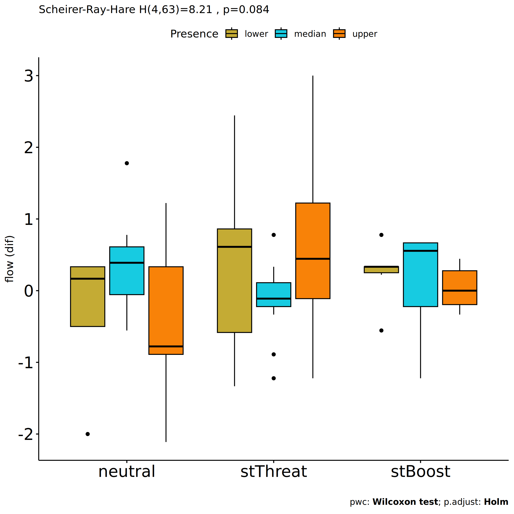

Non-Parametric ANCOVA tests for for assess flow state in environmental
cond
================
Geiser C. Challco <geiser@alumni.usp.br>

- [Setting Initial Variables](#setting-initial-variables)
- [Descriptive Statistics of Initial
  Data](#descriptive-statistics-of-initial-data)
- [One-way factor analysis for: *flow ~
  cond.env*](#one-way-factor-analysis-for-flow--condenv)
  - [Pre-test and Post-test PairWise comparisons for: *flow ~
    cond.env*](#pre-test-and-post-test-pairwise-comparisons-for-flow--condenv)
  - [Kruskal and Wilcoxon PairWise comparisons for: *flow ~
    cond.env*](#kruskal-and-wilcoxon-pairwise-comparisons-for-flow--condenv)
- [Two-way factor analysis for: *flow ~
  cond:Meaning*](#two-way-factor-analysis-for-flow--condmeaning)
  - [Pre-test and Post-test PairWise comparisons for: *flow ~
    cond.env:Meaning*](#pre-test-and-post-test-pairwise-comparisons-for-flow--condenvmeaning)
  - [Scheirer and Wilcoxon PairWise comparisons for: *flow ~
    cond.env:Meaning*](#scheirer-and-wilcoxon-pairwise-comparisons-for-flow--condenvmeaning)
- [Two-way factor analysis for: *flow ~
  cond:Presence*](#two-way-factor-analysis-for-flow--condpresence)
  - [Pre-test and Post-test PairWise comparisons for: *flow ~
    cond.env:Presence*](#pre-test-and-post-test-pairwise-comparisons-for-flow--condenvpresence)
  - [Scheirer and Wilcoxon PairWise comparisons for: *flow ~
    cond.env:Presence*](#scheirer-and-wilcoxon-pairwise-comparisons-for-flow--condenvpresence)
- [Two-way factor analysis for: *flow ~
  cond:Search*](#two-way-factor-analysis-for-flow--condsearch)
  - [Pre-test and Post-test PairWise comparisons for: *flow ~
    cond.env:Search*](#pre-test-and-post-test-pairwise-comparisons-for-flow--condenvsearch)
  - [Scheirer and Wilcoxon PairWise comparisons for: *flow ~
    cond.env:Search*](#scheirer-and-wilcoxon-pairwise-comparisons-for-flow--condenvsearch)

# Setting Initial Variables

``` r
dv = "flow"
dv.pos = "fss"
dv.pre = "dfs"
dv.dif = "dif.flow"

fatores2 <- c("gender","Meaning","Presence","Search")
lfatores2 <- as.list(fatores2)
names(lfatores2) <- fatores2

fatores1 <- c("cond.env", fatores2)
lfatores1 <- as.list(fatores1)
names(lfatores1) <- fatores1

lfatores <- c(lfatores1)

color <- list()
color[["prepost"]] = c("#ffee65","#f28e2B")
color[["env"]] = c("#a2b6c3","#1054b1","#fc2c8c")
color[["cond"]] = c("#aa8882","#fd7f6f","#42ae20")
color[["cond.env"]] = c("#aa8882","#fd7f6f","#42ae20")
color[["gender"]] = c("#FF007F","#4D4DFF")
color[["Meaning"]] = c("#c4ab34","#17cbe1","#f88208")
color[["Presence"]] = c("#c4ab34","#17cbe1","#f88208")
color[["Search"]] = c("#c4ab34","#17cbe1","#f88208")

color[["gender.Meaning"]] = c("#feb1d8","#b1b1fe","#FF007F","#4D4DFF","#dc006d","#3737ff")
color[["gender.Presence"]] = c("#feb1d8","#b1b1fe","#FF007F","#4D4DFF","#dc006d","#3737ff")
color[["gender.Search"]] = c("#feb1d8","#b1b1fe","#FF007F","#4D4DFF","#dc006d","#3737ff")


level <- list()
level[["env"]] = c("neutral","stM","stF")
level[["cond"]] = c("neutral","stThreat","stBoost")
level[["cond.env"]] = c("neutral","stThreat","stBoost")
level[["gender"]] = c("F","M")
level[["Meaning"]] = c("lower","median","upper")
level[["Presence"]] = c("lower","median","upper")
level[["Search"]] = c("lower","median","upper")

level[["gender.Meaning"]] = c("F.lower","M.lower","F.median","M.median","F.upper","M.upper")
level[["gender.Presence"]] = c("F.lower","M.lower","F.median","M.median","F.upper","M.upper")
level[["gender.Search"]] = c("F.lower","M.lower","F.median","M.median","F.upper","M.upper")


gdat <- read_excel("../data/data.xlsx", sheet = "results")
gdat <- gdat[!is.na(gdat[[dv.pre]]) & !is.na(gdat[[dv.pos]]),]
if (!dv.dif %in% colnames(gdat))
  gdat[[dv.dif]] <- gdat[[dv.pos]] - gdat[[dv.pre]]


dat <- gdat
dat$cond.env <- factor(dat[["cond.env"]], level[["cond.env"]])
for (coln in c(names(lfatores))) {
  if (length(level[[coln]]) > 0)
    plevel = level[[coln]][level[[coln]] %in% unique(dat[[coln]])]
  else
    plevel = unique(dat[[coln]])[!is.na(unique(dat[[coln]]))]
  
  dat[[coln]] <- factor(dat[[coln]], plevel)
}

dat <- dat[,c("userId", names(lfatores), dv.pre, dv.pos, dv.dif)]

dat.long <- rbind(dat, dat)
dat.long$time <- c(rep("pre", nrow(dat)), rep("pos", nrow(dat)))
dat.long$time <- factor(dat.long$time, c("pre","pos"))
dat.long[[dv]] <- c(dat[[dv.pre]], dat[[dv.pos]])


for (f in c("cond.env", names(lfatores))) {
  if (is.null(color[[f]]) && length(unique(dat[[f]])) > 0) 
      color[[f]] <- distinctColorPalette(length(unique(dat[[f]])))
}

for (f in c(fatores2)) {
  if (is.null(color[[paste0("cond.env:",f)]]) && length(unique(dat[[f]])) > 0)
    color[[paste0("cond.env:",f)]] <- distinctColorPalette(
      length(unique(dat[["cond.env"]]))*length(unique(dat[[f]])))
}

ldat <- list()
laov <- list()
lpwc <- list()
lemms <- list()
```

# Descriptive Statistics of Initial Data

``` r
df <- get.descriptives(dat, c(dv.pre, dv.pos, dv.dif), c("cond.env"),
                       symmetry.test = T, normality.test = F)
df <- plyr::rbind.fill(
  df, do.call(plyr::rbind.fill, lapply(lfatores2, FUN = function(f) {
    if (nrow(dat) > 0 && sum(!is.na(unique(dat[[f]]))) > 1)
      get.descriptives(dat, c(dv.pre,dv.pos), c("cond.env", f), include.global = F,
                       symmetry.test = T, normality.test = F)
    }))
)
df <- df[,c("variable",fatores1[fatores1 %in% colnames(df)],
            colnames(df)[!colnames(df) %in% c(fatores1,"variable")])]
```

| variable | cond.env | gender | Meaning | Presence | Search | n | mean | median | min | max | sd | se | ci | iqr | symmetry | skewness | kurtosis |
|:---|:---|:---|:---|:---|:---|---:|---:|---:|---:|---:|---:|---:|---:|---:|:---|---:|---:|
| dfs | neutral |  |  |  |  | 17 | 3.523 | 3.667 | 2.778 | 4.000 | 0.344 | 0.083 | 0.177 | 0.556 | NO | -0.5483789 | -0.8603284 |
| dfs | stThreat |  |  |  |  | 34 | 3.284 | 3.333 | 1.444 | 4.444 | 0.720 | 0.123 | 0.251 | 1.083 | NO | -0.5751934 | -0.3486283 |
| dfs | stBoost |  |  |  |  | 21 | 3.354 | 3.333 | 2.333 | 4.000 | 0.470 | 0.102 | 0.214 | 0.556 | YES | -0.3799167 | -0.7207334 |
| fss | neutral |  |  |  |  | 17 | 3.497 | 3.667 | 1.667 | 5.000 | 0.903 | 0.219 | 0.464 | 0.889 | NO | -0.6583444 | -0.3027827 |
| fss | stThreat |  |  |  |  | 34 | 3.614 | 3.667 | 2.000 | 5.000 | 0.733 | 0.126 | 0.256 | 1.056 | YES | -0.1794752 | -0.5032283 |
| fss | stBoost |  |  |  |  | 21 | 3.503 | 3.556 | 2.667 | 4.667 | 0.531 | 0.116 | 0.242 | 0.778 | NO | 0.6183534 | -0.2089496 |
| dif.flow | neutral |  |  |  |  | 17 | -0.026 | 0.333 | -2.111 | 1.778 | 1.013 | 0.246 | 0.521 | 1.000 | NO | -0.5185327 | -0.2762499 |
| dif.flow | stThreat |  |  |  |  | 34 | 0.330 | 0.167 | -1.333 | 3.000 | 1.033 | 0.177 | 0.361 | 0.889 | NO | 0.9019455 | 0.8141539 |
| dif.flow | stBoost |  |  |  |  | 21 | 0.148 | 0.333 | -1.222 | 0.778 | 0.494 | 0.108 | 0.225 | 0.778 | NO | -0.9313297 | 0.4728925 |
| dfs | neutral | F |  |  |  | 4 | 3.361 | 3.278 | 3.222 | 3.667 | 0.210 | 0.105 | 0.335 | 0.194 | few data | 0.0000000 | 0.0000000 |
| dfs | neutral | M |  |  |  | 13 | 3.573 | 3.667 | 2.778 | 4.000 | 0.368 | 0.102 | 0.222 | 0.333 | NO | -0.8734891 | -0.5656898 |
| dfs | stThreat | F |  |  |  | 8 | 3.306 | 3.278 | 2.556 | 4.000 | 0.451 | 0.160 | 0.377 | 0.444 | YES | -0.1328829 | -1.1921918 |
| dfs | stThreat | M |  |  |  | 26 | 3.278 | 3.333 | 1.444 | 4.444 | 0.791 | 0.155 | 0.320 | 1.278 | NO | -0.5411179 | -0.7065930 |
| dfs | stBoost | F |  |  |  | 4 | 3.417 | 3.500 | 2.778 | 3.889 | 0.466 | 0.233 | 0.741 | 0.361 | YES | -0.3776382 | -1.8502996 |
| dfs | stBoost | M |  |  |  | 17 | 3.340 | 3.333 | 2.333 | 4.000 | 0.483 | 0.117 | 0.249 | 0.556 | YES | -0.3287676 | -0.7478956 |
| fss | neutral | F |  |  |  | 4 | 3.139 | 3.444 | 1.667 | 4.000 | 1.032 | 0.516 | 1.642 | 0.917 | NO | -0.5471599 | -1.8258239 |
| fss | neutral | M |  |  |  | 13 | 3.607 | 3.889 | 1.667 | 5.000 | 0.874 | 0.243 | 0.528 | 0.889 | NO | -0.6057445 | -0.2610146 |
| fss | stThreat | F |  |  |  | 8 | 3.694 | 3.667 | 3.333 | 4.111 | 0.318 | 0.113 | 0.266 | 0.528 | YES | 0.1632678 | -1.7890678 |
| fss | stThreat | M |  |  |  | 26 | 3.590 | 3.722 | 2.000 | 5.000 | 0.824 | 0.162 | 0.333 | 1.167 | YES | -0.0941268 | -0.9786911 |
| fss | stBoost | F |  |  |  | 4 | 3.083 | 3.056 | 2.667 | 3.556 | 0.367 | 0.184 | 0.584 | 0.306 | YES | 0.1637483 | -1.9000750 |
| fss | stBoost | M |  |  |  | 17 | 3.601 | 3.667 | 2.889 | 4.667 | 0.523 | 0.127 | 0.269 | 0.556 | NO | 0.5798494 | -0.4150355 |
| dfs | neutral |  | lower |  |  | 3 | 3.667 | 3.667 | 3.667 | 3.667 | 0.000 | 0.000 | 0.000 | 0.000 | few data | 0.0000000 | 0.0000000 |
| dfs | neutral |  | median |  |  | 7 | 3.508 | 3.444 | 3.000 | 4.000 | 0.384 | 0.145 | 0.355 | 0.611 | YES | 0.0406393 | -1.9181338 |
| dfs | neutral |  | upper |  |  | 7 | 3.476 | 3.556 | 2.778 | 3.889 | 0.394 | 0.149 | 0.364 | 0.500 | NO | -0.5474625 | -1.2913750 |
| dfs | stThreat |  | lower |  |  | 10 | 3.233 | 3.167 | 2.222 | 4.000 | 0.690 | 0.218 | 0.493 | 1.306 | YES | -0.0656415 | -1.8422080 |
| dfs | stThreat |  | median |  |  | 9 | 3.642 | 3.667 | 3.111 | 4.333 | 0.437 | 0.146 | 0.336 | 0.778 | YES | 0.1473087 | -1.7297721 |
| dfs | stThreat |  | upper |  |  | 15 | 3.104 | 3.222 | 1.444 | 4.444 | 0.829 | 0.214 | 0.459 | 0.944 | YES | -0.3837996 | -0.8394887 |
| dfs | stBoost |  | lower |  |  | 5 | 3.156 | 3.333 | 2.556 | 3.556 | 0.390 | 0.174 | 0.484 | 0.333 | YES | -0.4884815 | -1.6314813 |
| dfs | stBoost |  | median |  |  | 13 | 3.479 | 3.667 | 2.333 | 4.000 | 0.514 | 0.143 | 0.311 | 0.667 | NO | -0.7829147 | -0.5249048 |
| dfs | stBoost |  | upper |  |  | 3 | 3.148 | 3.222 | 2.889 | 3.333 | 0.231 | 0.134 | 0.575 | 0.222 | few data | 0.0000000 | 0.0000000 |
| fss | neutral |  | lower |  |  | 3 | 3.222 | 4.000 | 1.667 | 4.000 | 1.347 | 0.778 | 3.347 | 1.167 | few data | 0.0000000 | 0.0000000 |
| fss | neutral |  | median |  |  | 7 | 3.111 | 3.222 | 1.667 | 3.889 | 0.811 | 0.307 | 0.750 | 0.944 | NO | -0.6095859 | -1.2464062 |
| fss | neutral |  | upper |  |  | 7 | 4.000 | 4.000 | 3.111 | 5.000 | 0.635 | 0.240 | 0.587 | 0.722 | YES | 0.1928170 | -1.4443982 |
| fss | stThreat |  | lower |  |  | 10 | 3.400 | 3.667 | 2.222 | 4.333 | 0.611 | 0.193 | 0.437 | 0.667 | YES | -0.3894482 | -0.9374230 |
| fss | stThreat |  | median |  |  | 9 | 3.370 | 3.333 | 2.556 | 4.222 | 0.636 | 0.212 | 0.489 | 1.222 | YES | -0.0292470 | -1.7545921 |
| fss | stThreat |  | upper |  |  | 15 | 3.904 | 3.889 | 2.000 | 5.000 | 0.797 | 0.206 | 0.441 | 0.722 | NO | -0.6279343 | -0.0569402 |
| fss | stBoost |  | lower |  |  | 5 | 3.311 | 3.333 | 2.889 | 3.667 | 0.363 | 0.163 | 0.451 | 0.667 | YES | -0.0644560 | -2.1620299 |
| fss | stBoost |  | median |  |  | 13 | 3.615 | 3.667 | 2.667 | 4.667 | 0.603 | 0.167 | 0.364 | 0.667 | YES | 0.3286689 | -0.8864161 |
| fss | stBoost |  | upper |  |  | 3 | 3.333 | 3.222 | 3.000 | 3.778 | 0.401 | 0.231 | 0.995 | 0.389 | few data | 0.0000000 | 0.0000000 |
| dfs | neutral |  |  | lower |  | 4 | 3.556 | 3.667 | 3.222 | 3.667 | 0.222 | 0.111 | 0.354 | 0.111 | few data | 0.0000000 | 0.0000000 |
| dfs | neutral |  |  | median |  | 8 | 3.361 | 3.333 | 2.778 | 3.889 | 0.379 | 0.134 | 0.317 | 0.444 | YES | -0.0542762 | -1.5313682 |
| dfs | neutral |  |  | upper |  | 5 | 3.756 | 3.778 | 3.333 | 4.000 | 0.253 | 0.113 | 0.315 | 0.111 | NO | -0.7164889 | -1.2691124 |
| dfs | stThreat |  |  | lower |  | 8 | 2.708 | 2.722 | 1.444 | 4.000 | 0.734 | 0.260 | 0.614 | 0.472 | YES | 0.0287646 | -0.6716856 |
| dfs | stThreat |  |  | median |  | 13 | 3.590 | 3.667 | 2.667 | 4.000 | 0.426 | 0.118 | 0.258 | 0.778 | NO | -0.6823905 | -0.8181890 |
| dfs | stThreat |  |  | upper |  | 13 | 3.333 | 3.333 | 2.000 | 4.444 | 0.776 | 0.215 | 0.469 | 0.889 | YES | -0.3408269 | -1.0015501 |
| dfs | stBoost |  |  | lower |  | 6 | 3.241 | 3.333 | 2.556 | 3.778 | 0.447 | 0.182 | 0.469 | 0.500 | YES | -0.3318956 | -1.6239859 |
| dfs | stBoost |  |  | median |  | 9 | 3.543 | 3.667 | 2.333 | 4.000 | 0.562 | 0.187 | 0.432 | 0.778 | NO | -0.9710161 | -0.4064939 |
| dfs | stBoost |  |  | upper |  | 6 | 3.185 | 3.278 | 2.778 | 3.444 | 0.250 | 0.102 | 0.262 | 0.278 | NO | -0.5325944 | -1.5428209 |
| fss | neutral |  |  | lower |  | 4 | 3.222 | 3.611 | 1.667 | 4.000 | 1.100 | 0.550 | 1.750 | 1.167 | few data | 0.0000000 | 0.0000000 |
| fss | neutral |  |  | median |  | 8 | 3.750 | 3.889 | 2.444 | 4.556 | 0.616 | 0.218 | 0.515 | 0.472 | NO | -0.8797939 | -0.1004129 |
| fss | neutral |  |  | upper |  | 5 | 3.311 | 3.111 | 1.667 | 5.000 | 1.200 | 0.537 | 1.490 | 0.556 | YES | 0.0461844 | -1.5096604 |
| fss | stThreat |  |  | lower |  | 8 | 3.083 | 3.000 | 2.222 | 3.889 | 0.602 | 0.213 | 0.503 | 1.028 | YES | 0.0347738 | -1.7530838 |
| fss | stThreat |  |  | median |  | 13 | 3.479 | 3.556 | 2.667 | 4.000 | 0.422 | 0.117 | 0.255 | 0.556 | NO | -0.5067107 | -1.1242413 |
| fss | stThreat |  |  | upper |  | 13 | 4.077 | 4.222 | 2.000 | 5.000 | 0.806 | 0.223 | 0.487 | 0.444 | NO | -1.1657429 | 0.8712154 |
| fss | stBoost |  |  | lower |  | 6 | 3.481 | 3.500 | 3.000 | 4.000 | 0.363 | 0.148 | 0.381 | 0.417 | YES | 0.0691045 | -1.7180990 |
| fss | stBoost |  |  | median |  | 9 | 3.704 | 3.667 | 2.667 | 4.667 | 0.662 | 0.221 | 0.509 | 0.333 | YES | 0.1169688 | -1.1916580 |
| fss | stBoost |  |  | upper |  | 6 | 3.222 | 3.056 | 2.889 | 3.778 | 0.358 | 0.146 | 0.376 | 0.444 | NO | 0.5366888 | -1.7364398 |
| dfs | neutral |  |  |  | lower | 8 | 3.347 | 3.389 | 2.778 | 3.667 | 0.333 | 0.118 | 0.278 | 0.500 | YES | -0.4392406 | -1.4624225 |
| dfs | neutral |  |  |  | median | 4 | 3.611 | 3.667 | 3.222 | 3.889 | 0.294 | 0.147 | 0.468 | 0.333 | YES | -0.3239695 | -2.0089286 |
| dfs | neutral |  |  |  | upper | 5 | 3.733 | 3.778 | 3.222 | 4.000 | 0.300 | 0.134 | 0.373 | 0.111 | NO | -0.8177042 | -1.1804616 |
| dfs | stThreat |  |  |  | lower | 8 | 3.194 | 3.000 | 2.222 | 4.444 | 0.722 | 0.255 | 0.604 | 0.667 | YES | 0.4501610 | -1.2275354 |
| dfs | stThreat |  |  |  | median | 17 | 3.405 | 3.667 | 1.444 | 4.000 | 0.714 | 0.173 | 0.367 | 0.667 | NO | -1.2811448 | 0.8189147 |
| dfs | stThreat |  |  |  | upper | 9 | 3.136 | 3.222 | 2.000 | 4.333 | 0.773 | 0.258 | 0.594 | 0.111 | YES | -0.1359199 | -1.1539534 |
| dfs | stBoost |  |  |  | lower | 3 | 3.556 | 3.556 | 3.222 | 3.889 | 0.333 | 0.192 | 0.828 | 0.333 | few data | 0.0000000 | 0.0000000 |
| dfs | stBoost |  |  |  | median | 13 | 3.214 | 3.333 | 2.333 | 4.000 | 0.496 | 0.138 | 0.300 | 0.778 | YES | -0.1505345 | -1.2099285 |
| dfs | stBoost |  |  |  | upper | 5 | 3.600 | 3.444 | 3.222 | 4.000 | 0.374 | 0.167 | 0.464 | 0.667 | YES | 0.1971279 | -2.2065534 |
| fss | neutral |  |  |  | lower | 8 | 3.431 | 3.778 | 1.667 | 4.556 | 0.949 | 0.336 | 0.794 | 0.972 | NO | -0.6654961 | -1.0773246 |
| fss | neutral |  |  |  | median | 4 | 3.889 | 3.944 | 3.556 | 4.111 | 0.240 | 0.120 | 0.382 | 0.222 | YES | -0.4463775 | -1.8750000 |
| fss | neutral |  |  |  | upper | 5 | 3.289 | 3.111 | 1.667 | 5.000 | 1.193 | 0.534 | 1.481 | 0.444 | YES | 0.0881633 | -1.4695705 |
| fss | stThreat |  |  |  | lower | 8 | 3.458 | 3.389 | 2.222 | 4.778 | 0.864 | 0.305 | 0.722 | 1.083 | YES | 0.1034011 | -1.5528950 |
| fss | stThreat |  |  |  | median | 17 | 3.621 | 3.667 | 2.667 | 4.333 | 0.476 | 0.116 | 0.245 | 0.444 | NO | -0.5616308 | -0.9162785 |
| fss | stThreat |  |  |  | upper | 9 | 3.741 | 3.889 | 2.000 | 5.000 | 1.033 | 0.344 | 0.794 | 1.000 | YES | -0.2776984 | -1.4005009 |
| fss | stBoost |  |  |  | lower | 3 | 3.148 | 3.000 | 2.667 | 3.778 | 0.570 | 0.329 | 1.416 | 0.556 | few data | 0.0000000 | 0.0000000 |
| fss | stBoost |  |  |  | median | 13 | 3.419 | 3.444 | 2.889 | 4.000 | 0.352 | 0.098 | 0.213 | 0.556 | YES | -0.0522206 | -1.5102426 |
| fss | stBoost |  |  |  | upper | 5 | 3.933 | 3.778 | 3.000 | 4.667 | 0.727 | 0.325 | 0.903 | 1.111 | YES | -0.0426850 | -2.0270836 |

# One-way factor analysis for: *flow ~ cond.env*

``` r
pdat = remove_group_data(dat[!is.na(dat[["cond.env"]]),], "dif.flow", "cond.env", n.limit = 3)

pdat.long <- rbind(pdat[,c("userId","cond.env")], pdat[,c("userId","cond.env")])
pdat.long[["time"]] <- c(rep("pre", nrow(pdat)), rep("pos", nrow(pdat)))
pdat.long[["time"]] <- factor(pdat.long[["time"]], c("pre","pos"))
pdat.long[["flow"]] <- c(pdat[["dfs"]], pdat[["fss"]])

y.position.min <- abs(
  max(pdat.long[["flow"]])
  - min(pdat.long[["flow"]]))/20

lvars = as.list(c("dif.flow","fss","dfs"))
names(lvars) = unlist(lvars)
```

## Pre-test and Post-test PairWise comparisons for: *flow ~ cond.env*

``` r
pwc.long <- group_by(pdat.long, cond.env) %>%
  pairwise_wilcox_test(flow ~ time, detailed = T)

df <- pwc.long[,c(".y.","cond.env","group1","group2","n1","n2","estimate",
                  "statistic","p.adj","p.adj.signif")]
```

| .y.  | cond.env | group1 | group2 |  n1 |  n2 |   estimate | statistic | p.adj | p.adj.signif |
|:-----|:---------|:-------|:-------|----:|----:|-----------:|----------:|------:|:-------------|
| flow | neutral  | pre    | pos    |  17 |  17 | -0.1111503 |     126.5 | 0.545 | ns           |
| flow | stThreat | pre    | pos    |  34 |  34 | -0.3332943 |     448.0 | 0.111 | ns           |
| flow | stBoost  | pre    | pos    |  21 |  21 | -0.1110997 |     198.0 | 0.578 | ns           |

``` r
stat.test <- pwc.long %>% add_xy_position(x = "time", fun = "max")
stat.test$y.position <- stat.test$y.position + y.position.min

gg <- ggline(
  pdat.long, x = "time", y = "flow", size = 1.5,
  facet.by = "cond.env", add = c("mean_ci"), color = "cond.env",
  position = position_dodge(width = 0.3), palette = color[["cond.env"]])

pdat.long$xj = jitter(as.numeric(pdat.long[["time"]]), amount=.1)
pdat.long$yj = jitter(pdat.long[["flow"]], amount = .01)

gg + geom_point(
  data = pdat.long, aes_string(x="xj",y="yj", color = "cond.env"), size=0.5) +
  stat_pvalue_manual(
    stat.test, tip.length = 0, hide.ns = T, label.size = 5,
    position = position_dodge(width = 0.3),
    label = "{ p.adj } ({ p.adj.signif })") + xlab("") +
  theme(strip.text = element_text(size = 16),
        axis.text = element_text(size = 18))
```

    ## Warning: `aes_string()` was deprecated in ggplot2 3.0.0.
    ## ℹ Please use tidy evaluation idioms with `aes()`.
    ## ℹ See also `vignette("ggplot2-in-packages")` for more information.
    ## This warning is displayed once every 8 hours.
    ## Call `lifecycle::last_lifecycle_warnings()` to see where this warning was
    ## generated.

<!-- -->

## Kruskal and Wilcoxon PairWise comparisons for: *flow ~ cond.env*

``` r
kt <- lapply(lvars, FUN = function(x) {
  kruskal_test(pdat, as.formula(paste0(x," ~ cond.env")))  
})

df <- do.call(rbind.fill, lapply(lvars, function(x) {
  add_significance(merge(
    kt[[x]], kruskal_effsize(pdat, as.formula(paste0(x," ~ cond.env"))),
    by = c(".y.","n"), suffixes = c("",".ez")))
}))

df <- df[,c(".y.","n","df","statistic","p","p.signif","effsize","magnitude")]
```

| .y.      |   n |  df | statistic |     p | p.signif |    effsize | magnitude |
|:---------|----:|----:|----------:|------:|:---------|-----------:|:----------|
| dif.flow |  72 |   2 | 0.4811939 | 0.786 | ns       | -0.0220117 | small     |
| fss      |  72 |   2 | 1.0415613 | 0.594 | ns       | -0.0138904 | small     |
| dfs      |  72 |   2 | 1.0933282 | 0.579 | ns       | -0.0131402 | small     |

``` r
pwc <- lapply(lvars, FUN = function(x) {
  pairwise_wilcox_test(pdat, as.formula(paste0(x," ~ cond.env")), detailed = T)  
})

df <- do.call(rbind.fill, pwc)
```

| estimate | .y. | group1 | group2 | n1 | n2 | statistic | p | conf.low | conf.high | method | alternative | p.adj | p.adj.signif |
|---:|:---|:---|:---|---:|---:|---:|---:|---:|---:|:---|:---|---:|:---|
| -0.1111546 | dif.flow | neutral | stThreat | 17 | 34 | 257.0 | 0.529 | -0.7777236 | 0.3333580 | Wilcoxon | two.sided | 1.000 | ns |
| -0.1110961 | dif.flow | neutral | stBoost | 17 | 21 | 163.0 | 0.659 | -0.5555400 | 0.3333475 | Wilcoxon | two.sided | 1.000 | ns |
| 0.1110557 | dif.flow | stThreat | stBoost | 34 | 21 | 376.0 | 0.748 | -0.3333212 | 0.4444363 | Wilcoxon | two.sided | 1.000 | ns |
| -0.0000475 | fss | neutral | stThreat | 17 | 34 | 280.5 | 0.873 | -0.5555115 | 0.3333417 | Wilcoxon | two.sided | 1.000 | ns |
| 0.2222109 | fss | neutral | stBoost | 17 | 21 | 205.0 | 0.444 | -0.4444145 | 0.5555475 | Wilcoxon | two.sided | 1.000 | ns |
| 0.1111364 | fss | stThreat | stBoost | 34 | 21 | 412.0 | 0.343 | -0.2221689 | 0.5555338 | Wilcoxon | two.sided | 1.000 | ns |
| 0.1111803 | dfs | neutral | stThreat | 17 | 34 | 333.0 | 0.383 | -0.2221929 | 0.5555169 | Wilcoxon | two.sided | 0.948 | ns |
| 0.1111521 | dfs | neutral | stBoost | 17 | 21 | 213.0 | 0.316 | -0.1111153 | 0.4444780 | Wilcoxon | two.sided | 0.948 | ns |
| -0.0000577 | dfs | stThreat | stBoost | 34 | 21 | 350.0 | 0.910 | -0.3334258 | 0.3332455 | Wilcoxon | two.sided | 0.948 | ns |

``` r
plots <- lapply(lvars, FUN = function(y) {
  stat.test <- pwc[[y]] %>% add_xy_position(x = "cond.env")
  stat.test$y.position <- stat.test$y.position + y.position.min
  ggboxplot(pdat, x = "cond.env", y = y, fill = "cond.env",
            palette = color[["cond.env"]]) +
    stat_pvalue_manual(stat.test, tip.length = 0, hide.ns = T, label.size = 5,
                       label="{ p.adj } ({ p.adj.signif })") + xlab("")
})
```

``` r
egg::ggarrange(plots[["dfs"]], plots[["fss"]], nrow = 1)
```

<!-- -->

``` r
plots[["dif.flow"]] +
  labs(subtitle = get_test_label(kt[["dif.flow"]], detailed = T),
       caption = get_pwc_label(pwc[["dif.flow"]])) +
  ylab("flow (dif)")  +
  theme(strip.text = element_text(size = 16),
        axis.text = element_text(size = 18))
```

<!-- -->

# Two-way factor analysis for: *flow ~ cond:Meaning*

``` r
pdat = remove_group_data(
  dat[!is.na(dat[["cond.env"]]) & !is.na(dat[["Meaning"]]),],
  "dif.flow", c("cond.env","Meaning"), n.limit = 3)

pdat.long <- rbind(pdat[,c("userId","cond.env","Meaning")],
                   pdat[,c("userId","cond.env","Meaning")])
pdat.long[["time"]] <- c(rep("pre", nrow(pdat)), rep("pos", nrow(pdat)))
pdat.long[["time"]] <- factor(pdat.long[["time"]], c("pre","pos"))
pdat.long[["flow"]] <- c(pdat[["dfs"]], pdat[["fss"]])

y.position.min <- abs(
  max(pdat.long[["flow"]])
  - min(pdat.long[["flow"]]))/20

lvars = as.list(c("dif.flow","fss","dfs"))
names(lvars) = unlist(lvars)
```

## Pre-test and Post-test PairWise comparisons for: *flow ~ cond.env:Meaning*

``` r
pwc.long <- group_by(pdat.long, cond.env:Meaning) %>%
  pairwise_wilcox_test(flow ~ time, detailed = T)

df <- pwc.long[,c(".y.","cond.env:Meaning","group1","group2","n1","n2","estimate",
                  "statistic","p.adj","p.adj.signif")]
```

| .y. | cond.env:Meaning | group1 | group2 | n1 | n2 | estimate | statistic | p.adj | p.adj.signif |
|:---|:---|:---|:---|---:|---:|---:|---:|---:|:---|
| flow | neutral:lower | pre | pos | 3 | 3 | -0.3332687 | 3.0 | 0.637 | ns |
| flow | neutral:median | pre | pos | 7 | 7 | 0.2221884 | 31.0 | 0.439 | ns |
| flow | neutral:upper | pre | pos | 7 | 7 | -0.4444057 | 12.5 | 0.141 | ns |
| flow | stThreat:lower | pre | pos | 10 | 10 | -0.1111593 | 44.5 | 0.703 | ns |
| flow | stThreat:median | pre | pos | 9 | 9 | 0.3333333 | 48.5 | 0.506 | ns |
| flow | stThreat:upper | pre | pos | 15 | 15 | -0.7777459 | 54.0 | 0.016 | \* |
| flow | stBoost:lower | pre | pos | 5 | 5 | -0.1111119 | 9.5 | 0.595 | ns |
| flow | stBoost:median | pre | pos | 13 | 13 | -0.0000449 | 81.5 | 0.897 | ns |
| flow | stBoost:upper | pre | pos | 3 | 3 | -0.1111556 | 3.5 | 0.825 | ns |

``` r
pwc.long <- group_by(pdat.long, cond.env, Meaning) %>%
  pairwise_wilcox_test(flow ~ time, detailed = T)

stat.test <- pwc.long %>% add_xy_position(x = "time", fun = "mean_ci")
sidx = which(stat.test$p.adj.signif != "ns")
stat.test$y.position[sidx] <- stat.test$y.position[sidx] + y.position.min * (1:length(sidx))

gg <- ggline(
  pdat.long, x = "time", y = "flow",
  color = "Meaning", linetype = "Meaning", shape = "Meaning", size = 1.5,
  facet.by = "cond.env", add = c("mean_ci"),
  position = position_dodge(width = 0.3), palette = color[["Meaning"]])

pdat.long$xj = jitter(as.numeric(pdat.long[["time"]]), amount=.1)
pdat.long$yj = jitter(pdat.long[["flow"]], amount = .01)

gg + geom_point(
  data = pdat.long, aes_string(x="xj",y="yj",colour="Meaning"), size=0.5) +
  stat_pvalue_manual(
    stat.test, tip.length = 0, hide.ns = T, label.size = 5,
    position = position_dodge(width = 0.3), color = "Meaning",
    label = "{ p.adj } ({ p.adj.signif })") + xlab("") +
  theme(strip.text = element_text(size = 16),
        axis.text = element_text(size = 18))
```

<!-- -->

## Scheirer and Wilcoxon PairWise comparisons for: *flow ~ cond.env:Meaning*

``` r
sch <- lapply(lvars, FUN = function(x) {
  scheirer.test(pdat, x, c("cond.env","Meaning"), as.table = T) 
})
df <- do.call(rbind.fill, sch)
```

| var      | Effect           |  Df |      Sum Sq |         H |   p.value | p.value.signif |
|:---------|:-----------------|----:|------------:|----------:|----------:|:---------------|
| dif.flow | cond.env         |   2 |   411.46354 | 0.9410789 | 0.6246652 | ns             |
| dif.flow | Meaning          |   2 |  3414.81150 | 7.8101864 | 0.0201391 | \*             |
| dif.flow | cond.env:Meaning |   4 |  1078.93333 | 2.4676825 | 0.6504319 | ns             |
| dif.flow | Residuals        |  63 | 26339.45125 |           |           |                |
| fss      | cond.env         |   2 |    47.72345 | 0.1094981 | 0.9467227 | ns             |
| fss      | Meaning          |   2 |  2862.61003 | 6.5680593 | 0.0374769 | \*             |
| fss      | cond.env:Meaning |   4 |  1883.44628 | 4.3214363 | 0.3642485 | ns             |
| fss      | Residuals        |  63 | 25744.49167 |           |           |                |
| dfs      | cond.env         |   2 |   658.86635 | 1.5165503 | 0.4684738 | ns             |
| dfs      | Meaning          |   2 |  1819.72936 | 4.1885750 | 0.1231580 | ns             |
| dfs      | cond.env:Meaning |   4 |   906.29981 | 2.0860820 | 0.7199298 | ns             |
| dfs      | Residuals        |  63 | 27644.97363 |           |           |                |

``` r
pwc <- lapply(lvars, FUN = function(x) {
  list(
    cond.env = tryCatch(pairwise_wilcox_test(group_by(pdat, Meaning),
                                 as.formula(paste0(x," ~ cond.env")), detailed = T)
                         , error = function(e) NULL),
    Meaning = tryCatch(pairwise_wilcox_test(group_by(pdat, cond.env),
                                 as.formula(paste0(x," ~ Meaning")), detailed = T)
                         , error = function(e) NULL)
  )
})

df <- do.call(rbind.fill, lapply(pwc, FUN =  function(x) {
  do.call(rbind.fill, x)
}))

ivs = c()
if ("cond.env" %in% colnames(df)) ivs = c(ivs, "cond.env")
if ("Meaning" %in% colnames(df)) ivs = c(ivs, "Meaning")
df <- df[,c(".y.",ivs,"group1","group2","n1","n2","estimate",
            "statistic","p.adj","p.adj.signif")]
```

| .y. | cond.env | Meaning | group1 | group2 | n1 | n2 | estimate | statistic | p.adj | p.adj.signif |
|:---|:---|:---|:---|:---|---:|---:|---:|---:|---:|:---|
| dif.flow |  | lower | neutral | stThreat | 3 | 10 | -0.4444274 | 12.0 | 1.000 | ns |
| dif.flow |  | lower | neutral | stBoost | 3 | 5 | -0.0000459 | 8.0 | 1.000 | ns |
| dif.flow |  | lower | stThreat | stBoost | 10 | 5 | 0.0000000 | 24.5 | 1.000 | ns |
| dif.flow |  | median | neutral | stThreat | 7 | 9 | 0.1110182 | 33.0 | 0.916 | ns |
| dif.flow |  | median | neutral | stBoost | 7 | 13 | -0.3333706 | 26.0 | 0.393 | ns |
| dif.flow |  | median | stThreat | stBoost | 9 | 13 | -0.4444427 | 38.5 | 0.393 | ns |
| dif.flow |  | upper | neutral | stThreat | 7 | 15 | -0.1110294 | 48.0 | 1.000 | ns |
| dif.flow |  | upper | neutral | stBoost | 7 | 3 | 0.3333016 | 13.5 | 1.000 | ns |
| dif.flow |  | upper | stThreat | stBoost | 15 | 3 | 0.2222373 | 32.0 | 0.858 | ns |
| dif.flow | neutral |  | lower | median | 3 | 7 | 0.1110981 | 13.0 | 0.720 | ns |
| dif.flow | neutral |  | lower | upper | 3 | 7 | -0.8888828 | 6.0 | 0.720 | ns |
| dif.flow | neutral |  | median | upper | 7 | 7 | -0.7777960 | 10.5 | 0.252 | ns |
| dif.flow | stThreat |  | lower | median | 10 | 9 | 0.4443876 | 62.0 | 0.354 | ns |
| dif.flow | stThreat |  | lower | upper | 10 | 15 | -0.4444446 | 53.0 | 0.354 | ns |
| dif.flow | stThreat |  | median | upper | 9 | 15 | -0.8888709 | 31.5 | 0.102 | ns |
| dif.flow | stBoost |  | lower | median | 5 | 13 | 0.0000378 | 32.0 | 1.000 | ns |
| dif.flow | stBoost |  | lower | upper | 5 | 3 | -0.0000613 | 6.0 | 1.000 | ns |
| dif.flow | stBoost |  | median | upper | 13 | 3 | 0.0000811 | 21.0 | 1.000 | ns |
| fss |  | lower | neutral | stThreat | 3 | 10 | 0.3332744 | 18.0 | 1.000 | ns |
| fss |  | lower | neutral | stBoost | 3 | 5 | 0.3333869 | 10.0 | 1.000 | ns |
| fss |  | lower | stThreat | stBoost | 10 | 5 | 0.0000350 | 29.5 | 1.000 | ns |
| fss |  | median | neutral | stThreat | 7 | 9 | -0.2222207 | 24.5 | 1.000 | ns |
| fss |  | median | neutral | stBoost | 7 | 13 | -0.4444006 | 33.0 | 1.000 | ns |
| fss |  | median | stThreat | stBoost | 9 | 13 | -0.3332938 | 46.5 | 1.000 | ns |
| fss |  | upper | neutral | stThreat | 7 | 15 | 0.0000498 | 54.5 | 0.916 | ns |
| fss |  | upper | neutral | stBoost | 7 | 3 | 0.6666667 | 17.0 | 0.366 | ns |
| fss |  | upper | stThreat | stBoost | 15 | 3 | 0.6667148 | 36.0 | 0.366 | ns |
| fss | neutral |  | lower | median | 3 | 7 | 0.1111409 | 14.5 | 0.842 | ns |
| fss | neutral |  | lower | upper | 3 | 7 | -0.5555130 | 7.0 | 0.842 | ns |
| fss | neutral |  | median | upper | 7 | 7 | -0.7778280 | 9.0 | 0.164 | ns |
| fss | stThreat |  | lower | median | 10 | 9 | 0.1111578 | 48.5 | 0.805 | ns |
| fss | stThreat |  | lower | upper | 10 | 15 | -0.4444974 | 38.5 | 0.134 | ns |
| fss | stThreat |  | median | upper | 9 | 15 | -0.5555023 | 39.0 | 0.188 | ns |
| fss | stBoost |  | lower | median | 5 | 13 | -0.2221981 | 21.0 | 0.822 | ns |
| fss | stBoost |  | lower | upper | 5 | 3 | -0.1110694 | 6.5 | 1.000 | ns |
| fss | stBoost |  | median | upper | 13 | 3 | 0.2222467 | 24.0 | 1.000 | ns |
| dfs |  | lower | neutral | stThreat | 3 | 10 | 0.4580854 | 18.0 | 1.000 | ns |
| dfs |  | lower | neutral | stBoost | 3 | 5 | 0.3333439 | 15.0 | 0.094 | ns |
| dfs |  | lower | stThreat | stBoost | 10 | 5 | 0.1111139 | 27.0 | 1.000 | ns |
| dfs |  | median | neutral | stThreat | 7 | 9 | -0.1111004 | 25.5 | 1.000 | ns |
| dfs |  | median | neutral | stBoost | 7 | 13 | -0.0000559 | 44.0 | 1.000 | ns |
| dfs |  | median | stThreat | stBoost | 9 | 13 | 0.1110386 | 66.5 | 1.000 | ns |
| dfs |  | upper | neutral | stThreat | 7 | 15 | 0.2222702 | 68.0 | 0.750 | ns |
| dfs |  | upper | neutral | stBoost | 7 | 3 | 0.4444308 | 16.0 | 0.750 | ns |
| dfs |  | upper | stThreat | stBoost | 15 | 3 | 0.0000360 | 23.5 | 0.953 | ns |
| dfs | neutral |  | lower | median | 3 | 7 | 0.2221799 | 12.0 | 1.000 | ns |
| dfs | neutral |  | lower | upper | 3 | 7 | 0.1110975 | 12.0 | 1.000 | ns |
| dfs | neutral |  | median | upper | 7 | 7 | 0.0000738 | 25.5 | 1.000 | ns |
| dfs | stThreat |  | lower | median | 10 | 9 | -0.3333503 | 30.0 | 0.464 | ns |
| dfs | stThreat |  | lower | upper | 10 | 15 | 0.1111340 | 80.0 | 0.802 | ns |
| dfs | stThreat |  | median | upper | 9 | 15 | 0.4444538 | 93.5 | 0.378 | ns |
| dfs | stBoost |  | lower | median | 5 | 13 | -0.3333696 | 18.0 | 0.498 | ns |
| dfs | stBoost |  | lower | upper | 5 | 3 | 0.1111087 | 9.0 | 0.760 | ns |
| dfs | stBoost |  | median | upper | 13 | 3 | 0.4443939 | 29.0 | 0.498 | ns |

``` r
plots <- lapply(lvars, FUN = function(y) {
  livs = list("cond.env", "Meaning")
  names(livs) = unlist(livs)
  lapply(livs, FUN = function(x) {
    iv2 = setdiff(names(livs), x)
    if (!is.null(pwc[[y]][[iv2]])) {
      stat.test <- pwc[[y]][[iv2]] %>% add_xy_position(x = x, fun = "max")
      sidx = which(stat.test$p.adj.signif != "ns")
      stat.test$y.position[sidx] <- stat.test$y.position[sidx] + y.position.min * (1:length(sidx))
      
      ggboxplot(pdat, x = x, y = y, fill = iv2, palette = color[[iv2]]) +
        stat_pvalue_manual(stat.test, tip.length = 0, hide.ns = T, label.size = 5,
                           label="{ p.adj } ({ p.adj.signif })") + xlab("")
    }
  })
})
```

``` r
if (!is.null(plots[["dfs"]][["cond.env"]]) &&
    !is.null(plots[["fss"]][["cond.env"]])) {
  egg::ggarrange(plots[["dfs"]][["cond.env"]],
                 plots[["fss"]][["cond.env"]], nrow = 1)  
}
```

<!-- -->

``` r
if (!is.null(plots[["dfs"]][["Meaning"]]) &&
    !is.null(plots[["fss"]][["Meaning"]])) {
  egg::ggarrange(plots[["dfs"]][["Meaning"]],
                 plots[["fss"]][["Meaning"]], nrow = 1)
}
```

<!-- -->

``` r
psch = sch[["dif.flow"]]
idx = which(psch$Effect == "cond.env:Meaning") 

dof = floor(as.double(psch$Df[idx]))
dof.res = floor(as.double(psch$Df[which(psch$Effect == "Residuals")]))
statistic = round(as.double(psch$H[idx]), 3)
p = round(as.double(psch[["p.value"]][idx]), 3)
pval = ifelse(p < 0.001,paste0(" , p<0.001"),paste0(" , p=",p))

if (!is.null(plots[["dif.flow"]][["cond.env"]]))
  plots[["dif.flow"]][["cond.env"]] +
    labs(subtitle = paste0("Scheirer-Ray-Hare H(", dof, ",", 
          dof.res, ")=", statistic, pval),
         caption = get_pwc_label(pwc[["dif.flow"]][["Meaning"]])) +
    ylab("flow (dif)") +
  theme(strip.text = element_text(size = 16),
        axis.text = element_text(size = 18))
```

<!-- -->

``` r
psch = sch[["dif.flow"]]
idx = which(psch$Effect == "cond.env:Meaning") 

dof = floor(as.double(psch$Df[idx]))
dof.res = floor(as.double(psch$Df[which(psch$Effect == "Residuals")]))
statistic = round(as.double(psch$H[idx]), 3)
p = round(as.double(psch[["p.value"]][idx]), 3)
pval = ifelse(p < 0.001,paste0(" , p<0.001"),paste0(" , p=",p))

if (!is.null(plots[["dif.flow"]][["Meaning"]]))
  plots[["dif.flow"]][["Meaning"]] +
    labs(subtitle = paste0("Scheirer-Ray-Hare H(", dof, ",", 
          dof.res, ")=", statistic, pval),
         caption = get_pwc_label(pwc[["dif.flow"]][["cond.env"]])) +
    ylab("flow (dif)") +
  theme(strip.text = element_text(size = 16),
        axis.text = element_text(size = 18))
```

<!-- -->

# Two-way factor analysis for: *flow ~ cond:Presence*

``` r
pdat = remove_group_data(
  dat[!is.na(dat[["cond.env"]]) & !is.na(dat[["Presence"]]),],
  "dif.flow", c("cond.env","Presence"), n.limit = 3)

pdat.long <- rbind(pdat[,c("userId","cond.env","Presence")],
                   pdat[,c("userId","cond.env","Presence")])
pdat.long[["time"]] <- c(rep("pre", nrow(pdat)), rep("pos", nrow(pdat)))
pdat.long[["time"]] <- factor(pdat.long[["time"]], c("pre","pos"))
pdat.long[["flow"]] <- c(pdat[["dfs"]], pdat[["fss"]])

y.position.min <- abs(
  max(pdat.long[["flow"]])
  - min(pdat.long[["flow"]]))/20

lvars = as.list(c("dif.flow","fss","dfs"))
names(lvars) = unlist(lvars)
```

## Pre-test and Post-test PairWise comparisons for: *flow ~ cond.env:Presence*

``` r
pwc.long <- group_by(pdat.long, cond.env:Presence) %>%
  pairwise_wilcox_test(flow ~ time, detailed = T)

df <- pwc.long[,c(".y.","cond.env:Presence","group1","group2","n1","n2","estimate",
                  "statistic","p.adj","p.adj.signif")]
```

| .y. | cond.env:Presence | group1 | group2 | n1 | n2 | estimate | statistic | p.adj | p.adj.signif |
|:---|:---|:---|:---|---:|---:|---:|---:|---:|:---|
| flow | neutral:lower | pre | pos | 4 | 4 | -0.0645979 | 7.5 | 1.000 | ns |
| flow | neutral:median | pre | pos | 8 | 8 | -0.4444809 | 14.0 | 0.064 | ns |
| flow | neutral:upper | pre | pos | 5 | 5 | 0.6666258 | 19.0 | 0.207 | ns |
| flow | stThreat:lower | pre | pos | 8 | 8 | -0.4444027 | 22.5 | 0.342 | ns |
| flow | stThreat:median | pre | pos | 13 | 13 | 0.1111670 | 100.5 | 0.423 | ns |
| flow | stThreat:upper | pre | pos | 13 | 13 | -0.7778023 | 40.0 | 0.024 | \* |
| flow | stBoost:lower | pre | pos | 6 | 6 | -0.2420634 | 13.0 | 0.467 | ns |
| flow | stBoost:median | pre | pos | 9 | 9 | -0.0000053 | 40.0 | 1.000 | ns |
| flow | stBoost:upper | pre | pos | 6 | 6 | 0.0000709 | 18.0 | 1.000 | ns |

``` r
pwc.long <- group_by(pdat.long, cond.env, Presence) %>%
  pairwise_wilcox_test(flow ~ time, detailed = T)

stat.test <- pwc.long %>% add_xy_position(x = "time", fun = "mean_ci")
sidx = which(stat.test$p.adj.signif != "ns")
stat.test$y.position[sidx] <- stat.test$y.position[sidx] + y.position.min * (1:length(sidx))

gg <- ggline(
  pdat.long, x = "time", y = "flow",
  color = "Presence", linetype = "Presence", shape = "Presence", size = 1.5,
  facet.by = "cond.env", add = c("mean_ci"),
  position = position_dodge(width = 0.3), palette = color[["Presence"]])

pdat.long$xj = jitter(as.numeric(pdat.long[["time"]]), amount=.1)
pdat.long$yj = jitter(pdat.long[["flow"]], amount = .01)

gg + geom_point(
  data = pdat.long, aes_string(x="xj",y="yj",colour="Presence"), size=0.5) +
  stat_pvalue_manual(
    stat.test, tip.length = 0, hide.ns = T, label.size = 5,
    position = position_dodge(width = 0.3), color = "Presence",
    label = "{ p.adj } ({ p.adj.signif })") + xlab("") +
  theme(strip.text = element_text(size = 16),
        axis.text = element_text(size = 18))
```

<!-- -->

## Scheirer and Wilcoxon PairWise comparisons for: *flow ~ cond.env:Presence*

``` r
sch <- lapply(lvars, FUN = function(x) {
  scheirer.test(pdat, x, c("cond.env","Presence"), as.table = T) 
})
df <- do.call(rbind.fill, sch)
```

| var      | Effect            |  Df |     Sum Sq |          H |   p.value | p.value.signif |
|:---------|:------------------|----:|-----------:|-----------:|----------:|:---------------|
| dif.flow | cond.env          |   2 |   183.4067 |  0.4194786 | 0.8107956 | ns             |
| dif.flow | Presence          |   2 |   184.0000 |  0.4208356 | 0.8102456 | ns             |
| dif.flow | cond.env:Presence |   4 |  3589.5945 |  8.2099414 | 0.0841835 | ns             |
| dif.flow | Residuals         |  63 | 27059.6015 |            |           |                |
| fss      | cond.env          |   2 |   341.0468 |  0.7825081 | 0.6762083 | ns             |
| fss      | Presence          |   2 |  1723.1524 |  3.9536532 | 0.1385081 | ns             |
| fss      | cond.env:Presence |   4 |  5646.4150 | 12.9553059 | 0.0114963 | \*             |
| fss      | Residuals         |  63 | 23120.9806 |            |           |                |
| dfs      | cond.env          |   2 |   403.2239 |  0.9281235 | 0.6287247 | ns             |
| dfs      | Presence          |   2 |  2472.6344 |  5.6914037 | 0.0580935 | ns             |
| dfs      | cond.env:Presence |   4 |  3933.0552 |  9.0529378 | 0.0597898 | ns             |
| dfs      | Residuals         |  63 | 23965.3132 |            |           |                |

``` r
pwc <- lapply(lvars, FUN = function(x) {
  list(
    cond.env = tryCatch(pairwise_wilcox_test(group_by(pdat, Presence),
                                 as.formula(paste0(x," ~ cond.env")), detailed = T)
                         , error = function(e) NULL),
    Presence = tryCatch(pairwise_wilcox_test(group_by(pdat, cond.env),
                                 as.formula(paste0(x," ~ Presence")), detailed = T)
                         , error = function(e) NULL)
  )
})

df <- do.call(rbind.fill, lapply(pwc, FUN =  function(x) {
  do.call(rbind.fill, x)
}))

ivs = c()
if ("cond.env" %in% colnames(df)) ivs = c(ivs, "cond.env")
if ("Presence" %in% colnames(df)) ivs = c(ivs, "Presence")
df <- df[,c(".y.",ivs,"group1","group2","n1","n2","estimate",
            "statistic","p.adj","p.adj.signif")]
```

| .y. | cond.env | Presence | group1 | group2 | n1 | n2 | estimate | statistic | p.adj | p.adj.signif |
|:---|:---|:---|:---|:---|---:|---:|---:|---:|---:|:---|
| dif.flow |  | lower | neutral | stThreat | 4 | 8 | -0.5885346 | 9.0 | 0.804 | ns |
| dif.flow |  | lower | neutral | stBoost | 4 | 6 | -0.2293756 | 10.0 | 1.000 | ns |
| dif.flow |  | lower | stThreat | stBoost | 8 | 6 | 0.1120378 | 27.0 | 1.000 | ns |
| dif.flow |  | median | neutral | stThreat | 8 | 13 | 0.4444388 | 73.0 | 0.411 | ns |
| dif.flow |  | median | neutral | stBoost | 8 | 9 | 0.0000897 | 37.0 | 0.961 | ns |
| dif.flow |  | median | stThreat | stBoost | 13 | 9 | -0.4444017 | 42.5 | 0.598 | ns |
| dif.flow |  | upper | neutral | stThreat | 5 | 13 | -1.2221864 | 16.5 | 0.260 | ns |
| dif.flow |  | upper | neutral | stBoost | 5 | 6 | -0.6111111 | 10.0 | 0.429 | ns |
| dif.flow |  | upper | stThreat | stBoost | 13 | 6 | 0.5493589 | 59.0 | 0.260 | ns |
| dif.flow | neutral |  | lower | median | 4 | 8 | -0.3864238 | 10.5 | 0.788 | ns |
| dif.flow | neutral |  | lower | upper | 4 | 5 | 0.0663304 | 12.0 | 0.788 | ns |
| dif.flow | neutral |  | median | upper | 8 | 5 | 0.7980807 | 29.5 | 0.561 | ns |
| dif.flow | stThreat |  | lower | median | 8 | 13 | 0.5556048 | 67.0 | 0.584 | ns |
| dif.flow | stThreat |  | lower | upper | 8 | 13 | -0.3589033 | 46.5 | 0.717 | ns |
| dif.flow | stThreat |  | median | upper | 13 | 13 | -0.6666328 | 41.0 | 0.081 | ns |
| dif.flow | stBoost |  | lower | median | 6 | 9 | -0.2221557 | 26.0 | 1.000 | ns |
| dif.flow | stBoost |  | lower | upper | 6 | 6 | 0.2516572 | 22.5 | 1.000 | ns |
| dif.flow | stBoost |  | median | upper | 9 | 6 | 0.2222753 | 36.5 | 0.864 | ns |
| fss |  | lower | neutral | stThreat | 4 | 8 | 0.3333025 | 21.0 | 0.884 | ns |
| fss |  | lower | neutral | stBoost | 4 | 6 | 0.0000381 | 12.5 | 1.000 | ns |
| fss |  | lower | stThreat | stBoost | 8 | 6 | -0.3333799 | 14.0 | 0.639 | ns |
| fss |  | median | neutral | stThreat | 8 | 13 | 0.2222886 | 72.5 | 0.432 | ns |
| fss |  | median | neutral | stBoost | 8 | 9 | 0.1111284 | 41.0 | 1.000 | ns |
| fss |  | median | stThreat | stBoost | 13 | 9 | -0.1111372 | 48.5 | 1.000 | ns |
| fss |  | upper | neutral | stThreat | 5 | 13 | -0.9999396 | 17.0 | 0.274 | ns |
| fss |  | upper | neutral | stBoost | 5 | 6 | 0.1110666 | 18.0 | 0.644 | ns |
| fss |  | upper | stThreat | stBoost | 13 | 6 | 1.0920828 | 69.0 | 0.028 | \* |
| fss | neutral |  | lower | median | 4 | 8 | -0.3333879 | 12.0 | 1.000 | ns |
| fss | neutral |  | lower | upper | 4 | 5 | 0.1111908 | 11.5 | 1.000 | ns |
| fss | neutral |  | median | upper | 8 | 5 | 0.4444998 | 27.0 | 1.000 | ns |
| fss | stThreat |  | lower | median | 8 | 13 | -0.3333892 | 32.0 | 0.154 | ns |
| fss | stThreat |  | lower | upper | 8 | 13 | -1.1111465 | 12.5 | 0.014 | \* |
| fss | stThreat |  | median | upper | 13 | 13 | -0.6666942 | 29.5 | 0.014 | \* |
| fss | stBoost |  | lower | median | 6 | 9 | -0.1111302 | 20.5 | 0.513 | ns |
| fss | stBoost |  | lower | upper | 6 | 6 | 0.2222225 | 26.0 | 0.513 | ns |
| fss | stBoost |  | median | upper | 9 | 6 | 0.5555629 | 39.0 | 0.513 | ns |
| dfs |  | lower | neutral | stThreat | 4 | 8 | 0.7778278 | 28.0 | 0.145 | ns |
| dfs |  | lower | neutral | stBoost | 4 | 6 | 0.3333322 | 17.0 | 0.330 | ns |
| dfs |  | lower | stThreat | stBoost | 8 | 6 | -0.5797094 | 12.0 | 0.268 | ns |
| dfs |  | median | neutral | stThreat | 8 | 13 | -0.2222575 | 33.5 | 0.567 | ns |
| dfs |  | median | neutral | stBoost | 8 | 9 | -0.2222631 | 23.5 | 0.567 | ns |
| dfs |  | median | stThreat | stBoost | 13 | 9 | 0.0000491 | 59.0 | 1.000 | ns |
| dfs |  | upper | neutral | stThreat | 5 | 13 | 0.4443806 | 43.5 | 0.594 | ns |
| dfs |  | upper | neutral | stBoost | 5 | 6 | 0.5555556 | 28.0 | 0.063 | ns |
| dfs |  | upper | stThreat | stBoost | 13 | 6 | 0.1111741 | 46.5 | 0.594 | ns |
| dfs | neutral |  | lower | median | 4 | 8 | 0.2221406 | 21.0 | 0.438 | ns |
| dfs | neutral |  | lower | upper | 4 | 5 | -0.1975717 | 3.0 | 0.229 | ns |
| dfs | neutral |  | median | upper | 8 | 5 | -0.3791013 | 7.5 | 0.229 | ns |
| dfs | stThreat |  | lower | median | 8 | 13 | -0.8888923 | 14.5 | 0.021 | \* |
| dfs | stThreat |  | lower | upper | 8 | 13 | -0.6666440 | 25.5 | 0.117 | ns |
| dfs | stThreat |  | median | upper | 13 | 13 | 0.2222550 | 99.0 | 0.469 | ns |
| dfs | stBoost |  | lower | median | 6 | 9 | -0.3333589 | 16.0 | 0.426 | ns |
| dfs | stBoost |  | lower | upper | 6 | 6 | 0.1110796 | 21.0 | 0.684 | ns |
| dfs | stBoost |  | median | upper | 9 | 6 | 0.4612057 | 40.5 | 0.369 | ns |

``` r
plots <- lapply(lvars, FUN = function(y) {
  livs = list("cond.env", "Presence")
  names(livs) = unlist(livs)
  lapply(livs, FUN = function(x) {
    iv2 = setdiff(names(livs), x)
    if (!is.null(pwc[[y]][[iv2]])) {
      stat.test <- pwc[[y]][[iv2]] %>% add_xy_position(x = x, fun = "max")
      sidx = which(stat.test$p.adj.signif != "ns")
      stat.test$y.position[sidx] <- stat.test$y.position[sidx] + y.position.min * (1:length(sidx))
      
      ggboxplot(pdat, x = x, y = y, fill = iv2, palette = color[[iv2]]) +
        stat_pvalue_manual(stat.test, tip.length = 0, hide.ns = T, label.size = 5,
                           label="{ p.adj } ({ p.adj.signif })") + xlab("")
    }
  })
})
```

``` r
if (!is.null(plots[["dfs"]][["cond.env"]]) &&
    !is.null(plots[["fss"]][["cond.env"]])) {
  egg::ggarrange(plots[["dfs"]][["cond.env"]],
                 plots[["fss"]][["cond.env"]], nrow = 1)  
}
```

<!-- -->

``` r
if (!is.null(plots[["dfs"]][["Presence"]]) &&
    !is.null(plots[["fss"]][["Presence"]])) {
  egg::ggarrange(plots[["dfs"]][["Presence"]],
                 plots[["fss"]][["Presence"]], nrow = 1)
}
```

<!-- -->

``` r
psch = sch[["dif.flow"]]
idx = which(psch$Effect == "cond.env:Presence") 

dof = floor(as.double(psch$Df[idx]))
dof.res = floor(as.double(psch$Df[which(psch$Effect == "Residuals")]))
statistic = round(as.double(psch$H[idx]), 3)
p = round(as.double(psch[["p.value"]][idx]), 3)
pval = ifelse(p < 0.001,paste0(" , p<0.001"),paste0(" , p=",p))

if (!is.null(plots[["dif.flow"]][["cond.env"]]))
  plots[["dif.flow"]][["cond.env"]] +
    labs(subtitle = paste0("Scheirer-Ray-Hare H(", dof, ",", 
          dof.res, ")=", statistic, pval),
         caption = get_pwc_label(pwc[["dif.flow"]][["Presence"]])) +
    ylab("flow (dif)") +
  theme(strip.text = element_text(size = 16),
        axis.text = element_text(size = 18))
```

<!-- -->

``` r
psch = sch[["dif.flow"]]
idx = which(psch$Effect == "cond.env:Presence") 

dof = floor(as.double(psch$Df[idx]))
dof.res = floor(as.double(psch$Df[which(psch$Effect == "Residuals")]))
statistic = round(as.double(psch$H[idx]), 3)
p = round(as.double(psch[["p.value"]][idx]), 3)
pval = ifelse(p < 0.001,paste0(" , p<0.001"),paste0(" , p=",p))

if (!is.null(plots[["dif.flow"]][["Presence"]]))
  plots[["dif.flow"]][["Presence"]] +
    labs(subtitle = paste0("Scheirer-Ray-Hare H(", dof, ",", 
          dof.res, ")=", statistic, pval),
         caption = get_pwc_label(pwc[["dif.flow"]][["cond.env"]])) +
    ylab("flow (dif)") +
  theme(strip.text = element_text(size = 16),
        axis.text = element_text(size = 18))
```

<!-- -->

# Two-way factor analysis for: *flow ~ cond:Search*

``` r
pdat = remove_group_data(
  dat[!is.na(dat[["cond.env"]]) & !is.na(dat[["Search"]]),],
  "dif.flow", c("cond.env","Search"), n.limit = 3)

pdat.long <- rbind(pdat[,c("userId","cond.env","Search")],
                   pdat[,c("userId","cond.env","Search")])
pdat.long[["time"]] <- c(rep("pre", nrow(pdat)), rep("pos", nrow(pdat)))
pdat.long[["time"]] <- factor(pdat.long[["time"]], c("pre","pos"))
pdat.long[["flow"]] <- c(pdat[["dfs"]], pdat[["fss"]])

y.position.min <- abs(
  max(pdat.long[["flow"]])
  - min(pdat.long[["flow"]]))/20

lvars = as.list(c("dif.flow","fss","dfs"))
names(lvars) = unlist(lvars)
```

## Pre-test and Post-test PairWise comparisons for: *flow ~ cond.env:Search*

``` r
pwc.long <- group_by(pdat.long, cond.env:Search) %>%
  pairwise_wilcox_test(flow ~ time, detailed = T)

df <- pwc.long[,c(".y.","cond.env:Search","group1","group2","n1","n2","estimate",
                  "statistic","p.adj","p.adj.signif")]
```

| .y. | cond.env:Search | group1 | group2 | n1 | n2 | estimate | statistic | p.adj | p.adj.signif |
|:---|:---|:---|:---|---:|---:|---:|---:|---:|:---|
| flow | neutral:lower | pre | pos | 8 | 8 | -0.3333310 | 23.0 | 0.368 | ns |
| flow | neutral:median | pre | pos | 4 | 4 | -0.2777778 | 3.0 | 0.189 | ns |
| flow | neutral:upper | pre | pos | 5 | 5 | 0.6666524 | 19.0 | 0.207 | ns |
| flow | stThreat:lower | pre | pos | 8 | 8 | -0.3188430 | 26.5 | 0.598 | ns |
| flow | stThreat:median | pre | pos | 17 | 17 | -0.1111194 | 122.0 | 0.446 | ns |
| flow | stThreat:upper | pre | pos | 9 | 9 | -0.6667640 | 22.5 | 0.120 | ns |
| flow | stBoost:lower | pre | pos | 3 | 3 | 0.5555556 | 7.0 | 0.400 | ns |
| flow | stBoost:median | pre | pos | 13 | 13 | -0.2221375 | 64.5 | 0.313 | ns |
| flow | stBoost:upper | pre | pos | 5 | 5 | -0.3333483 | 9.0 | 0.528 | ns |

``` r
pwc.long <- group_by(pdat.long, cond.env, Search) %>%
  pairwise_wilcox_test(flow ~ time, detailed = T)

stat.test <- pwc.long %>% add_xy_position(x = "time", fun = "mean_ci")
sidx = which(stat.test$p.adj.signif != "ns")
stat.test$y.position[sidx] <- stat.test$y.position[sidx] + y.position.min * (1:length(sidx))

gg <- ggline(
  pdat.long, x = "time", y = "flow",
  color = "Search", linetype = "Search", shape = "Search", size = 1.5,
  facet.by = "cond.env", add = c("mean_ci"),
  position = position_dodge(width = 0.3), palette = color[["Search"]])

pdat.long$xj = jitter(as.numeric(pdat.long[["time"]]), amount=.1)
pdat.long$yj = jitter(pdat.long[["flow"]], amount = .01)

gg + geom_point(
  data = pdat.long, aes_string(x="xj",y="yj",colour="Search"), size=0.5) +
  stat_pvalue_manual(
    stat.test, tip.length = 0, hide.ns = T, label.size = 5,
    position = position_dodge(width = 0.3), color = "Search",
    label = "{ p.adj } ({ p.adj.signif })") + xlab("") +
  theme(strip.text = element_text(size = 16),
        axis.text = element_text(size = 18))
```

<!-- -->

## Scheirer and Wilcoxon PairWise comparisons for: *flow ~ cond.env:Search*

``` r
sch <- lapply(lvars, FUN = function(x) {
  scheirer.test(pdat, x, c("cond.env","Search"), as.table = T) 
})
df <- do.call(rbind.fill, sch)
```

| var      | Effect          |  Df |      Sum Sq |         H |   p.value | p.value.signif |
|:---------|:----------------|----:|------------:|----------:|----------:|:---------------|
| dif.flow | cond.env        |   2 |   212.68853 | 0.4864506 | 0.7840948 | ns             |
| dif.flow | Search          |   2 |    19.65125 | 0.0449454 | 0.9777780 | ns             |
| dif.flow | cond.env:Search |   4 |  1480.00370 | 3.3849906 | 0.4955798 | ns             |
| dif.flow | Residuals       |  63 | 29333.54113 |           |           |                |
| fss      | cond.env        |   2 |   551.66688 | 1.2657612 | 0.5310598 | ns             |
| fss      | Search          |   2 |   465.52909 | 1.0681241 | 0.5862189 | ns             |
| fss      | cond.env:Search |   4 |  1953.96447 | 4.4832354 | 0.3445400 | ns             |
| fss      | Residuals       |  63 | 28071.05441 |           |           |                |
| dfs      | cond.env        |   2 |   735.54518 | 1.6930464 | 0.4289036 | ns             |
| dfs      | Search          |   2 |   643.40402 | 1.4809598 | 0.4768850 | ns             |
| dfs      | cond.env:Search |   4 |  2759.03972 | 6.3506393 | 0.1744480 | ns             |
| dfs      | Residuals       |  63 | 26968.55906 |           |           |                |

``` r
pwc <- lapply(lvars, FUN = function(x) {
  list(
    cond.env = tryCatch(pairwise_wilcox_test(group_by(pdat, Search),
                                 as.formula(paste0(x," ~ cond.env")), detailed = T)
                         , error = function(e) NULL),
    Search = tryCatch(pairwise_wilcox_test(group_by(pdat, cond.env),
                                 as.formula(paste0(x," ~ Search")), detailed = T)
                         , error = function(e) NULL)
  )
})

df <- do.call(rbind.fill, lapply(pwc, FUN =  function(x) {
  do.call(rbind.fill, x)
}))

ivs = c()
if ("cond.env" %in% colnames(df)) ivs = c(ivs, "cond.env")
if ("Search" %in% colnames(df)) ivs = c(ivs, "Search")
df <- df[,c(".y.",ivs,"group1","group2","n1","n2","estimate",
            "statistic","p.adj","p.adj.signif")]
```

| .y. | cond.env | Search | group1 | group2 | n1 | n2 | estimate | statistic | p.adj | p.adj.signif |
|:---|:---|:---|:---|:---|---:|---:|---:|---:|---:|:---|
| dif.flow |  | lower | neutral | stThreat | 8 | 8 | -0.3682291 | 25.0 | 1.000 | ns |
| dif.flow |  | lower | neutral | stBoost | 8 | 3 | 0.6805991 | 14.5 | 1.000 | ns |
| dif.flow |  | lower | stThreat | stBoost | 8 | 3 | 0.7256710 | 17.0 | 1.000 | ns |
| dif.flow |  | median | neutral | stThreat | 4 | 17 | 0.1111275 | 39.0 | 1.000 | ns |
| dif.flow |  | median | neutral | stBoost | 4 | 13 | 0.1110975 | 28.5 | 1.000 | ns |
| dif.flow |  | median | stThreat | stBoost | 17 | 13 | -0.0000154 | 107.5 | 1.000 | ns |
| dif.flow |  | upper | neutral | stThreat | 5 | 9 | -0.8888746 | 15.0 | 0.885 | ns |
| dif.flow |  | upper | neutral | stBoost | 5 | 5 | -0.8889272 | 7.0 | 0.885 | ns |
| dif.flow |  | upper | stThreat | stBoost | 9 | 5 | -0.2222316 | 21.0 | 0.894 | ns |
| dif.flow | neutral |  | lower | median | 8 | 4 | -0.2222033 | 13.5 | 0.912 | ns |
| dif.flow | neutral |  | lower | upper | 8 | 5 | 0.6663819 | 27.5 | 0.912 | ns |
| dif.flow | neutral |  | median | upper | 4 | 5 | 0.7222222 | 14.0 | 0.912 | ns |
| dif.flow | stThreat |  | lower | median | 8 | 17 | 0.2222501 | 79.5 | 1.000 | ns |
| dif.flow | stThreat |  | lower | upper | 8 | 9 | -0.0026800 | 34.0 | 1.000 | ns |
| dif.flow | stThreat |  | median | upper | 17 | 9 | -0.0000498 | 72.0 | 1.000 | ns |
| dif.flow | stBoost |  | lower | median | 3 | 13 | -0.8888582 | 10.5 | 0.690 | ns |
| dif.flow | stBoost |  | lower | upper | 3 | 5 | -0.9999615 | 3.0 | 0.690 | ns |
| dif.flow | stBoost |  | median | upper | 13 | 5 | -0.1111680 | 24.5 | 0.690 | ns |
| fss |  | lower | neutral | stThreat | 8 | 8 | 0.1111037 | 34.0 | 1.000 | ns |
| fss |  | lower | neutral | stBoost | 8 | 3 | 0.4513889 | 16.0 | 1.000 | ns |
| fss |  | lower | stThreat | stBoost | 8 | 3 | 0.2777778 | 15.0 | 1.000 | ns |
| fss |  | median | neutral | stThreat | 4 | 17 | 0.2222182 | 45.5 | 0.328 | ns |
| fss |  | median | neutral | stBoost | 4 | 13 | 0.4444535 | 44.5 | 0.120 | ns |
| fss |  | median | stThreat | stBoost | 17 | 13 | 0.2222628 | 144.0 | 0.328 | ns |
| fss |  | upper | neutral | stThreat | 5 | 9 | -0.3333368 | 16.0 | 1.000 | ns |
| fss |  | upper | neutral | stBoost | 5 | 5 | -0.6665924 | 8.5 | 1.000 | ns |
| fss |  | upper | stThreat | stBoost | 9 | 5 | -0.2222483 | 21.0 | 1.000 | ns |
| fss | neutral |  | lower | median | 8 | 4 | -0.1571631 | 11.5 | 0.986 | ns |
| fss | neutral |  | lower | upper | 8 | 5 | 0.3378474 | 24.5 | 0.986 | ns |
| fss | neutral |  | median | upper | 4 | 5 | 0.5566515 | 15.5 | 0.651 | ns |
| fss | stThreat |  | lower | median | 8 | 17 | -0.2221688 | 60.0 | 1.000 | ns |
| fss | stThreat |  | lower | upper | 8 | 9 | -0.3333131 | 29.0 | 1.000 | ns |
| fss | stThreat |  | median | upper | 17 | 9 | -0.2222598 | 67.0 | 1.000 | ns |
| fss | stBoost |  | lower | median | 3 | 13 | -0.3332802 | 13.5 | 0.540 | ns |
| fss | stBoost |  | lower | upper | 3 | 5 | -0.8888375 | 3.0 | 0.540 | ns |
| fss | stBoost |  | median | upper | 13 | 5 | -0.5555863 | 18.5 | 0.540 | ns |
| dfs |  | lower | neutral | stThreat | 8 | 8 | 0.3333317 | 40.5 | 1.000 | ns |
| dfs |  | lower | neutral | stBoost | 8 | 3 | -0.2222042 | 8.5 | 1.000 | ns |
| dfs |  | lower | stThreat | stBoost | 8 | 3 | -0.4485939 | 7.0 | 1.000 | ns |
| dfs |  | median | neutral | stThreat | 4 | 17 | -0.0000492 | 33.5 | 1.000 | ns |
| dfs |  | median | neutral | stBoost | 4 | 13 | 0.4444140 | 38.5 | 0.492 | ns |
| dfs |  | median | stThreat | stBoost | 17 | 13 | 0.3333196 | 144.0 | 0.492 | ns |
| dfs |  | upper | neutral | stThreat | 5 | 9 | 0.6666283 | 34.0 | 0.357 | ns |
| dfs |  | upper | neutral | stBoost | 5 | 5 | 0.0000074 | 13.5 | 0.915 | ns |
| dfs |  | upper | stThreat | stBoost | 9 | 5 | -0.2222653 | 10.5 | 0.357 | ns |
| dfs | neutral |  | lower | median | 8 | 4 | -0.2222325 | 8.5 | 0.460 | ns |
| dfs | neutral |  | lower | upper | 8 | 5 | -0.3333480 | 5.5 | 0.116 | ns |
| dfs | neutral |  | median | upper | 4 | 5 | -0.1110950 | 7.0 | 0.530 | ns |
| dfs | stThreat |  | lower | median | 8 | 17 | -0.4444342 | 53.0 | 0.788 | ns |
| dfs | stThreat |  | lower | upper | 8 | 9 | -0.0543536 | 34.5 | 0.923 | ns |
| dfs | stThreat |  | median | upper | 17 | 9 | 0.4444293 | 99.5 | 0.666 | ns |
| dfs | stBoost |  | lower | median | 3 | 13 | 0.2222597 | 27.0 | 0.690 | ns |
| dfs | stBoost |  | lower | upper | 3 | 5 | -0.1110796 | 6.5 | 0.880 | ns |
| dfs | stBoost |  | median | upper | 13 | 5 | -0.3333492 | 17.5 | 0.450 | ns |

``` r
plots <- lapply(lvars, FUN = function(y) {
  livs = list("cond.env", "Search")
  names(livs) = unlist(livs)
  lapply(livs, FUN = function(x) {
    iv2 = setdiff(names(livs), x)
    if (!is.null(pwc[[y]][[iv2]])) {
      stat.test <- pwc[[y]][[iv2]] %>% add_xy_position(x = x, fun = "max")
      sidx = which(stat.test$p.adj.signif != "ns")
      stat.test$y.position[sidx] <- stat.test$y.position[sidx] + y.position.min * (1:length(sidx))
      
      ggboxplot(pdat, x = x, y = y, fill = iv2, palette = color[[iv2]]) +
        stat_pvalue_manual(stat.test, tip.length = 0, hide.ns = T, label.size = 5,
                           label="{ p.adj } ({ p.adj.signif })") + xlab("")
    }
  })
})
```

``` r
if (!is.null(plots[["dfs"]][["cond.env"]]) &&
    !is.null(plots[["fss"]][["cond.env"]])) {
  egg::ggarrange(plots[["dfs"]][["cond.env"]],
                 plots[["fss"]][["cond.env"]], nrow = 1)  
}
```

<!-- -->

``` r
if (!is.null(plots[["dfs"]][["Search"]]) &&
    !is.null(plots[["fss"]][["Search"]])) {
  egg::ggarrange(plots[["dfs"]][["Search"]],
                 plots[["fss"]][["Search"]], nrow = 1)
}
```

<!-- -->

``` r
psch = sch[["dif.flow"]]
idx = which(psch$Effect == "cond.env:Search") 

dof = floor(as.double(psch$Df[idx]))
dof.res = floor(as.double(psch$Df[which(psch$Effect == "Residuals")]))
statistic = round(as.double(psch$H[idx]), 3)
p = round(as.double(psch[["p.value"]][idx]), 3)
pval = ifelse(p < 0.001,paste0(" , p<0.001"),paste0(" , p=",p))

if (!is.null(plots[["dif.flow"]][["cond.env"]]))
  plots[["dif.flow"]][["cond.env"]] +
    labs(subtitle = paste0("Scheirer-Ray-Hare H(", dof, ",", 
          dof.res, ")=", statistic, pval),
         caption = get_pwc_label(pwc[["dif.flow"]][["Search"]])) +
    ylab("flow (dif)") +
  theme(strip.text = element_text(size = 16),
        axis.text = element_text(size = 18))
```

<!-- -->

``` r
psch = sch[["dif.flow"]]
idx = which(psch$Effect == "cond.env:Search") 

dof = floor(as.double(psch$Df[idx]))
dof.res = floor(as.double(psch$Df[which(psch$Effect == "Residuals")]))
statistic = round(as.double(psch$H[idx]), 3)
p = round(as.double(psch[["p.value"]][idx]), 3)
pval = ifelse(p < 0.001,paste0(" , p<0.001"),paste0(" , p=",p))

if (!is.null(plots[["dif.flow"]][["Search"]]))
  plots[["dif.flow"]][["Search"]] +
    labs(subtitle = paste0("Scheirer-Ray-Hare H(", dof, ",", 
          dof.res, ")=", statistic, pval),
         caption = get_pwc_label(pwc[["dif.flow"]][["cond.env"]])) +
    ylab("flow (dif)") +
  theme(strip.text = element_text(size = 16),
        axis.text = element_text(size = 18))
```

<!-- -->
