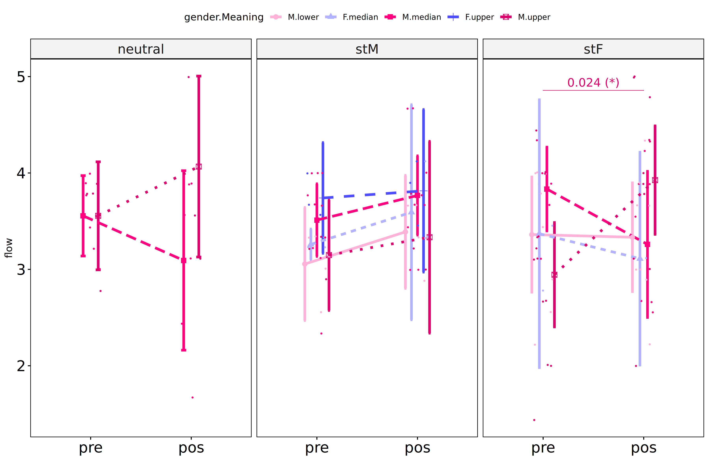

Non-Parametric ANCOVA tests for for assess flow state based on
environment and gender
================
Geiser C. Challco <geiser@alumni.usp.br>

- [Setting Initial Variables](#setting-initial-variables)
- [Descriptive Statistics of Initial
  Data](#descriptive-statistics-of-initial-data)
- [One-way factor analysis for: *dv ~
  env*](#one-way-factor-analysis-for-dv--env)
  - [Pre-test and Post-test PairWise comparisons for: *flow ~
    env*](#pre-test-and-post-test-pairwise-comparisons-for-flow--env)
  - [Kruskal and Wilcoxon PairWise comparisons for: *flow ~
    env*](#kruskal-and-wilcoxon-pairwise-comparisons-for-flow--env)
- [Two-way factor analysis for: *dv ~
  env:gender*](#two-way-factor-analysis-for-dv--envgender)
  - [Pre-test and Post-test PairWise comparisons for: *flow ~
    env:gender*](#pre-test-and-post-test-pairwise-comparisons-for-flow--envgender)
  - [Scheirer and Wilcoxon PairWise comparisons for: *flow ~
    env:gender*](#scheirer-and-wilcoxon-pairwise-comparisons-for-flow--envgender)
- [Two-way factor analysis for: *dv ~
  env:gender.Meaning*](#two-way-factor-analysis-for-dv--envgendermeaning)
  - [Pre-test and Post-test PairWise comparisons for: *flow ~
    env:gender.Meaning*](#pre-test-and-post-test-pairwise-comparisons-for-flow--envgendermeaning)
  - [Scheirer and Wilcoxon PairWise comparisons for: *flow ~
    env:gender.Meaning*](#scheirer-and-wilcoxon-pairwise-comparisons-for-flow--envgendermeaning)
- [Two-way factor analysis for: *dv ~
  env:gender.Presence*](#two-way-factor-analysis-for-dv--envgenderpresence)
  - [Pre-test and Post-test PairWise comparisons for: *flow ~
    env:gender.Presence*](#pre-test-and-post-test-pairwise-comparisons-for-flow--envgenderpresence)
  - [Scheirer and Wilcoxon PairWise comparisons for: *flow ~
    env:gender.Presence*](#scheirer-and-wilcoxon-pairwise-comparisons-for-flow--envgenderpresence)
- [Two-way factor analysis for: *dv ~
  env:gender.Search*](#two-way-factor-analysis-for-dv--envgendersearch)
  - [Pre-test and Post-test PairWise comparisons for: *flow ~
    env:gender.Search*](#pre-test-and-post-test-pairwise-comparisons-for-flow--envgendersearch)
  - [Scheirer and Wilcoxon PairWise comparisons for: *flow ~
    env:gender.Search*](#scheirer-and-wilcoxon-pairwise-comparisons-for-flow--envgendersearch)

# Setting Initial Variables

``` r
dv = "flow"
dv.pos = "fss"
dv.pre = "dfs"
dv.dif = "dif.flow"

fatores2 <- c("gender","gender.Meaning","gender.Presence","gender.Search")
lfatores2 <- as.list(fatores2)
names(lfatores2) <- fatores2

fatores1 <- c("env", fatores2)
lfatores1 <- as.list(fatores1)
names(lfatores1) <- fatores1

lfatores <- c(lfatores1)

color <- list()
color[["prepost"]] = c("#ffee65","#f28e2B")
color[["env"]] = c("#a2b6c3","#1054b1","#fc2c8c")
color[["cond"]] = c("#aa8882","#fd7f6f","#42ae20")
color[["gender"]] = c("#FF007F","#4D4DFF")
color[["Meaning"]] = c("#c4ab34","#17cbe1","#f88208")
color[["Presence"]] = c("#c4ab34","#17cbe1","#f88208")
color[["Search"]] = c("#c4ab34","#17cbe1","#f88208")

color[["gender.Meaning"]] = c("#feb1d8","#b1b1fe","#FF007F","#4D4DFF","#dc006d","#3737ff")
color[["gender.Presence"]] = c("#feb1d8","#b1b1fe","#FF007F","#4D4DFF","#dc006d","#3737ff")
color[["gender.Search"]] = c("#feb1d8","#b1b1fe","#FF007F","#4D4DFF","#dc006d","#3737ff")


level <- list()
level[["env"]] = c("neutral","stM","stF")
level[["cond"]] = c("neutral","stThreat","stBoost")
level[["gender"]] = c("F","M")
level[["Meaning"]] = c("lower","median","upper")
level[["Presence"]] = c("lower","median","upper")
level[["Search"]] = c("lower","median","upper")

level[["gender.Meaning"]] = c("F.lower","M.lower","F.median","M.median","F.upper","M.upper")
level[["gender.Presence"]] = c("F.lower","M.lower","F.median","M.median","F.upper","M.upper")
level[["gender.Search"]] = c("F.lower","M.lower","F.median","M.median","F.upper","M.upper")


gdat <- read_excel("../data/data.xlsx", sheet = "results")
gdat <- gdat[!is.na(gdat[[dv.pre]]) & !is.na(gdat[[dv.pos]]),]
if (!dv.dif %in% colnames(gdat))
  gdat[[dv.dif]] <- gdat[[dv.pos]] - gdat[[dv.pre]]


dat <- gdat
dat$env <- factor(dat[["env"]], level[["env"]])
for (coln in c(names(lfatores))) {
  if (length(level[[coln]]) > 0)
    plevel = level[[coln]][level[[coln]] %in% unique(dat[[coln]])]
  else
    plevel = unique(dat[[coln]])[!is.na(unique(dat[[coln]]))]
  
  dat[[coln]] <- factor(dat[[coln]], plevel)
}

dat <- dat[,c("userId", names(lfatores), dv.pre, dv.pos, dv.dif)]

dat.long <- rbind(dat, dat)
dat.long$time <- c(rep("pre", nrow(dat)), rep("pos", nrow(dat)))
dat.long$time <- factor(dat.long$time, c("pre","pos"))
dat.long[[dv]] <- c(dat[[dv.pre]], dat[[dv.pos]])


for (f in c("env", names(lfatores))) {
  if (is.null(color[[f]]) && length(unique(dat[[f]])) > 0) 
      color[[f]] <- distinctColorPalette(length(unique(dat[[f]])))
}

for (f in c(fatores2)) {
  if (is.null(color[[paste0("env:",f)]]) && length(unique(dat[[f]])) > 0)
    color[[paste0("env:",f)]] <- distinctColorPalette(
      length(unique(dat[["env"]]))*length(unique(dat[[f]])))
}

ldat <- list()
laov <- list()
lpwc <- list()
lemms <- list()
```

# Descriptive Statistics of Initial Data

``` r
df <- get.descriptives(dat, c(dv.pre, dv.pos, dv.dif), c("env"),
                       symmetry.test = T, normality.test = F)
df <- plyr::rbind.fill(
  df, do.call(plyr::rbind.fill, lapply(lfatores2, FUN = function(f) {
    if (nrow(dat) > 0 && sum(!is.na(unique(dat[[f]]))) > 1)
      get.descriptives(dat, c(dv.pre,dv.pos), c("env", f), include.global = F,
                       symmetry.test = T, normality.test = F)
    }))
)
```

    ## Warning: There were 3 warnings in `mutate()`.
    ## The first warning was:
    ## ℹ In argument: `ci = abs(stats::qt(alpha/2, .data$n - 1) * .data$se)`.
    ## Caused by warning:
    ## ! There was 1 warning in `mutate()`.
    ## ℹ In argument: `ci = abs(stats::qt(alpha/2, .data$n - 1) * .data$se)`.
    ## Caused by warning in `stats::qt()`:
    ## ! NaNs produced
    ## ℹ Run `dplyr::last_dplyr_warnings()` to see the 2 remaining warnings.
    ## There were 3 warnings in `mutate()`.
    ## The first warning was:
    ## ℹ In argument: `ci = abs(stats::qt(alpha/2, .data$n - 1) * .data$se)`.
    ## Caused by warning:
    ## ! There was 1 warning in `mutate()`.
    ## ℹ In argument: `ci = abs(stats::qt(alpha/2, .data$n - 1) * .data$se)`.
    ## Caused by warning in `stats::qt()`:
    ## ! NaNs produced
    ## ℹ Run `dplyr::last_dplyr_warnings()` to see the 2 remaining warnings.

    ## Warning: There were 4 warnings in `mutate()`.
    ## The first warning was:
    ## ℹ In argument: `ci = abs(stats::qt(alpha/2, .data$n - 1) * .data$se)`.
    ## Caused by warning:
    ## ! There was 1 warning in `mutate()`.
    ## ℹ In argument: `ci = abs(stats::qt(alpha/2, .data$n - 1) * .data$se)`.
    ## Caused by warning in `stats::qt()`:
    ## ! NaNs produced
    ## ℹ Run `dplyr::last_dplyr_warnings()` to see the 3 remaining warnings.
    ## There were 4 warnings in `mutate()`.
    ## The first warning was:
    ## ℹ In argument: `ci = abs(stats::qt(alpha/2, .data$n - 1) * .data$se)`.
    ## Caused by warning:
    ## ! There was 1 warning in `mutate()`.
    ## ℹ In argument: `ci = abs(stats::qt(alpha/2, .data$n - 1) * .data$se)`.
    ## Caused by warning in `stats::qt()`:
    ## ! NaNs produced
    ## ℹ Run `dplyr::last_dplyr_warnings()` to see the 3 remaining warnings.

    ## Warning: There were 5 warnings in `mutate()`.
    ## The first warning was:
    ## ℹ In argument: `ci = abs(stats::qt(alpha/2, .data$n - 1) * .data$se)`.
    ## Caused by warning:
    ## ! There was 1 warning in `mutate()`.
    ## ℹ In argument: `ci = abs(stats::qt(alpha/2, .data$n - 1) * .data$se)`.
    ## Caused by warning in `stats::qt()`:
    ## ! NaNs produced
    ## ℹ Run `dplyr::last_dplyr_warnings()` to see the 4 remaining warnings.
    ## There were 5 warnings in `mutate()`.
    ## The first warning was:
    ## ℹ In argument: `ci = abs(stats::qt(alpha/2, .data$n - 1) * .data$se)`.
    ## Caused by warning:
    ## ! There was 1 warning in `mutate()`.
    ## ℹ In argument: `ci = abs(stats::qt(alpha/2, .data$n - 1) * .data$se)`.
    ## Caused by warning in `stats::qt()`:
    ## ! NaNs produced
    ## ℹ Run `dplyr::last_dplyr_warnings()` to see the 4 remaining warnings.

``` r
df <- df[,c("variable",fatores1[fatores1 %in% colnames(df)],
            colnames(df)[!colnames(df) %in% c(fatores1,"variable")])]
```

| variable | env | gender | gender.Meaning | gender.Presence | gender.Search | n | mean | median | min | max | sd | se | ci | iqr | symmetry | skewness | kurtosis |
|:---|:---|:---|:---|:---|:---|---:|---:|---:|---:|---:|---:|---:|---:|---:|:---|---:|---:|
| dfs | neutral |  |  |  |  | 17 | 3.523 | 3.667 | 2.778 | 4.000 | 0.344 | 0.083 | 0.177 | 0.556 | NO | -0.5483789 | -0.8603284 |
| dfs | stM |  |  |  |  | 25 | 3.329 | 3.333 | 2.333 | 4.000 | 0.464 | 0.093 | 0.192 | 0.556 | YES | -0.2822876 | -0.6912911 |
| dfs | stF |  |  |  |  | 30 | 3.296 | 3.389 | 1.444 | 4.444 | 0.752 | 0.137 | 0.281 | 1.167 | NO | -0.6091242 | -0.4765186 |
| fss | neutral |  |  |  |  | 17 | 3.497 | 3.667 | 1.667 | 5.000 | 0.903 | 0.219 | 0.464 | 0.889 | NO | -0.6583444 | -0.3027827 |
| fss | stM |  |  |  |  | 25 | 3.631 | 3.667 | 2.889 | 4.667 | 0.462 | 0.092 | 0.191 | 0.444 | YES | 0.4841192 | -0.1413067 |
| fss | stF |  |  |  |  | 30 | 3.522 | 3.611 | 2.000 | 5.000 | 0.793 | 0.145 | 0.296 | 0.972 | YES | 0.0826367 | -0.9032674 |
| dif.flow | neutral |  |  |  |  | 17 | -0.026 | 0.333 | -2.111 | 1.778 | 1.013 | 0.246 | 0.521 | 1.000 | NO | -0.5185327 | -0.2762499 |
| dif.flow | stM |  |  |  |  | 25 | 0.302 | 0.333 | -0.333 | 1.111 | 0.406 | 0.081 | 0.168 | 0.778 | YES | 0.0189865 | -1.2657772 |
| dif.flow | stF |  |  |  |  | 30 | 0.226 | 0.056 | -1.333 | 3.000 | 1.122 | 0.205 | 0.419 | 0.944 | NO | 0.9547081 | 0.5390779 |
| dfs | neutral | F |  |  |  | 4 | 3.361 | 3.278 | 3.222 | 3.667 | 0.210 | 0.105 | 0.335 | 0.194 | few data | 0.0000000 | 0.0000000 |
| dfs | neutral | M |  |  |  | 13 | 3.573 | 3.667 | 2.778 | 4.000 | 0.368 | 0.102 | 0.222 | 0.333 | NO | -0.8734891 | -0.5656898 |
| dfs | stM | F |  |  |  | 8 | 3.306 | 3.278 | 2.556 | 4.000 | 0.451 | 0.160 | 0.377 | 0.444 | YES | -0.1328829 | -1.1921918 |
| dfs | stM | M |  |  |  | 17 | 3.340 | 3.333 | 2.333 | 4.000 | 0.483 | 0.117 | 0.249 | 0.556 | YES | -0.3287676 | -0.7478956 |
| dfs | stF | F |  |  |  | 4 | 3.417 | 3.500 | 2.778 | 3.889 | 0.466 | 0.233 | 0.741 | 0.361 | YES | -0.3776382 | -1.8502996 |
| dfs | stF | M |  |  |  | 26 | 3.278 | 3.333 | 1.444 | 4.444 | 0.791 | 0.155 | 0.320 | 1.278 | NO | -0.5411179 | -0.7065930 |
| fss | neutral | F |  |  |  | 4 | 3.139 | 3.444 | 1.667 | 4.000 | 1.032 | 0.516 | 1.642 | 0.917 | NO | -0.5471599 | -1.8258239 |
| fss | neutral | M |  |  |  | 13 | 3.607 | 3.889 | 1.667 | 5.000 | 0.874 | 0.243 | 0.528 | 0.889 | NO | -0.6057445 | -0.2610146 |
| fss | stM | F |  |  |  | 8 | 3.694 | 3.667 | 3.333 | 4.111 | 0.318 | 0.113 | 0.266 | 0.528 | YES | 0.1632678 | -1.7890678 |
| fss | stM | M |  |  |  | 17 | 3.601 | 3.667 | 2.889 | 4.667 | 0.523 | 0.127 | 0.269 | 0.556 | NO | 0.5798494 | -0.4150355 |
| fss | stF | F |  |  |  | 4 | 3.083 | 3.056 | 2.667 | 3.556 | 0.367 | 0.184 | 0.584 | 0.306 | YES | 0.1637483 | -1.9000750 |
| fss | stF | M |  |  |  | 26 | 3.590 | 3.722 | 2.000 | 5.000 | 0.824 | 0.162 | 0.333 | 1.167 | YES | -0.0941268 | -0.9786911 |
| dfs | neutral |  | F.lower |  |  | 1 | 3.667 | 3.667 | 3.667 | 3.667 |  |  |  | 0.000 | few data | 0.0000000 | 0.0000000 |
| dfs | neutral |  | M.lower |  |  | 2 | 3.667 | 3.667 | 3.667 | 3.667 | 0.000 | 0.000 | 0.000 | 0.000 | few data | 0.0000000 | 0.0000000 |
| dfs | neutral |  | F.median |  |  | 1 | 3.222 | 3.222 | 3.222 | 3.222 |  |  |  | 0.000 | few data | 0.0000000 | 0.0000000 |
| dfs | neutral |  | M.median |  |  | 6 | 3.556 | 3.611 | 3.000 | 4.000 | 0.398 | 0.162 | 0.417 | 0.583 | YES | -0.1965294 | -1.9217122 |
| dfs | neutral |  | F.upper |  |  | 2 | 3.278 | 3.278 | 3.222 | 3.333 | 0.079 | 0.056 | 0.706 | 0.056 | few data | 0.0000000 | 0.0000000 |
| dfs | neutral |  | M.upper |  |  | 5 | 3.556 | 3.778 | 2.778 | 3.889 | 0.451 | 0.202 | 0.560 | 0.222 | NO | -0.8952108 | -1.1531680 |
| dfs | stM |  | F.lower |  |  | 2 | 2.722 | 2.722 | 2.556 | 2.889 | 0.236 | 0.167 | 2.118 | 0.167 | few data | 0.0000000 | 0.0000000 |
| dfs | stM |  | M.lower |  |  | 4 | 3.056 | 3.167 | 2.556 | 3.333 | 0.369 | 0.184 | 0.586 | 0.444 | few data | 0.0000000 | 0.0000000 |
| dfs | stM |  | F.median |  |  | 3 | 3.259 | 3.222 | 3.222 | 3.333 | 0.064 | 0.037 | 0.159 | 0.056 | few data | 0.0000000 | 0.0000000 |
| dfs | stM |  | M.median |  |  | 10 | 3.511 | 3.667 | 2.333 | 4.000 | 0.527 | 0.167 | 0.377 | 0.694 | NO | -0.9231131 | -0.2298035 |
| dfs | stM |  | F.upper |  |  | 3 | 3.741 | 3.667 | 3.556 | 4.000 | 0.231 | 0.134 | 0.575 | 0.222 | few data | 0.0000000 | 0.0000000 |
| dfs | stM |  | M.upper |  |  | 3 | 3.148 | 3.222 | 2.889 | 3.333 | 0.231 | 0.134 | 0.575 | 0.222 | few data | 0.0000000 | 0.0000000 |
| dfs | stF |  | F.lower |  |  | 1 | 3.556 | 3.556 | 3.556 | 3.556 |  |  |  | 0.000 | few data | 0.0000000 | 0.0000000 |
| dfs | stF |  | M.lower |  |  | 8 | 3.361 | 3.611 | 2.222 | 4.000 | 0.715 | 0.253 | 0.597 | 1.194 | YES | -0.4282741 | -1.7134209 |
| dfs | stF |  | F.median |  |  | 3 | 3.370 | 3.444 | 2.778 | 3.889 | 0.559 | 0.323 | 1.389 | 0.556 | few data | 0.0000000 | 0.0000000 |
| dfs | stF |  | M.median |  |  | 6 | 3.833 | 3.944 | 3.111 | 4.333 | 0.414 | 0.169 | 0.435 | 0.278 | NO | -0.5788940 | -1.0932880 |
| dfs | stF |  | M.upper |  |  | 12 | 2.944 | 3.111 | 1.444 | 4.444 | 0.852 | 0.246 | 0.541 | 0.833 | YES | -0.0543124 | -0.9418796 |
| fss | neutral |  | F.lower |  |  | 1 | 1.667 | 1.667 | 1.667 | 1.667 |  |  |  | 0.000 | few data | 0.0000000 | 0.0000000 |
| fss | neutral |  | M.lower |  |  | 2 | 4.000 | 4.000 | 4.000 | 4.000 | 0.000 | 0.000 | 0.000 | 0.000 | few data | 0.0000000 | 0.0000000 |
| fss | neutral |  | F.median |  |  | 1 | 3.222 | 3.222 | 3.222 | 3.222 |  |  |  | 0.000 | few data | 0.0000000 | 0.0000000 |
| fss | neutral |  | M.median |  |  | 6 | 3.093 | 3.333 | 1.667 | 3.889 | 0.887 | 0.362 | 0.931 | 1.194 | YES | -0.4921275 | -1.6121527 |
| fss | neutral |  | F.upper |  |  | 2 | 3.833 | 3.833 | 3.667 | 4.000 | 0.236 | 0.167 | 2.118 | 0.167 | few data | 0.0000000 | 0.0000000 |
| fss | neutral |  | M.upper |  |  | 5 | 4.067 | 4.111 | 3.111 | 5.000 | 0.756 | 0.338 | 0.939 | 1.000 | YES | -0.0351951 | -1.9484136 |
| fss | stM |  | F.lower |  |  | 2 | 3.667 | 3.667 | 3.667 | 3.667 | 0.000 | 0.000 | 0.000 | 0.000 | few data | 0.0000000 | 0.0000000 |
| fss | stM |  | M.lower |  |  | 4 | 3.389 | 3.500 | 2.889 | 3.667 | 0.369 | 0.184 | 0.586 | 0.444 | few data | 0.0000000 | 0.0000000 |
| fss | stM |  | F.median |  |  | 3 | 3.593 | 3.333 | 3.333 | 4.111 | 0.449 | 0.259 | 1.116 | 0.389 | few data | 0.0000000 | 0.0000000 |
| fss | stM |  | M.median |  |  | 10 | 3.767 | 3.722 | 3.000 | 4.667 | 0.575 | 0.182 | 0.411 | 0.444 | YES | 0.2811063 | -1.1528125 |
| fss | stM |  | F.upper |  |  | 3 | 3.815 | 3.889 | 3.444 | 4.111 | 0.339 | 0.196 | 0.843 | 0.333 | few data | 0.0000000 | 0.0000000 |
| fss | stM |  | M.upper |  |  | 3 | 3.333 | 3.222 | 3.000 | 3.778 | 0.401 | 0.231 | 0.995 | 0.389 | few data | 0.0000000 | 0.0000000 |
| fss | stF |  | F.lower |  |  | 1 | 3.000 | 3.000 | 3.000 | 3.000 |  |  |  | 0.000 | few data | 0.0000000 | 0.0000000 |
| fss | stF |  | M.lower |  |  | 8 | 3.333 | 3.333 | 2.222 | 4.333 | 0.675 | 0.238 | 0.564 | 0.750 | YES | -0.1173132 | -1.3652312 |
| fss | stF |  | F.median |  |  | 3 | 3.111 | 3.111 | 2.667 | 3.556 | 0.444 | 0.257 | 1.104 | 0.444 | few data | 0.0000000 | 0.0000000 |
| fss | stF |  | M.median |  |  | 6 | 3.259 | 3.111 | 2.556 | 4.222 | 0.722 | 0.295 | 0.758 | 1.139 | YES | 0.1785892 | -2.0716853 |
| fss | stF |  | M.upper |  |  | 12 | 3.926 | 3.944 | 2.000 | 5.000 | 0.886 | 0.256 | 0.563 | 0.833 | NO | -0.6300483 | -0.5363632 |
| dfs | neutral |  |  | F.lower |  | 2 | 3.444 | 3.444 | 3.222 | 3.667 | 0.314 | 0.222 | 2.824 | 0.222 | few data | 0.0000000 | 0.0000000 |
| dfs | neutral |  |  | M.lower |  | 2 | 3.667 | 3.667 | 3.667 | 3.667 | 0.000 | 0.000 | 0.000 | 0.000 | few data | 0.0000000 | 0.0000000 |
| dfs | neutral |  |  | F.median |  | 1 | 3.222 | 3.222 | 3.222 | 3.222 |  |  |  | 0.000 | few data | 0.0000000 | 0.0000000 |
| dfs | neutral |  |  | M.median |  | 7 | 3.381 | 3.444 | 2.778 | 3.889 | 0.405 | 0.153 | 0.375 | 0.556 | YES | -0.1712214 | -1.6917681 |
| dfs | neutral |  |  | F.upper |  | 1 | 3.333 | 3.333 | 3.333 | 3.333 |  |  |  | 0.000 | few data | 0.0000000 | 0.0000000 |
| dfs | neutral |  |  | M.upper |  | 4 | 3.861 | 3.833 | 3.778 | 4.000 | 0.106 | 0.053 | 0.169 | 0.139 | few data | 0.0000000 | 0.0000000 |
| dfs | stM |  |  | F.lower |  | 2 | 2.722 | 2.722 | 2.556 | 2.889 | 0.236 | 0.167 | 2.118 | 0.167 | few data | 0.0000000 | 0.0000000 |
| dfs | stM |  |  | M.lower |  | 5 | 3.178 | 3.333 | 2.556 | 3.778 | 0.469 | 0.210 | 0.582 | 0.444 | YES | -0.0805345 | -1.8087767 |
| dfs | stM |  |  | F.median |  | 3 | 3.370 | 3.222 | 3.222 | 3.667 | 0.257 | 0.148 | 0.637 | 0.222 | few data | 0.0000000 | 0.0000000 |
| dfs | stM |  |  | M.median |  | 8 | 3.500 | 3.667 | 2.333 | 4.000 | 0.585 | 0.207 | 0.489 | 0.806 | NO | -0.8019187 | -0.7892161 |
| dfs | stM |  |  | F.upper |  | 3 | 3.630 | 3.556 | 3.333 | 4.000 | 0.339 | 0.196 | 0.843 | 0.333 | few data | 0.0000000 | 0.0000000 |
| dfs | stM |  |  | M.upper |  | 4 | 3.222 | 3.278 | 3.000 | 3.333 | 0.157 | 0.079 | 0.250 | 0.167 | few data | 0.0000000 | 0.0000000 |
| dfs | stF |  |  | F.lower |  | 1 | 3.556 | 3.556 | 3.556 | 3.556 |  |  |  | 0.000 | few data | 0.0000000 | 0.0000000 |
| dfs | stF |  |  | M.lower |  | 6 | 2.704 | 2.722 | 1.444 | 4.000 | 0.863 | 0.352 | 0.905 | 0.750 | YES | 0.0364940 | -1.3678530 |
| dfs | stF |  |  | F.median |  | 1 | 3.889 | 3.889 | 3.889 | 3.889 |  |  |  | 0.000 | few data | 0.0000000 | 0.0000000 |
| dfs | stF |  |  | M.median |  | 10 | 3.656 | 3.833 | 2.667 | 4.000 | 0.455 | 0.144 | 0.325 | 0.500 | NO | -1.0191877 | -0.4195972 |
| dfs | stF |  |  | F.upper |  | 2 | 3.111 | 3.111 | 2.778 | 3.444 | 0.471 | 0.333 | 4.235 | 0.333 | few data | 0.0000000 | 0.0000000 |
| dfs | stF |  |  | M.upper |  | 10 | 3.244 | 3.278 | 2.000 | 4.444 | 0.860 | 0.272 | 0.615 | 1.056 | YES | -0.0938821 | -1.4095571 |
| fss | neutral |  |  | F.lower |  | 2 | 2.444 | 2.444 | 1.667 | 3.222 | 1.100 | 0.778 | 9.883 | 0.778 | few data | 0.0000000 | 0.0000000 |
| fss | neutral |  |  | M.lower |  | 2 | 4.000 | 4.000 | 4.000 | 4.000 | 0.000 | 0.000 | 0.000 | 0.000 | few data | 0.0000000 | 0.0000000 |
| fss | neutral |  |  | F.median |  | 1 | 4.000 | 4.000 | 4.000 | 4.000 |  |  |  | 0.000 | few data | 0.0000000 | 0.0000000 |
| fss | neutral |  |  | M.median |  | 7 | 3.714 | 3.889 | 2.444 | 4.556 | 0.657 | 0.248 | 0.608 | 0.444 | NO | -0.6990639 | -0.5994072 |
| fss | neutral |  |  | F.upper |  | 1 | 3.667 | 3.667 | 3.667 | 3.667 |  |  |  | 0.000 | few data | 0.0000000 | 0.0000000 |
| fss | neutral |  |  | M.upper |  | 4 | 3.222 | 3.111 | 1.667 | 5.000 | 1.367 | 0.683 | 2.175 | 0.833 | few data | 0.0000000 | 0.0000000 |
| fss | stM |  |  | F.lower |  | 2 | 3.667 | 3.667 | 3.667 | 3.667 | 0.000 | 0.000 | 0.000 | 0.000 | few data | 0.0000000 | 0.0000000 |
| fss | stM |  |  | M.lower |  | 5 | 3.578 | 3.667 | 3.222 | 4.000 | 0.308 | 0.138 | 0.383 | 0.333 | YES | 0.1168177 | -1.8611368 |
| fss | stM |  |  | F.median |  | 3 | 3.370 | 3.333 | 3.333 | 3.444 | 0.064 | 0.037 | 0.159 | 0.056 | few data | 0.0000000 | 0.0000000 |
| fss | stM |  |  | M.median |  | 8 | 3.833 | 3.722 | 3.000 | 4.667 | 0.573 | 0.202 | 0.479 | 0.389 | YES | 0.3394928 | -1.2910868 |
| fss | stM |  |  | F.upper |  | 3 | 4.037 | 4.111 | 3.889 | 4.111 | 0.128 | 0.074 | 0.319 | 0.111 | few data | 0.0000000 | 0.0000000 |
| fss | stM |  |  | M.upper |  | 4 | 3.167 | 3.000 | 2.889 | 3.778 | 0.411 | 0.205 | 0.654 | 0.222 | few data | 0.0000000 | 0.0000000 |
| fss | stF |  |  | F.lower |  | 1 | 3.000 | 3.000 | 3.000 | 3.000 |  |  |  | 0.000 | few data | 0.0000000 | 0.0000000 |
| fss | stF |  |  | M.lower |  | 6 | 2.889 | 2.833 | 2.222 | 3.889 | 0.571 | 0.233 | 0.599 | 0.417 | NO | 0.5897719 | -1.0974518 |
| fss | stF |  |  | F.median |  | 1 | 2.667 | 2.667 | 2.667 | 2.667 |  |  |  | 0.000 | few data | 0.0000000 | 0.0000000 |
| fss | stF |  |  | M.median |  | 10 | 3.511 | 3.667 | 2.667 | 4.000 | 0.481 | 0.152 | 0.344 | 0.750 | NO | -0.6218137 | -1.4145267 |
| fss | stF |  |  | F.upper |  | 2 | 3.333 | 3.333 | 3.111 | 3.556 | 0.314 | 0.222 | 2.824 | 0.222 | few data | 0.0000000 | 0.0000000 |
| fss | stF |  |  | M.upper |  | 10 | 4.089 | 4.333 | 2.000 | 5.000 | 0.928 | 0.293 | 0.664 | 0.778 | NO | -1.0257890 | -0.0886632 |
| dfs | neutral |  |  |  | F.lower | 3 | 3.407 | 3.333 | 3.222 | 3.667 | 0.231 | 0.134 | 0.575 | 0.222 | few data | 0.0000000 | 0.0000000 |
| dfs | neutral |  |  |  | M.lower | 5 | 3.311 | 3.444 | 2.778 | 3.667 | 0.404 | 0.181 | 0.501 | 0.667 | YES | -0.2722383 | -2.0770248 |
| dfs | neutral |  |  |  | F.median | 1 | 3.222 | 3.222 | 3.222 | 3.222 |  |  |  | 0.000 | few data | 0.0000000 | 0.0000000 |
| dfs | neutral |  |  |  | M.median | 3 | 3.741 | 3.778 | 3.556 | 3.889 | 0.170 | 0.098 | 0.422 | 0.167 | few data | 0.0000000 | 0.0000000 |
| dfs | neutral |  |  |  | M.upper | 5 | 3.733 | 3.778 | 3.222 | 4.000 | 0.300 | 0.134 | 0.373 | 0.111 | NO | -0.8177042 | -1.1804616 |
| dfs | stM |  |  |  | F.lower | 1 | 2.889 | 2.889 | 2.889 | 2.889 |  |  |  | 0.000 | few data | 0.0000000 | 0.0000000 |
| dfs | stM |  |  |  | M.lower | 1 | 3.222 | 3.222 | 3.222 | 3.222 |  |  |  | 0.000 | few data | 0.0000000 | 0.0000000 |
| dfs | stM |  |  |  | F.median | 4 | 3.278 | 3.444 | 2.556 | 3.667 | 0.501 | 0.251 | 0.797 | 0.444 | NO | -0.5889533 | -1.8062181 |
| dfs | stM |  |  |  | M.median | 12 | 3.250 | 3.333 | 2.333 | 4.000 | 0.499 | 0.144 | 0.317 | 0.694 | YES | -0.3045227 | -1.1057189 |
| dfs | stM |  |  |  | F.upper | 3 | 3.481 | 3.222 | 3.222 | 4.000 | 0.449 | 0.259 | 1.116 | 0.389 | few data | 0.0000000 | 0.0000000 |
| dfs | stM |  |  |  | M.upper | 4 | 3.639 | 3.667 | 3.222 | 4.000 | 0.419 | 0.210 | 0.667 | 0.694 | few data | 0.0000000 | 0.0000000 |
| dfs | stF |  |  |  | F.lower | 2 | 3.722 | 3.722 | 3.556 | 3.889 | 0.236 | 0.167 | 2.118 | 0.167 | few data | 0.0000000 | 0.0000000 |
| dfs | stF |  |  |  | M.lower | 7 | 3.238 | 3.111 | 2.222 | 4.444 | 0.768 | 0.290 | 0.711 | 0.889 | YES | 0.2895553 | -1.5067117 |
| dfs | stF |  |  |  | F.median | 1 | 2.778 | 2.778 | 2.778 | 2.778 |  |  |  | 0.000 | few data | 0.0000000 | 0.0000000 |
| dfs | stF |  |  |  | M.median | 13 | 3.444 | 3.778 | 1.444 | 4.000 | 0.780 | 0.216 | 0.472 | 0.667 | NO | -1.3239866 | 0.6332247 |
| dfs | stF |  |  |  | F.upper | 1 | 3.444 | 3.444 | 3.444 | 3.444 |  |  |  | 0.000 | few data | 0.0000000 | 0.0000000 |
| dfs | stF |  |  |  | M.upper | 6 | 2.963 | 3.111 | 2.000 | 4.333 | 0.877 | 0.358 | 0.920 | 0.917 | YES | 0.2006600 | -1.5187909 |
| fss | neutral |  |  |  | F.lower | 3 | 2.852 | 3.222 | 1.667 | 3.667 | 1.050 | 0.606 | 2.609 | 1.000 | few data | 0.0000000 | 0.0000000 |
| fss | neutral |  |  |  | M.lower | 5 | 3.778 | 4.000 | 2.444 | 4.556 | 0.790 | 0.353 | 0.980 | 0.111 | NO | -0.7623932 | -1.1829232 |
| fss | neutral |  |  |  | F.median | 1 | 4.000 | 4.000 | 4.000 | 4.000 |  |  |  | 0.000 | few data | 0.0000000 | 0.0000000 |
| fss | neutral |  |  |  | M.median | 3 | 3.852 | 3.889 | 3.556 | 4.111 | 0.280 | 0.161 | 0.695 | 0.278 | few data | 0.0000000 | 0.0000000 |
| fss | neutral |  |  |  | M.upper | 5 | 3.289 | 3.111 | 1.667 | 5.000 | 1.193 | 0.534 | 1.481 | 0.444 | YES | 0.0881633 | -1.4695705 |
| fss | stM |  |  |  | F.lower | 1 | 3.667 | 3.667 | 3.667 | 3.667 |  |  |  | 0.000 | few data | 0.0000000 | 0.0000000 |
| fss | stM |  |  |  | M.lower | 1 | 3.778 | 3.778 | 3.778 | 3.778 |  |  |  | 0.000 | few data | 0.0000000 | 0.0000000 |
| fss | stM |  |  |  | F.median | 4 | 3.833 | 3.889 | 3.444 | 4.111 | 0.333 | 0.167 | 0.530 | 0.500 | few data | 0.0000000 | 0.0000000 |
| fss | stM |  |  |  | M.median | 12 | 3.444 | 3.556 | 2.889 | 4.000 | 0.355 | 0.102 | 0.225 | 0.500 | YES | -0.2000669 | -1.4534173 |
| fss | stM |  |  |  | F.upper | 3 | 3.519 | 3.333 | 3.333 | 3.889 | 0.321 | 0.185 | 0.797 | 0.278 | few data | 0.0000000 | 0.0000000 |
| fss | stM |  |  |  | M.upper | 4 | 4.028 | 4.222 | 3.000 | 4.667 | 0.803 | 0.402 | 1.278 | 1.083 | few data | 0.0000000 | 0.0000000 |
| fss | stF |  |  |  | F.lower | 2 | 2.833 | 2.833 | 2.667 | 3.000 | 0.236 | 0.167 | 2.118 | 0.167 | few data | 0.0000000 | 0.0000000 |
| fss | stF |  |  |  | M.lower | 7 | 3.429 | 3.111 | 2.222 | 4.778 | 0.928 | 0.351 | 0.859 | 1.278 | YES | 0.1759848 | -1.7445971 |
| fss | stF |  |  |  | F.median | 1 | 3.111 | 3.111 | 3.111 | 3.111 |  |  |  | 0.000 | few data | 0.0000000 | 0.0000000 |
| fss | stF |  |  |  | M.median | 13 | 3.556 | 3.667 | 2.667 | 4.333 | 0.505 | 0.140 | 0.305 | 0.889 | YES | -0.3929997 | -1.2782358 |
| fss | stF |  |  |  | F.upper | 1 | 3.556 | 3.556 | 3.556 | 3.556 |  |  |  | 0.000 | few data | 0.0000000 | 0.0000000 |
| fss | stF |  |  |  | M.upper | 6 | 3.852 | 4.278 | 2.000 | 5.000 | 1.274 | 0.520 | 1.337 | 1.861 | YES | -0.4303757 | -1.8527991 |

# One-way factor analysis for: *dv ~ env*

``` r
pdat = remove_group_data(dat[!is.na(dat[["env"]]),], "dif.flow", "env", n.limit = 3)

pdat.long <- rbind(pdat[,c("userId","env")], pdat[,c("userId","env")])
pdat.long[["time"]] <- c(rep("pre", nrow(pdat)), rep("pos", nrow(pdat)))
pdat.long[["time"]] <- factor(pdat.long[["time"]], c("pre","pos"))
pdat.long[["flow"]] <- c(pdat[["dfs"]], pdat[["fss"]])

y.position.min <- abs(
  max(pdat.long[["flow"]])
  - min(pdat.long[["flow"]]))/20

lvars = as.list(c("dif.flow","fss","dfs"))
names(lvars) = unlist(lvars)
```

## Pre-test and Post-test PairWise comparisons for: *flow ~ env*

``` r
pwc.long <- group_by(pdat.long, env) %>%
  pairwise_wilcox_test(flow ~ time, detailed = T)

df <- pwc.long[,c(".y.","env","group1","group2","n1","n2","estimate",
                  "statistic","p.adj","p.adj.signif")]
```

| .y.  | env     | group1 | group2 |  n1 |  n2 |   estimate | statistic | p.adj | p.adj.signif |
|:-----|:--------|:-------|:-------|----:|----:|-----------:|----------:|------:|:-------------|
| flow | neutral | pre    | pos    |  17 |  17 | -0.1111503 |     126.5 | 0.545 | ns           |
| flow | stM     | pre    | pos    |  25 |  25 | -0.3332694 |     206.5 | 0.039 | \*           |
| flow | stF     | pre    | pos    |  30 |  30 | -0.2222205 |     402.5 | 0.486 | ns           |

``` r
stat.test <- pwc.long %>% add_xy_position(x = "time", fun = "max")
stat.test$y.position <- stat.test$y.position + y.position.min

gg <- ggline(
  pdat.long, x = "time", y = "flow", size = 1.5,
  facet.by = "env", add = c("mean_ci"), color = "env",
  position = position_dodge(width = 0.3), palette = color[["env"]])

pdat.long$xj = jitter(as.numeric(pdat.long[["time"]]), amount=.1)
pdat.long$yj = jitter(pdat.long[["flow"]], amount = .01)

gg + geom_point(
  data = pdat.long, aes_string(x="xj",y="yj", color = "env"), size=0.5) +
  stat_pvalue_manual(
    stat.test, tip.length = 0, hide.ns = T, label.size = 5,
    position = position_dodge(width = 0.3),
    label = "{ p.adj } ({ p.adj.signif })") + xlab("") +
  theme(strip.text = element_text(size = 16),
        axis.text = element_text(size = 18))
```

    ## Warning: `aes_string()` was deprecated in ggplot2 3.0.0.
    ## ℹ Please use tidy evaluation idioms with `aes()`.
    ## ℹ See also `vignette("ggplot2-in-packages")` for more information.
    ## This warning is displayed once every 8 hours.
    ## Call `lifecycle::last_lifecycle_warnings()` to see where this warning was
    ## generated.

<!-- -->

## Kruskal and Wilcoxon PairWise comparisons for: *flow ~ env*

``` r
kt <- lapply(lvars, FUN = function(x) {
  kruskal_test(pdat, as.formula(paste0(x," ~ env")))  
})

df <- do.call(rbind.fill, lapply(lvars, function(x) {
  add_significance(merge(
    kt[[x]], kruskal_effsize(pdat, as.formula(paste0(x," ~ env"))),
    by = c(".y.","n"), suffixes = c("",".ez")))
}))

df <- df[,c(".y.","n","df","statistic","p","p.signif","effsize","magnitude")]
```

| .y.      |   n |  df | statistic |     p | p.signif |    effsize | magnitude |
|:---------|----:|----:|----------:|------:|:---------|-----------:|:----------|
| dif.flow |  72 |   2 | 1.6110839 | 0.447 | ns       | -0.0056365 | small     |
| fss      |  72 |   2 | 0.2315053 | 0.891 | ns       | -0.0256304 | small     |
| dfs      |  72 |   2 | 1.2276045 | 0.541 | ns       | -0.0111941 | small     |

``` r
pwc <- lapply(lvars, FUN = function(x) {
  pairwise_wilcox_test(pdat, as.formula(paste0(x," ~ env")), detailed = T)  
})

df <- do.call(rbind.fill, pwc)
```

| estimate | .y. | group1 | group2 | n1 | n2 | statistic | p | conf.low | conf.high | method | alternative | p.adj | p.adj.signif |
|---:|:---|:---|:---|---:|---:|---:|---:|---:|---:|:---|:---|---:|:---|
| -0.2222465 | dif.flow | neutral | stM | 17 | 25 | 171.5 | 0.299 | -0.6666532 | 0.2222173 | Wilcoxon | two.sided | 0.813 | ns |
| -0.0000388 | dif.flow | neutral | stF | 17 | 30 | 248.5 | 0.894 | -0.7777510 | 0.4444643 | Wilcoxon | two.sided | 0.894 | ns |
| 0.2222667 | dif.flow | stM | stF | 25 | 30 | 440.5 | 0.271 | -0.1111488 | 0.5555966 | Wilcoxon | two.sided | 0.813 | ns |
| 0.0000281 | fss | neutral | stM | 17 | 25 | 216.0 | 0.938 | -0.4444987 | 0.3334257 | Wilcoxon | two.sided | 1.000 | ns |
| 0.1110839 | fss | neutral | stF | 17 | 30 | 269.5 | 0.756 | -0.4444729 | 0.5555577 | Wilcoxon | two.sided | 1.000 | ns |
| 0.1110526 | fss | stM | stF | 25 | 30 | 402.5 | 0.647 | -0.2222838 | 0.5554799 | Wilcoxon | two.sided | 1.000 | ns |
| 0.2221977 | dfs | neutral | stM | 17 | 25 | 263.5 | 0.193 | -0.1110821 | 0.4444761 | Wilcoxon | two.sided | 0.579 | ns |
| 0.1111299 | dfs | neutral | stF | 17 | 30 | 282.5 | 0.549 | -0.2221919 | 0.5555061 | Wilcoxon | two.sided | 1.000 | ns |
| -0.0000042 | dfs | stM | stF | 25 | 30 | 362.0 | 0.832 | -0.3333552 | 0.3333184 | Wilcoxon | two.sided | 1.000 | ns |

``` r
plots <- lapply(lvars, FUN = function(y) {
  stat.test <- pwc[[y]] %>% add_xy_position(x = "env")
  stat.test$y.position <- stat.test$y.position + y.position.min
  ggboxplot(pdat, x = "env", y = y, fill = "env",
            palette = color[["env"]]) +
    stat_pvalue_manual(stat.test, tip.length = 0, hide.ns = T, label.size = 5,
                       label="{ p.adj } ({ p.adj.signif })") + xlab("")
})
```

``` r
egg::ggarrange(plots[["dfs"]], plots[["fss"]], nrow = 1)
```

<!-- -->

``` r
plots[["dif.flow"]] +
  labs(subtitle = get_test_label(kt[["dif.flow"]], detailed = T),
       caption = get_pwc_label(pwc[["dif.flow"]])) +
  ylab("flow (dif)")  +
  theme(strip.text = element_text(size = 16),
        axis.text = element_text(size = 18))
```

<!-- -->

# Two-way factor analysis for: *dv ~ env:gender*

``` r
pdat = remove_group_data(
  dat[!is.na(dat[["env"]]) & !is.na(dat[["gender"]]),],
  "dif.flow", c("env","gender"), n.limit = 3)

pdat.long <- rbind(pdat[,c("userId","env","gender")],
                   pdat[,c("userId","env","gender")])
pdat.long[["time"]] <- c(rep("pre", nrow(pdat)), rep("pos", nrow(pdat)))
pdat.long[["time"]] <- factor(pdat.long[["time"]], c("pre","pos"))
pdat.long[["flow"]] <- c(pdat[["dfs"]], pdat[["fss"]])

y.position.min <- abs(
  max(pdat.long[["flow"]])
  - min(pdat.long[["flow"]]))/20

lvars = as.list(c("dif.flow","fss","dfs"))
names(lvars) = unlist(lvars)
```

## Pre-test and Post-test PairWise comparisons for: *flow ~ env:gender*

``` r
pwc.long <- group_by(pdat.long, env:gender) %>%
  pairwise_wilcox_test(flow ~ time, detailed = T)

df <- pwc.long[,c(".y.","env:gender","group1","group2","n1","n2","estimate",
                  "statistic","p.adj","p.adj.signif")]
```

| .y.  | env:gender | group1 | group2 |  n1 |  n2 |   estimate | statistic | p.adj | p.adj.signif |
|:-----|:-----------|:-------|:-------|----:|----:|-----------:|----------:|------:|:-------------|
| flow | neutral:F  | pre    | pos    |   4 |   4 | -0.0000424 |       7.5 | 1.000 | ns           |
| flow | neutral:M  | pre    | pos    |  13 |  13 | -0.1111632 |      70.0 | 0.471 | ns           |
| flow | stM:F      | pre    | pos    |   8 |   8 | -0.4443533 |      14.0 | 0.064 | ns           |
| flow | stM:M      | pre    | pos    |  17 |  17 | -0.2222398 |     112.0 | 0.267 | ns           |
| flow | stF:F      | pre    | pos    |   4 |   4 |  0.4317550 |      11.5 | 0.384 | ns           |
| flow | stF:M      | pre    | pos    |  26 |  26 | -0.3333254 |     284.0 | 0.326 | ns           |

``` r
pwc.long <- group_by(pdat.long, env, gender) %>%
  pairwise_wilcox_test(flow ~ time, detailed = T)

stat.test <- pwc.long %>% add_xy_position(x = "time", fun = "mean_ci")
sidx = which(stat.test$p.adj.signif != "ns")
stat.test$y.position[sidx] <- stat.test$y.position[sidx] + y.position.min * (1:length(sidx))

gg <- ggline(
  pdat.long, x = "time", y = "flow",
  color = "gender", linetype = "gender", shape = "gender", size = 1.5,
  facet.by = "env", add = c("mean_ci"),
  position = position_dodge(width = 0.3), palette = color[["gender"]])

pdat.long$xj = jitter(as.numeric(pdat.long[["time"]]), amount=.1)
pdat.long$yj = jitter(pdat.long[["flow"]], amount = .01)

gg + geom_point(
  data = pdat.long, aes_string(x="xj",y="yj",colour="gender"), size=0.5) +
  stat_pvalue_manual(
    stat.test, tip.length = 0, hide.ns = T, label.size = 5,
    position = position_dodge(width = 0.3), color = "gender",
    label = "{ p.adj } ({ p.adj.signif })") + xlab("") +
  theme(strip.text = element_text(size = 16),
        axis.text = element_text(size = 18))
```

<!-- -->

## Scheirer and Wilcoxon PairWise comparisons for: *flow ~ env:gender*

``` r
sch <- lapply(lvars, FUN = function(x) {
  scheirer.test(pdat, x, c("env","gender"), as.table = T) 
})
df <- do.call(rbind.fill, sch)
```

| var      | Effect     |  Df |      Sum Sq |         H |   p.value | p.value.signif |
|:---------|:-----------|----:|------------:|----------:|----------:|:---------------|
| dif.flow | env        |   2 |   744.22142 | 1.7021461 | 0.4269565 | ns             |
| dif.flow | gender     |   1 |    48.28643 | 0.1104383 | 0.7396457 | ns             |
| dif.flow | env:gender |   2 |   629.80062 | 1.4404485 | 0.4866431 | ns             |
| dif.flow | Residuals  |  66 | 29662.46903 |           |           |                |
| fss      | env        |   2 |   184.23148 | 0.4227063 | 0.8094881 | ns             |
| fss      | gender     |   1 |   407.35275 | 0.9346425 | 0.3336595 | ns             |
| fss      | env:gender |   2 |  1277.63036 | 2.9314339 | 0.2309124 | ns             |
| fss      | Residuals  |  66 | 29158.61807 |           |           |                |
| dfs      | env        |   2 |   512.24234 | 1.1790574 | 0.5545886 | ns             |
| dfs      | gender     |   1 |   127.48907 | 0.2934489 | 0.5880188 | ns             |
| dfs      | env:gender |   2 |   264.60986 | 0.6090676 | 0.7374671 | ns             |
| dfs      | Residuals  |  66 | 29920.56745 |           |           |                |

``` r
pwc <- lapply(lvars, FUN = function(x) {
  list(
    env = tryCatch(pairwise_wilcox_test(group_by(pdat, gender),
                                 as.formula(paste0(x," ~ env")), detailed = T)
                         , error = function(e) NULL),
    gender = tryCatch(pairwise_wilcox_test(group_by(pdat, env),
                                 as.formula(paste0(x," ~ gender")), detailed = T)
                         , error = function(e) NULL)
  )
})

df <- do.call(rbind.fill, lapply(pwc, FUN =  function(x) {
  do.call(rbind.fill, x)
}))

ivs = c()
if ("env" %in% colnames(df)) ivs = c(ivs, "env")
if ("gender" %in% colnames(df)) ivs = c(ivs, "gender")
df <- df[,c(".y.",ivs,"group1","group2","n1","n2","estimate",
            "statistic","p.adj","p.adj.signif")]
```

| .y. | env | gender | group1 | group2 | n1 | n2 | estimate | statistic | p.adj | p.adj.signif |
|:---|:---|:---|:---|:---|---:|---:|---:|---:|---:|:---|
| dif.flow |  | F | neutral | stM | 4 | 8 | -0.2807736 | 12.5 | 1.000 | ns |
| dif.flow |  | F | neutral | stF | 4 | 4 | 0.3333333 | 9.0 | 1.000 | ns |
| dif.flow |  | F | stM | stF | 8 | 4 | 0.6666504 | 26.0 | 0.318 | ns |
| dif.flow |  | M | neutral | stM | 13 | 17 | -0.2221955 | 91.0 | 1.000 | ns |
| dif.flow |  | M | neutral | stF | 13 | 26 | -0.1110595 | 159.0 | 1.000 | ns |
| dif.flow |  | M | stM | stF | 17 | 26 | 0.1111305 | 240.5 | 1.000 | ns |
| dif.flow | neutral |  | F | M | 4 | 13 | -0.0000467 | 24.0 | 0.865 | ns |
| dif.flow | stM |  | F | M | 8 | 17 | 0.1111566 | 81.0 | 0.466 | ns |
| dif.flow | stF |  | F | M | 4 | 26 | -0.4444267 | 36.5 | 0.359 | ns |
| fss |  | F | neutral | stM | 4 | 8 | -0.2221467 | 10.0 | 0.690 | ns |
| fss |  | F | neutral | stF | 4 | 4 | 0.3333333 | 11.0 | 0.690 | ns |
| fss |  | F | stM | stF | 8 | 4 | 0.6111111 | 29.0 | 0.098 | ns |
| fss |  | M | neutral | stM | 13 | 17 | 0.1111857 | 126.0 | 1.000 | ns |
| fss |  | M | neutral | stF | 13 | 26 | 0.1110693 | 178.0 | 1.000 | ns |
| fss |  | M | stM | stF | 17 | 26 | -0.0000433 | 211.0 | 1.000 | ns |
| fss | neutral |  | F | M | 4 | 13 | -0.3333300 | 19.5 | 0.495 | ns |
| fss | stM |  | F | M | 8 | 17 | 0.1111243 | 79.5 | 0.518 | ns |
| fss | stF |  | F | M | 4 | 26 | -0.5556047 | 31.5 | 0.221 | ns |
| dfs |  | F | neutral | stM | 4 | 8 | 0.0000114 | 17.0 | 1.000 | ns |
| dfs |  | F | neutral | stF | 4 | 4 | -0.2221856 | 6.0 | 1.000 | ns |
| dfs |  | F | stM | stF | 8 | 4 | -0.2221828 | 13.5 | 1.000 | ns |
| dfs |  | M | neutral | stM | 13 | 17 | 0.2222499 | 141.5 | 0.597 | ns |
| dfs |  | M | neutral | stF | 13 | 26 | 0.2222023 | 192.5 | 0.982 | ns |
| dfs |  | M | stM | stF | 17 | 26 | -0.0000207 | 219.0 | 0.982 | ns |
| dfs | neutral |  | F | M | 4 | 13 | -0.3332534 | 14.0 | 0.189 | ns |
| dfs | stM |  | F | M | 8 | 17 | -0.0000089 | 63.5 | 0.814 | ns |
| dfs | stF |  | F | M | 4 | 26 | 0.1110671 | 54.0 | 0.927 | ns |

``` r
plots <- lapply(lvars, FUN = function(y) {
  livs = list("env", "gender")
  names(livs) = unlist(livs)
  lapply(livs, FUN = function(x) {
    iv2 = setdiff(names(livs), x)
    if (!is.null(pwc[[y]][[iv2]])) {
      stat.test <- pwc[[y]][[iv2]] %>% add_xy_position(x = x, fun = "max")
      sidx = which(stat.test$p.adj.signif != "ns")
      stat.test$y.position[sidx] <- stat.test$y.position[sidx] + y.position.min * (1:length(sidx))
      
      ggboxplot(pdat, x = x, y = y, fill = iv2, palette = color[[iv2]]) +
        stat_pvalue_manual(stat.test, tip.length = 0, hide.ns = T, label.size = 5,
                           label="{ p.adj } ({ p.adj.signif })") + xlab("")
    }
  })
})
```

``` r
if (!is.null(plots[["dfs"]][["env"]]) &&
    !is.null(plots[["fss"]][["env"]])) {
  egg::ggarrange(plots[["dfs"]][["env"]],
                 plots[["fss"]][["env"]], nrow = 1)  
}
```

<!-- -->

``` r
if (!is.null(plots[["dfs"]][["gender"]]) &&
    !is.null(plots[["fss"]][["gender"]])) {
  egg::ggarrange(plots[["dfs"]][["gender"]],
                 plots[["fss"]][["gender"]], nrow = 1)
}
```

<!-- -->

``` r
psch = sch[["dif.flow"]]
idx = which(psch$Effect == "env:gender") 

dof = floor(as.double(psch$Df[idx]))
dof.res = floor(as.double(psch$Df[which(psch$Effect == "Residuals")]))
statistic = round(as.double(psch$H[idx]), 3)
p = round(as.double(psch[["p.value"]][idx]), 3)
pval = ifelse(p < 0.001,paste0(" , p<0.001"),paste0(" , p=",p))

if (!is.null(plots[["dif.flow"]][["env"]]))
  plots[["dif.flow"]][["env"]] +
    labs(subtitle = paste0("Scheirer-Ray-Hare H(", dof, ",", 
          dof.res, ")=", statistic, pval),
         caption = get_pwc_label(pwc[["dif.flow"]][["gender"]])) +
    ylab("flow (dif)") +
  theme(strip.text = element_text(size = 16),
        axis.text = element_text(size = 18))
```

<!-- -->

``` r
psch = sch[["dif.flow"]]
idx = which(psch$Effect == "env:gender") 

dof = floor(as.double(psch$Df[idx]))
dof.res = floor(as.double(psch$Df[which(psch$Effect == "Residuals")]))
statistic = round(as.double(psch$H[idx]), 3)
p = round(as.double(psch[["p.value"]][idx]), 3)
pval = ifelse(p < 0.001,paste0(" , p<0.001"),paste0(" , p=",p))

if (!is.null(plots[["dif.flow"]][["gender"]]))
  plots[["dif.flow"]][["gender"]] +
    labs(subtitle = paste0("Scheirer-Ray-Hare H(", dof, ",", 
          dof.res, ")=", statistic, pval),
         caption = get_pwc_label(pwc[["dif.flow"]][["env"]])) +
    ylab("flow (dif)") +
  theme(strip.text = element_text(size = 16),
        axis.text = element_text(size = 18))
```

<!-- -->

# Two-way factor analysis for: *dv ~ env:gender.Meaning*

``` r
pdat = remove_group_data(
  dat[!is.na(dat[["env"]]) & !is.na(dat[["gender.Meaning"]]),],
  "dif.flow", c("env","gender.Meaning"), n.limit = 3)
```

    ## Warning: There were 3 warnings in `mutate()`.
    ## The first warning was:
    ## ℹ In argument: `ci = abs(stats::qt(alpha/2, .data$n - 1) * .data$se)`.
    ## Caused by warning:
    ## ! There was 1 warning in `mutate()`.
    ## ℹ In argument: `ci = abs(stats::qt(alpha/2, .data$n - 1) * .data$se)`.
    ## Caused by warning in `stats::qt()`:
    ## ! NaNs produced
    ## ℹ Run `dplyr::last_dplyr_warnings()` to see the 2 remaining warnings.

``` r
pdat.long <- rbind(pdat[,c("userId","env","gender.Meaning")],
                   pdat[,c("userId","env","gender.Meaning")])
pdat.long[["time"]] <- c(rep("pre", nrow(pdat)), rep("pos", nrow(pdat)))
pdat.long[["time"]] <- factor(pdat.long[["time"]], c("pre","pos"))
pdat.long[["flow"]] <- c(pdat[["dfs"]], pdat[["fss"]])

y.position.min <- abs(
  max(pdat.long[["flow"]])
  - min(pdat.long[["flow"]]))/20

lvars = as.list(c("dif.flow","fss","dfs"))
names(lvars) = unlist(lvars)
```

## Pre-test and Post-test PairWise comparisons for: *flow ~ env:gender.Meaning*

``` r
pwc.long <- group_by(pdat.long, env:gender.Meaning) %>%
  pairwise_wilcox_test(flow ~ time, detailed = T)

df <- pwc.long[,c(".y.","env:gender.Meaning","group1","group2","n1","n2","estimate",
                  "statistic","p.adj","p.adj.signif")]
```

| .y. | env:gender.Meaning | group1 | group2 | n1 | n2 | estimate | statistic | p.adj | p.adj.signif |
|:---|:---|:---|:---|---:|---:|---:|---:|---:|:---|
| flow | neutral:M.median | pre | pos | 6 | 6 | 0.2948362 | 23.0 | 0.468 | ns |
| flow | neutral:M.upper | pre | pos | 5 | 5 | -0.5556185 | 7.5 | 0.344 | ns |
| flow | stM:M.lower | pre | pos | 4 | 4 | -0.3333333 | 4.0 | 0.297 | ns |
| flow | stM:F.median | pre | pos | 3 | 3 | -0.1111556 | 1.0 | 0.157 | ns |
| flow | stM:M.median | pre | pos | 10 | 10 | -0.1111301 | 42.5 | 0.593 | ns |
| flow | stM:F.upper | pre | pos | 3 | 3 | -0.1111111 | 4.0 | 1.000 | ns |
| flow | stM:M.upper | pre | pos | 3 | 3 | -0.1111556 | 3.5 | 0.825 | ns |
| flow | stF:M.lower | pre | pos | 8 | 8 | 0.1110860 | 34.0 | 0.874 | ns |
| flow | stF:F.median | pre | pos | 3 | 3 | 0.3333333 | 6.0 | 0.700 | ns |
| flow | stF:M.median | pre | pos | 6 | 6 | 0.4444618 | 27.5 | 0.147 | ns |
| flow | stF:M.upper | pre | pos | 12 | 12 | -1.0000269 | 32.5 | 0.024 | \* |

``` r
pwc.long <- group_by(pdat.long, env, gender.Meaning) %>%
  pairwise_wilcox_test(flow ~ time, detailed = T)

stat.test <- pwc.long %>% add_xy_position(x = "time", fun = "mean_ci")
sidx = which(stat.test$p.adj.signif != "ns")
stat.test$y.position[sidx] <- stat.test$y.position[sidx] + y.position.min * (1:length(sidx))

gg <- ggline(
  pdat.long, x = "time", y = "flow",
  color = "gender.Meaning", linetype = "gender.Meaning", shape = "gender.Meaning", size = 1.5,
  facet.by = "env", add = c("mean_ci"),
  position = position_dodge(width = 0.3), palette = color[["gender.Meaning"]])

pdat.long$xj = jitter(as.numeric(pdat.long[["time"]]), amount=.1)
pdat.long$yj = jitter(pdat.long[["flow"]], amount = .01)

gg + geom_point(
  data = pdat.long, aes_string(x="xj",y="yj",colour="gender.Meaning"), size=0.5) +
  stat_pvalue_manual(
    stat.test, tip.length = 0, hide.ns = T, label.size = 5,
    position = position_dodge(width = 0.3), color = "gender.Meaning",
    label = "{ p.adj } ({ p.adj.signif })") + xlab("") +
  theme(strip.text = element_text(size = 16),
        axis.text = element_text(size = 18))
```

<!-- -->

## Scheirer and Wilcoxon PairWise comparisons for: *flow ~ env:gender.Meaning*

``` r
sch <- lapply(lvars, FUN = function(x) {
  scheirer.test(pdat, x, c("env","gender.Meaning"), as.table = T) 
})
df <- do.call(rbind.fill, sch)
```

| var      | Effect             |  Df |     Sum Sq |          H |   p.value | p.value.signif |
|:---------|:-------------------|----:|-----------:|-----------:|----------:|:---------------|
| dif.flow | env                |   2 |  1195.3945 |  3.5635377 | 0.1683401 | ns             |
| dif.flow | gender.Meaning     |   4 |  3404.8920 | 10.1501734 | 0.0379726 | \*             |
| dif.flow | env:gender.Meaning |   4 |  1686.6035 |  5.0278591 | 0.2844509 | ns             |
| dif.flow | Residuals          |  52 | 15367.3687 |            |           |                |
| fss      | env                |   2 |   146.2092 |  0.4370346 | 0.8037096 | ns             |
| fss      | gender.Meaning     |   4 |  2438.6666 |  7.2894286 | 0.1213612 | ns             |
| fss      | env:gender.Meaning |   4 |  1852.3088 |  5.5367440 | 0.2365185 | ns             |
| fss      | Residuals          |  52 | 16422.4146 |            |           |                |
| dfs      | env                |   2 |   645.8117 |  1.9393746 | 0.3792016 | ns             |
| dfs      | gender.Meaning     |   4 |  3078.3667 |  9.2443446 | 0.0552739 | ns             |
| dfs      | env:gender.Meaning |   4 |  1242.7311 |  3.7319251 | 0.4434996 | ns             |
| dfs      | Residuals          |  52 | 16038.4042 |            |           |                |

``` r
pwc <- lapply(lvars, FUN = function(x) {
  list(
    env = tryCatch(pairwise_wilcox_test(group_by(pdat, gender.Meaning),
                                 as.formula(paste0(x," ~ env")), detailed = T)
                         , error = function(e) NULL),
    gender.Meaning = tryCatch(pairwise_wilcox_test(group_by(pdat, env),
                                 as.formula(paste0(x," ~ gender.Meaning")), detailed = T)
                         , error = function(e) NULL)
  )
})

df <- do.call(rbind.fill, lapply(pwc, FUN =  function(x) {
  do.call(rbind.fill, x)
}))

ivs = c()
if ("env" %in% colnames(df)) ivs = c(ivs, "env")
if ("gender.Meaning" %in% colnames(df)) ivs = c(ivs, "gender.Meaning")
df <- df[,c(".y.",ivs,"group1","group2","n1","n2","estimate",
            "statistic","p.adj","p.adj.signif")]
```

| .y. | env | group1 | group2 | n1 | n2 | estimate | statistic | p.adj | p.adj.signif |
|:---|:---|:---|:---|---:|---:|---:|---:|---:|:---|
| dif.flow | neutral | M.median | M.upper | 6 | 5 | -1.0000000 | 7.0 | 0.177 | ns |
| dif.flow | stM | M.lower | F.median | 4 | 3 | 0.0402196 | 7.0 | 1.000 | ns |
| dif.flow | stM | M.lower | M.median | 4 | 10 | 0.1110263 | 23.0 | 1.000 | ns |
| dif.flow | stM | M.lower | F.upper | 4 | 3 | 0.2938797 | 8.5 | 1.000 | ns |
| dif.flow | stM | M.lower | M.upper | 4 | 3 | 0.0773991 | 6.0 | 1.000 | ns |
| dif.flow | stM | F.median | M.median | 3 | 10 | 0.1111121 | 18.0 | 1.000 | ns |
| dif.flow | stM | F.median | F.upper | 3 | 3 | 0.2222485 | 7.0 | 1.000 | ns |
| dif.flow | stM | F.median | M.upper | 3 | 3 | 0.3333056 | 5.0 | 1.000 | ns |
| dif.flow | stM | M.median | F.upper | 10 | 3 | 0.1111001 | 18.5 | 1.000 | ns |
| dif.flow | stM | M.median | M.upper | 10 | 3 | 0.1711296 | 18.5 | 1.000 | ns |
| dif.flow | stM | F.upper | M.upper | 3 | 3 | 0.0000000 | 5.0 | 1.000 | ns |
| dif.flow | stF | M.lower | F.median | 8 | 3 | 0.1666667 | 14.0 | 0.776 | ns |
| dif.flow | stF | M.lower | M.median | 8 | 6 | 0.5542653 | 35.0 | 0.519 | ns |
| dif.flow | stF | M.lower | M.upper | 8 | 12 | -0.8784794 | 23.0 | 0.292 | ns |
| dif.flow | stF | F.median | M.median | 3 | 6 | 0.2777778 | 13.5 | 0.596 | ns |
| dif.flow | stF | F.median | M.upper | 3 | 12 | -1.1111352 | 7.0 | 0.516 | ns |
| dif.flow | stF | M.median | M.upper | 6 | 12 | -1.3333673 | 7.5 | 0.052 | ns |
| fss | neutral | M.median | M.upper | 6 | 5 | -0.9999324 | 6.0 | 0.118 | ns |
| fss | stM | M.lower | F.median | 4 | 3 | -0.3486336 | 5.0 | 1.000 | ns |
| fss | stM | M.lower | M.median | 4 | 10 | -0.3333080 | 10.0 | 1.000 | ns |
| fss | stM | M.lower | F.upper | 4 | 3 | -0.4444133 | 2.0 | 1.000 | ns |
| fss | stM | M.lower | M.upper | 4 | 3 | -0.0813989 | 6.0 | 1.000 | ns |
| fss | stM | F.median | M.median | 3 | 10 | -0.3333202 | 12.0 | 1.000 | ns |
| fss | stM | F.median | F.upper | 3 | 3 | -0.1111120 | 2.5 | 1.000 | ns |
| fss | stM | F.median | M.upper | 3 | 3 | 0.3333010 | 7.0 | 1.000 | ns |
| fss | stM | M.median | F.upper | 10 | 3 | -0.1111635 | 12.5 | 1.000 | ns |
| fss | stM | M.median | M.upper | 10 | 3 | 0.4444444 | 21.0 | 1.000 | ns |
| fss | stM | F.upper | M.upper | 3 | 3 | 0.4444444 | 8.0 | 1.000 | ns |
| fss | stF | M.lower | F.median | 8 | 3 | 0.2864131 | 15.0 | 1.000 | ns |
| fss | stF | M.lower | M.median | 8 | 6 | 0.1633765 | 27.5 | 1.000 | ns |
| fss | stF | M.lower | M.upper | 8 | 12 | -0.6666834 | 24.0 | 0.410 | ns |
| fss | stF | F.median | M.median | 3 | 6 | -0.0000001 | 8.5 | 1.000 | ns |
| fss | stF | F.median | M.upper | 3 | 12 | -0.8631625 | 6.5 | 0.500 | ns |
| fss | stF | M.median | M.upper | 6 | 12 | -0.7777145 | 18.0 | 0.500 | ns |
| dfs | neutral | M.median | M.upper | 6 | 5 | 0.0000407 | 15.5 | 1.000 | ns |
| dfs | stM | M.lower | F.median | 4 | 3 | -0.1555334 | 5.0 | 1.000 | ns |
| dfs | stM | M.lower | M.median | 4 | 10 | -0.5994220 | 9.0 | 0.938 | ns |
| dfs | stM | M.lower | F.upper | 4 | 3 | -0.6666214 | 0.0 | 0.497 | ns |
| dfs | stM | M.lower | M.upper | 4 | 3 | -0.0000550 | 6.0 | 1.000 | ns |
| dfs | stM | F.median | M.median | 3 | 10 | -0.4444050 | 8.5 | 1.000 | ns |
| dfs | stM | F.median | F.upper | 3 | 3 | -0.4443915 | 0.0 | 0.689 | ns |
| dfs | stM | F.median | M.upper | 3 | 3 | 0.0000245 | 5.5 | 1.000 | ns |
| dfs | stM | M.median | F.upper | 10 | 3 | -0.1705586 | 12.5 | 1.000 | ns |
| dfs | stM | M.median | M.upper | 10 | 3 | 0.4444744 | 23.0 | 1.000 | ns |
| dfs | stM | F.upper | M.upper | 3 | 3 | 0.6666667 | 9.0 | 0.800 | ns |
| dfs | stF | M.lower | F.median | 8 | 3 | 0.1111059 | 13.5 | 1.000 | ns |
| dfs | stF | M.lower | M.median | 8 | 6 | -0.3332901 | 15.0 | 1.000 | ns |
| dfs | stF | M.lower | M.upper | 8 | 12 | 0.5555740 | 62.5 | 1.000 | ns |
| dfs | stF | F.median | M.median | 3 | 6 | -0.4444423 | 3.5 | 0.965 | ns |
| dfs | stF | F.median | M.upper | 3 | 12 | 0.3608623 | 25.0 | 1.000 | ns |
| dfs | stF | M.median | M.upper | 6 | 12 | 0.8888441 | 58.0 | 0.257 | ns |

``` r
plots <- lapply(lvars, FUN = function(y) {
  livs = list("env", "gender.Meaning")
  names(livs) = unlist(livs)
  lapply(livs, FUN = function(x) {
    iv2 = setdiff(names(livs), x)
    if (!is.null(pwc[[y]][[iv2]])) {
      stat.test <- pwc[[y]][[iv2]] %>% add_xy_position(x = x, fun = "max")
      sidx = which(stat.test$p.adj.signif != "ns")
      stat.test$y.position[sidx] <- stat.test$y.position[sidx] + y.position.min * (1:length(sidx))
      
      ggboxplot(pdat, x = x, y = y, fill = iv2, palette = color[[iv2]]) +
        stat_pvalue_manual(stat.test, tip.length = 0, hide.ns = T, label.size = 5,
                           label="{ p.adj } ({ p.adj.signif })") + xlab("")
    }
  })
})
```

``` r
if (!is.null(plots[["dfs"]][["env"]]) &&
    !is.null(plots[["fss"]][["env"]])) {
  egg::ggarrange(plots[["dfs"]][["env"]],
                 plots[["fss"]][["env"]], nrow = 1)  
}
```

<!-- -->

``` r
if (!is.null(plots[["dfs"]][["gender.Meaning"]]) &&
    !is.null(plots[["fss"]][["gender.Meaning"]])) {
  egg::ggarrange(plots[["dfs"]][["gender.Meaning"]],
                 plots[["fss"]][["gender.Meaning"]], nrow = 1)
}
```

``` r
psch = sch[["dif.flow"]]
idx = which(psch$Effect == "env:gender.Meaning") 

dof = floor(as.double(psch$Df[idx]))
dof.res = floor(as.double(psch$Df[which(psch$Effect == "Residuals")]))
statistic = round(as.double(psch$H[idx]), 3)
p = round(as.double(psch[["p.value"]][idx]), 3)
pval = ifelse(p < 0.001,paste0(" , p<0.001"),paste0(" , p=",p))

if (!is.null(plots[["dif.flow"]][["env"]]))
  plots[["dif.flow"]][["env"]] +
    labs(subtitle = paste0("Scheirer-Ray-Hare H(", dof, ",", 
          dof.res, ")=", statistic, pval),
         caption = get_pwc_label(pwc[["dif.flow"]][["gender.Meaning"]])) +
    ylab("flow (dif)") +
  theme(strip.text = element_text(size = 16),
        axis.text = element_text(size = 18))
```

<!-- -->

``` r
psch = sch[["dif.flow"]]
idx = which(psch$Effect == "env:gender.Meaning") 

dof = floor(as.double(psch$Df[idx]))
dof.res = floor(as.double(psch$Df[which(psch$Effect == "Residuals")]))
statistic = round(as.double(psch$H[idx]), 3)
p = round(as.double(psch[["p.value"]][idx]), 3)
pval = ifelse(p < 0.001,paste0(" , p<0.001"),paste0(" , p=",p))

if (!is.null(plots[["dif.flow"]][["gender.Meaning"]]))
  plots[["dif.flow"]][["gender.Meaning"]] +
    labs(subtitle = paste0("Scheirer-Ray-Hare H(", dof, ",", 
          dof.res, ")=", statistic, pval),
         caption = get_pwc_label(pwc[["dif.flow"]][["env"]])) +
    ylab("flow (dif)") +
  theme(strip.text = element_text(size = 16),
        axis.text = element_text(size = 18))
```

# Two-way factor analysis for: *dv ~ env:gender.Presence*

``` r
pdat = remove_group_data(
  dat[!is.na(dat[["env"]]) & !is.na(dat[["gender.Presence"]]),],
  "dif.flow", c("env","gender.Presence"), n.limit = 3)
```

    ## Warning: There were 4 warnings in `mutate()`.
    ## The first warning was:
    ## ℹ In argument: `ci = abs(stats::qt(alpha/2, .data$n - 1) * .data$se)`.
    ## Caused by warning:
    ## ! There was 1 warning in `mutate()`.
    ## ℹ In argument: `ci = abs(stats::qt(alpha/2, .data$n - 1) * .data$se)`.
    ## Caused by warning in `stats::qt()`:
    ## ! NaNs produced
    ## ℹ Run `dplyr::last_dplyr_warnings()` to see the 3 remaining warnings.

``` r
pdat.long <- rbind(pdat[,c("userId","env","gender.Presence")],
                   pdat[,c("userId","env","gender.Presence")])
pdat.long[["time"]] <- c(rep("pre", nrow(pdat)), rep("pos", nrow(pdat)))
pdat.long[["time"]] <- factor(pdat.long[["time"]], c("pre","pos"))
pdat.long[["flow"]] <- c(pdat[["dfs"]], pdat[["fss"]])

y.position.min <- abs(
  max(pdat.long[["flow"]])
  - min(pdat.long[["flow"]]))/20

lvars = as.list(c("dif.flow","fss","dfs"))
names(lvars) = unlist(lvars)
```

## Pre-test and Post-test PairWise comparisons for: *flow ~ env:gender.Presence*

``` r
pwc.long <- group_by(pdat.long, env:gender.Presence) %>%
  pairwise_wilcox_test(flow ~ time, detailed = T)

df <- pwc.long[,c(".y.","env:gender.Presence","group1","group2","n1","n2","estimate",
                  "statistic","p.adj","p.adj.signif")]
```

| .y. | env:gender.Presence | group1 | group2 | n1 | n2 | estimate | statistic | p.adj | p.adj.signif |
|:---|:---|:---|:---|---:|---:|---:|---:|---:|:---|
| flow | neutral:M.median | pre | pos | 7 | 7 | -0.3333893 | 13 | 0.156 | ns |
| flow | neutral:M.upper | pre | pos | 4 | 4 | 0.7322304 | 12 | 0.306 | ns |
| flow | stM:M.lower | pre | pos | 5 | 5 | -0.3333437 | 7 | 0.289 | ns |
| flow | stM:F.median | pre | pos | 3 | 3 | -0.1110732 | 3 | 0.653 | ns |
| flow | stM:M.median | pre | pos | 8 | 8 | -0.2058802 | 26 | 0.559 | ns |
| flow | stM:F.upper | pre | pos | 3 | 3 | -0.5555541 | 1 | 0.184 | ns |
| flow | stM:M.upper | pre | pos | 4 | 4 | 0.2221989 | 11 | 0.457 | ns |
| flow | stF:M.lower | pre | pos | 6 | 6 | -0.1111105 | 16 | 0.809 | ns |
| flow | stF:M.median | pre | pos | 10 | 10 | 0.1110290 | 63 | 0.338 | ns |
| flow | stF:M.upper | pre | pos | 10 | 10 | -0.9999853 | 25 | 0.062 | ns |

``` r
pwc.long <- group_by(pdat.long, env, gender.Presence) %>%
  pairwise_wilcox_test(flow ~ time, detailed = T)

stat.test <- pwc.long %>% add_xy_position(x = "time", fun = "mean_ci")
sidx = which(stat.test$p.adj.signif != "ns")
stat.test$y.position[sidx] <- stat.test$y.position[sidx] + y.position.min * (1:length(sidx))

gg <- ggline(
  pdat.long, x = "time", y = "flow",
  color = "gender.Presence", linetype = "gender.Presence", shape = "gender.Presence", size = 1.5,
  facet.by = "env", add = c("mean_ci"),
  position = position_dodge(width = 0.3), palette = color[["gender.Presence"]])

pdat.long$xj = jitter(as.numeric(pdat.long[["time"]]), amount=.1)
pdat.long$yj = jitter(pdat.long[["flow"]], amount = .01)

gg + geom_point(
  data = pdat.long, aes_string(x="xj",y="yj",colour="gender.Presence"), size=0.5) +
  stat_pvalue_manual(
    stat.test, tip.length = 0, hide.ns = T, label.size = 5,
    position = position_dodge(width = 0.3), color = "gender.Presence",
    label = "{ p.adj } ({ p.adj.signif })") + xlab("") +
  theme(strip.text = element_text(size = 16),
        axis.text = element_text(size = 18))
```

<!-- -->

## Scheirer and Wilcoxon PairWise comparisons for: *flow ~ env:gender.Presence*

``` r
sch <- lapply(lvars, FUN = function(x) {
  scheirer.test(pdat, x, c("env","gender.Presence"), as.table = T) 
})
df <- do.call(rbind.fill, sch)
```

| var | Effect | Df | Sum Sq | H | p.value | p.value.signif |
|:---|:---|---:|---:|---:|---:|:---|
| dif.flow | env | 2 | 236.56511 | 0.7769618 | 0.6780862 | ns |
| dif.flow | gender.Presence | 4 | 322.73115 | 1.0599609 | 0.9005717 | ns |
| dif.flow | env:gender.Presence | 3 | 2592.77059 | 8.5155569 | 0.0364759 | \* |
| dif.flow | Residuals | 50 | 14769.82708 |  |  |  |
| fss | env | 2 | 73.48144 | 0.2420324 | 0.8860196 | ns |
| fss | gender.Presence | 4 | 2255.16805 | 7.4280483 | 0.1149242 | ns |
| fss | env:gender.Presence | 3 | 3319.14211 | 10.9325546 | 0.0120962 | \* |
| fss | Residuals | 50 | 12335.72024 |  |  |  |
| dfs | env | 2 | 35.27948 | 0.1168457 | 0.9432510 | ns |
| dfs | gender.Presence | 4 | 1963.40908 | 6.5028144 | 0.1646131 | ns |
| dfs | env:gender.Presence | 3 | 1856.89017 | 6.1500236 | 0.1045351 | ns |
| dfs | Residuals | 50 | 13742.48929 |  |  |  |

``` r
pwc <- lapply(lvars, FUN = function(x) {
  list(
    env = tryCatch(pairwise_wilcox_test(group_by(pdat, gender.Presence),
                                 as.formula(paste0(x," ~ env")), detailed = T)
                         , error = function(e) NULL),
    gender.Presence = tryCatch(pairwise_wilcox_test(group_by(pdat, env),
                                 as.formula(paste0(x," ~ gender.Presence")), detailed = T)
                         , error = function(e) NULL)
  )
})

df <- do.call(rbind.fill, lapply(pwc, FUN =  function(x) {
  do.call(rbind.fill, x)
}))

ivs = c()
if ("env" %in% colnames(df)) ivs = c(ivs, "env")
if ("gender.Presence" %in% colnames(df)) ivs = c(ivs, "gender.Presence")
df <- df[,c(".y.",ivs,"group1","group2","n1","n2","estimate",
            "statistic","p.adj","p.adj.signif")]
```

| .y. | env | group1 | group2 | n1 | n2 | estimate | statistic | p.adj | p.adj.signif |
|:---|:---|:---|:---|---:|---:|---:|---:|---:|:---|
| dif.flow | neutral | M.median | M.upper | 7 | 4 | 1.1666667 | 22.0 | 0.164 | ns |
| dif.flow | stM | M.lower | F.median | 5 | 3 | 0.2222345 | 15.0 | 0.347 | ns |
| dif.flow | stM | M.lower | M.median | 5 | 8 | 0.0986231 | 20.0 | 1.000 | ns |
| dif.flow | stM | M.lower | F.upper | 5 | 3 | -0.2221861 | 7.0 | 1.000 | ns |
| dif.flow | stM | M.lower | M.upper | 5 | 4 | 0.4444444 | 16.0 | 1.000 | ns |
| dif.flow | stM | F.median | M.median | 3 | 8 | -0.4444494 | 7.5 | 1.000 | ns |
| dif.flow | stM | F.median | F.upper | 3 | 3 | -0.4444604 | 2.0 | 1.000 | ns |
| dif.flow | stM | F.median | M.upper | 3 | 4 | 0.1238562 | 8.0 | 1.000 | ns |
| dif.flow | stM | M.median | F.upper | 8 | 3 | -0.1111080 | 10.0 | 1.000 | ns |
| dif.flow | stM | M.median | M.upper | 8 | 4 | 0.3165707 | 26.5 | 0.789 | ns |
| dif.flow | stM | F.upper | M.upper | 3 | 4 | 0.4050086 | 10.5 | 1.000 | ns |
| dif.flow | stF | M.lower | M.median | 6 | 10 | 0.2222591 | 32.5 | 0.828 | ns |
| dif.flow | stF | M.lower | M.upper | 6 | 10 | -0.6414494 | 21.5 | 0.770 | ns |
| dif.flow | stF | M.median | M.upper | 10 | 10 | -0.7216897 | 24.5 | 0.175 | ns |
| fss | neutral | M.median | M.upper | 7 | 4 | 0.7777694 | 19.0 | 0.392 | ns |
| fss | stM | M.lower | F.median | 5 | 3 | 0.2222484 | 10.0 | 1.000 | ns |
| fss | stM | M.lower | M.median | 5 | 8 | -0.1111173 | 14.0 | 1.000 | ns |
| fss | stM | M.lower | F.upper | 5 | 3 | -0.4444589 | 1.0 | 0.632 | ns |
| fss | stM | M.lower | M.upper | 5 | 4 | 0.4272932 | 16.0 | 0.870 | ns |
| fss | stM | F.median | M.median | 3 | 8 | -0.3333855 | 3.5 | 0.690 | ns |
| fss | stM | F.median | F.upper | 3 | 3 | -0.6666873 | 0.0 | 0.632 | ns |
| fss | stM | F.median | M.upper | 3 | 4 | 0.3333646 | 9.0 | 1.000 | ns |
| fss | stM | M.median | F.upper | 8 | 3 | -0.3333446 | 6.0 | 1.000 | ns |
| fss | stM | M.median | M.upper | 8 | 4 | 0.7466784 | 26.0 | 0.690 | ns |
| fss | stM | F.upper | M.upper | 3 | 4 | 1.0534284 | 12.0 | 0.477 | ns |
| fss | stF | M.lower | M.median | 6 | 10 | -0.7586247 | 13.0 | 0.070 | ns |
| fss | stF | M.lower | M.upper | 6 | 10 | -1.3333630 | 8.0 | 0.058 | ns |
| fss | stF | M.median | M.upper | 10 | 10 | -0.6667168 | 21.0 | 0.061 | ns |
| dfs | neutral | M.median | M.upper | 7 | 4 | -0.4444552 | 3.5 | 0.056 | ns |
| dfs | stM | M.lower | F.median | 5 | 3 | -0.3333033 | 7.0 | 1.000 | ns |
| dfs | stM | M.lower | M.median | 5 | 8 | -0.3333708 | 13.0 | 1.000 | ns |
| dfs | stM | M.lower | F.upper | 5 | 3 | -0.4444234 | 3.0 | 1.000 | ns |
| dfs | stM | M.lower | M.upper | 5 | 4 | -0.0000226 | 10.0 | 1.000 | ns |
| dfs | stM | F.median | M.median | 3 | 8 | -0.3333278 | 9.0 | 1.000 | ns |
| dfs | stM | F.median | F.upper | 3 | 3 | -0.3333022 | 2.0 | 1.000 | ns |
| dfs | stM | F.median | M.upper | 3 | 4 | 0.1222028 | 7.0 | 1.000 | ns |
| dfs | stM | M.median | F.upper | 8 | 3 | -0.0000608 | 11.5 | 1.000 | ns |
| dfs | stM | M.median | M.upper | 8 | 4 | 0.4171175 | 22.5 | 1.000 | ns |
| dfs | stM | F.upper | M.upper | 3 | 4 | 0.3333336 | 11.0 | 0.987 | ns |
| dfs | stF | M.lower | M.median | 6 | 10 | -0.9660765 | 10.5 | 0.109 | ns |
| dfs | stF | M.lower | M.upper | 6 | 10 | -0.4804815 | 18.0 | 0.422 | ns |
| dfs | stF | M.median | M.upper | 10 | 10 | 0.5555095 | 64.0 | 0.422 | ns |

``` r
plots <- lapply(lvars, FUN = function(y) {
  livs = list("env", "gender.Presence")
  names(livs) = unlist(livs)
  lapply(livs, FUN = function(x) {
    iv2 = setdiff(names(livs), x)
    if (!is.null(pwc[[y]][[iv2]])) {
      stat.test <- pwc[[y]][[iv2]] %>% add_xy_position(x = x, fun = "max")
      sidx = which(stat.test$p.adj.signif != "ns")
      stat.test$y.position[sidx] <- stat.test$y.position[sidx] + y.position.min * (1:length(sidx))
      
      ggboxplot(pdat, x = x, y = y, fill = iv2, palette = color[[iv2]]) +
        stat_pvalue_manual(stat.test, tip.length = 0, hide.ns = T, label.size = 5,
                           label="{ p.adj } ({ p.adj.signif })") + xlab("")
    }
  })
})
```

``` r
if (!is.null(plots[["dfs"]][["env"]]) &&
    !is.null(plots[["fss"]][["env"]])) {
  egg::ggarrange(plots[["dfs"]][["env"]],
                 plots[["fss"]][["env"]], nrow = 1)  
}
```

<!-- -->

``` r
if (!is.null(plots[["dfs"]][["gender.Presence"]]) &&
    !is.null(plots[["fss"]][["gender.Presence"]])) {
  egg::ggarrange(plots[["dfs"]][["gender.Presence"]],
                 plots[["fss"]][["gender.Presence"]], nrow = 1)
}
```

``` r
psch = sch[["dif.flow"]]
idx = which(psch$Effect == "env:gender.Presence") 

dof = floor(as.double(psch$Df[idx]))
dof.res = floor(as.double(psch$Df[which(psch$Effect == "Residuals")]))
statistic = round(as.double(psch$H[idx]), 3)
p = round(as.double(psch[["p.value"]][idx]), 3)
pval = ifelse(p < 0.001,paste0(" , p<0.001"),paste0(" , p=",p))

if (!is.null(plots[["dif.flow"]][["env"]]))
  plots[["dif.flow"]][["env"]] +
    labs(subtitle = paste0("Scheirer-Ray-Hare H(", dof, ",", 
          dof.res, ")=", statistic, pval),
         caption = get_pwc_label(pwc[["dif.flow"]][["gender.Presence"]])) +
    ylab("flow (dif)") +
  theme(strip.text = element_text(size = 16),
        axis.text = element_text(size = 18))
```

<!-- -->

``` r
psch = sch[["dif.flow"]]
idx = which(psch$Effect == "env:gender.Presence") 

dof = floor(as.double(psch$Df[idx]))
dof.res = floor(as.double(psch$Df[which(psch$Effect == "Residuals")]))
statistic = round(as.double(psch$H[idx]), 3)
p = round(as.double(psch[["p.value"]][idx]), 3)
pval = ifelse(p < 0.001,paste0(" , p<0.001"),paste0(" , p=",p))

if (!is.null(plots[["dif.flow"]][["gender.Presence"]]))
  plots[["dif.flow"]][["gender.Presence"]] +
    labs(subtitle = paste0("Scheirer-Ray-Hare H(", dof, ",", 
          dof.res, ")=", statistic, pval),
         caption = get_pwc_label(pwc[["dif.flow"]][["env"]])) +
    ylab("flow (dif)") +
  theme(strip.text = element_text(size = 16),
        axis.text = element_text(size = 18))
```

# Two-way factor analysis for: *dv ~ env:gender.Search*

``` r
pdat = remove_group_data(
  dat[!is.na(dat[["env"]]) & !is.na(dat[["gender.Search"]]),],
  "dif.flow", c("env","gender.Search"), n.limit = 3)
```

    ## Warning: There were 5 warnings in `mutate()`.
    ## The first warning was:
    ## ℹ In argument: `ci = abs(stats::qt(alpha/2, .data$n - 1) * .data$se)`.
    ## Caused by warning:
    ## ! There was 1 warning in `mutate()`.
    ## ℹ In argument: `ci = abs(stats::qt(alpha/2, .data$n - 1) * .data$se)`.
    ## Caused by warning in `stats::qt()`:
    ## ! NaNs produced
    ## ℹ Run `dplyr::last_dplyr_warnings()` to see the 4 remaining warnings.

``` r
pdat.long <- rbind(pdat[,c("userId","env","gender.Search")],
                   pdat[,c("userId","env","gender.Search")])
pdat.long[["time"]] <- c(rep("pre", nrow(pdat)), rep("pos", nrow(pdat)))
pdat.long[["time"]] <- factor(pdat.long[["time"]], c("pre","pos"))
pdat.long[["flow"]] <- c(pdat[["dfs"]], pdat[["fss"]])

y.position.min <- abs(
  max(pdat.long[["flow"]])
  - min(pdat.long[["flow"]]))/20

lvars = as.list(c("dif.flow","fss","dfs"))
names(lvars) = unlist(lvars)
```

## Pre-test and Post-test PairWise comparisons for: *flow ~ env:gender.Search*

``` r
pwc.long <- group_by(pdat.long, env:gender.Search) %>%
  pairwise_wilcox_test(flow ~ time, detailed = T)

df <- pwc.long[,c(".y.","env:gender.Search","group1","group2","n1","n2","estimate",
                  "statistic","p.adj","p.adj.signif")]
```

| .y. | env:gender.Search | group1 | group2 | n1 | n2 | estimate | statistic | p.adj | p.adj.signif |
|:---|:---|:---|:---|---:|---:|---:|---:|---:|:---|
| flow | neutral:F.lower | pre | pos | 3 | 3 | 0.1111403 | 6.0 | 0.653 | ns |
| flow | neutral:M.lower | pre | pos | 5 | 5 | -0.5554853 | 5.0 | 0.141 | ns |
| flow | neutral:M.median | pre | pos | 3 | 3 | -0.1111654 | 3.0 | 0.653 | ns |
| flow | neutral:M.upper | pre | pos | 5 | 5 | 0.6666524 | 19.0 | 0.207 | ns |
| flow | stM:F.median | pre | pos | 4 | 4 | -0.4922027 | 2.5 | 0.144 | ns |
| flow | stM:M.median | pre | pos | 12 | 12 | -0.1111115 | 57.0 | 0.397 | ns |
| flow | stM:F.upper | pre | pos | 3 | 3 | -0.1110880 | 3.0 | 0.653 | ns |
| flow | stM:M.upper | pre | pos | 4 | 4 | -0.5942388 | 6.0 | 0.661 | ns |
| flow | stF:M.lower | pre | pos | 7 | 7 | -0.1111738 | 22.5 | 0.848 | ns |
| flow | stF:M.median | pre | pos | 13 | 13 | 0.0000118 | 89.0 | 0.836 | ns |
| flow | stF:M.upper | pre | pos | 6 | 6 | -1.1110911 | 10.5 | 0.256 | ns |

``` r
pwc.long <- group_by(pdat.long, env, gender.Search) %>%
  pairwise_wilcox_test(flow ~ time, detailed = T)

stat.test <- pwc.long %>% add_xy_position(x = "time", fun = "mean_ci")
sidx = which(stat.test$p.adj.signif != "ns")
stat.test$y.position[sidx] <- stat.test$y.position[sidx] + y.position.min * (1:length(sidx))

gg <- ggline(
  pdat.long, x = "time", y = "flow",
  color = "gender.Search", linetype = "gender.Search", shape = "gender.Search", size = 1.5,
  facet.by = "env", add = c("mean_ci"),
  position = position_dodge(width = 0.3), palette = color[["gender.Search"]])

pdat.long$xj = jitter(as.numeric(pdat.long[["time"]]), amount=.1)
pdat.long$yj = jitter(pdat.long[["flow"]], amount = .01)

gg + geom_point(
  data = pdat.long, aes_string(x="xj",y="yj",colour="gender.Search"), size=0.5) +
  stat_pvalue_manual(
    stat.test, tip.length = 0, hide.ns = T, label.size = 5,
    position = position_dodge(width = 0.3), color = "gender.Search",
    label = "{ p.adj } ({ p.adj.signif })") + xlab("") +
  theme(strip.text = element_text(size = 16),
        axis.text = element_text(size = 18))
```

<!-- -->

## Scheirer and Wilcoxon PairWise comparisons for: *flow ~ env:gender.Search*

``` r
sch <- lapply(lvars, FUN = function(x) {
  scheirer.test(pdat, x, c("env","gender.Search"), as.table = T) 
})
df <- do.call(rbind.fill, sch)
```

| var      | Effect            |  Df |      Sum Sq |         H |   p.value | p.value.signif |
|:---------|:------------------|----:|------------:|----------:|----------:|:---------------|
| dif.flow | env               |   2 |   429.23214 | 1.2027784 | 0.5480498 | ns             |
| dif.flow | gender.Search     |   5 |  1356.64805 | 3.8015489 | 0.5783271 | ns             |
| dif.flow | env:gender.Search |   3 |   682.79698 | 1.9133084 | 0.5905933 | ns             |
| dif.flow | Residuals         |  54 | 20388.19528 |           |           |                |
| fss      | env               |   2 |    40.93014 | 0.1150405 | 0.9441028 | ns             |
| fss      | gender.Search     |   5 |  1302.84998 | 3.6618607 | 0.5990498 | ns             |
| fss      | env:gender.Search |   3 |  1793.19028 | 5.0400377 | 0.1688888 | ns             |
| fss      | Residuals         |  54 | 19659.61589 |           |           |                |
| dfs      | env               |   2 |   895.06872 | 2.5279406 | 0.2825301 | ns             |
| dfs      | gender.Search     |   5 |  1034.42687 | 2.9215295 | 0.7120823 | ns             |
| dfs      | env:gender.Search |   3 |  2143.86049 | 6.0549004 | 0.1089695 | ns             |
| dfs      | Residuals         |  54 | 19100.91603 |           |           |                |

``` r
pwc <- lapply(lvars, FUN = function(x) {
  list(
    env = tryCatch(pairwise_wilcox_test(group_by(pdat, gender.Search),
                                 as.formula(paste0(x," ~ env")), detailed = T)
                         , error = function(e) NULL),
    gender.Search = tryCatch(pairwise_wilcox_test(group_by(pdat, env),
                                 as.formula(paste0(x," ~ gender.Search")), detailed = T)
                         , error = function(e) NULL)
  )
})

df <- do.call(rbind.fill, lapply(pwc, FUN =  function(x) {
  do.call(rbind.fill, x)
}))

ivs = c()
if ("env" %in% colnames(df)) ivs = c(ivs, "env")
if ("gender.Search" %in% colnames(df)) ivs = c(ivs, "gender.Search")
df <- df[,c(".y.",ivs,"group1","group2","n1","n2","estimate",
            "statistic","p.adj","p.adj.signif")]
```

| .y. | env | group1 | group2 | n1 | n2 | estimate | statistic | p.adj | p.adj.signif |
|:---|:---|:---|:---|---:|---:|---:|---:|---:|:---|
| dif.flow | neutral | F.lower | M.lower | 3 | 5 | -0.4444171 | 2.0 | 0.804 | ns |
| dif.flow | neutral | F.lower | M.median | 3 | 3 | -0.2222505 | 3.5 | 1.000 | ns |
| dif.flow | neutral | F.lower | M.upper | 3 | 5 | 0.0000470 | 7.5 | 1.000 | ns |
| dif.flow | neutral | M.lower | M.median | 5 | 3 | 0.3333338 | 9.0 | 1.000 | ns |
| dif.flow | neutral | M.lower | M.upper | 5 | 5 | 1.1111249 | 20.0 | 0.804 | ns |
| dif.flow | neutral | M.median | M.upper | 3 | 5 | 0.6666667 | 10.0 | 1.000 | ns |
| dif.flow | stM | F.median | M.median | 4 | 12 | 0.4443982 | 35.0 | 1.000 | ns |
| dif.flow | stM | F.median | F.upper | 4 | 3 | 0.6666159 | 9.0 | 1.000 | ns |
| dif.flow | stM | F.median | M.upper | 4 | 4 | 0.1111775 | 11.0 | 1.000 | ns |
| dif.flow | stM | M.median | F.upper | 12 | 3 | 0.2221734 | 22.5 | 1.000 | ns |
| dif.flow | stM | M.median | M.upper | 12 | 4 | -0.2144780 | 15.5 | 1.000 | ns |
| dif.flow | stM | F.upper | M.upper | 3 | 4 | -0.5554979 | 3.0 | 1.000 | ns |
| dif.flow | stF | M.lower | M.median | 7 | 13 | 0.3333292 | 52.5 | 1.000 | ns |
| dif.flow | stF | M.lower | M.upper | 7 | 6 | -0.5288639 | 16.0 | 1.000 | ns |
| dif.flow | stF | M.median | M.upper | 13 | 6 | -0.5873999 | 31.5 | 1.000 | ns |
| fss | neutral | F.lower | M.lower | 3 | 5 | -0.7777519 | 2.0 | 0.804 | ns |
| fss | neutral | F.lower | M.median | 3 | 3 | -0.6666667 | 1.0 | 1.000 | ns |
| fss | neutral | F.lower | M.upper | 3 | 5 | -0.0000477 | 7.5 | 1.000 | ns |
| fss | neutral | M.lower | M.median | 5 | 3 | 0.1110959 | 8.5 | 1.000 | ns |
| fss | neutral | M.lower | M.upper | 5 | 5 | 0.7778063 | 17.0 | 1.000 | ns |
| fss | neutral | M.median | M.upper | 3 | 5 | 0.5554908 | 11.5 | 1.000 | ns |
| fss | stM | F.median | M.median | 4 | 12 | 0.4444157 | 37.5 | 0.654 | ns |
| fss | stM | F.median | F.upper | 4 | 3 | 0.2419466 | 10.0 | 0.832 | ns |
| fss | stM | F.median | M.upper | 4 | 4 | -0.4106623 | 6.0 | 1.000 | ns |
| fss | stM | M.median | F.upper | 12 | 3 | -0.1110695 | 16.0 | 1.000 | ns |
| fss | stM | M.median | M.upper | 12 | 4 | -0.7778127 | 11.5 | 0.705 | ns |
| fss | stM | F.upper | M.upper | 3 | 4 | -0.6667221 | 4.0 | 1.000 | ns |
| fss | stF | M.lower | M.median | 7 | 13 | -0.0000637 | 42.5 | 1.000 | ns |
| fss | stF | M.lower | M.upper | 7 | 6 | -0.3954926 | 16.5 | 1.000 | ns |
| fss | stF | M.median | M.upper | 13 | 6 | -0.5555955 | 27.5 | 0.999 | ns |
| dfs | neutral | F.lower | M.lower | 3 | 5 | 0.0000352 | 8.0 | 1.000 | ns |
| dfs | neutral | F.lower | M.median | 3 | 3 | -0.3333333 | 1.0 | 0.696 | ns |
| dfs | neutral | F.lower | M.upper | 3 | 5 | -0.4444085 | 2.5 | 0.696 | ns |
| dfs | neutral | M.lower | M.median | 5 | 3 | -0.3332991 | 2.0 | 0.670 | ns |
| dfs | neutral | M.lower | M.upper | 5 | 5 | -0.3333831 | 3.0 | 0.352 | ns |
| dfs | neutral | M.median | M.upper | 3 | 5 | -0.0000056 | 6.5 | 1.000 | ns |
| dfs | stM | F.median | M.median | 4 | 12 | 0.0000602 | 25.0 | 1.000 | ns |
| dfs | stM | F.median | F.upper | 4 | 3 | -0.2095555 | 6.0 | 1.000 | ns |
| dfs | stM | F.median | M.upper | 4 | 4 | -0.3853355 | 5.5 | 1.000 | ns |
| dfs | stM | M.median | F.upper | 12 | 3 | -0.2221844 | 14.5 | 1.000 | ns |
| dfs | stM | M.median | M.upper | 12 | 4 | -0.3332758 | 13.5 | 1.000 | ns |
| dfs | stM | F.upper | M.upper | 3 | 4 | -0.0958109 | 4.0 | 1.000 | ns |
| dfs | stF | M.lower | M.median | 7 | 13 | -0.4444114 | 36.5 | 0.990 | ns |
| dfs | stF | M.lower | M.upper | 7 | 6 | 0.2221831 | 25.0 | 0.990 | ns |
| dfs | stF | M.median | M.upper | 13 | 6 | 0.6666998 | 54.0 | 0.597 | ns |

``` r
plots <- lapply(lvars, FUN = function(y) {
  livs = list("env", "gender.Search")
  names(livs) = unlist(livs)
  lapply(livs, FUN = function(x) {
    iv2 = setdiff(names(livs), x)
    if (!is.null(pwc[[y]][[iv2]])) {
      stat.test <- pwc[[y]][[iv2]] %>% add_xy_position(x = x, fun = "max")
      sidx = which(stat.test$p.adj.signif != "ns")
      stat.test$y.position[sidx] <- stat.test$y.position[sidx] + y.position.min * (1:length(sidx))
      
      ggboxplot(pdat, x = x, y = y, fill = iv2, palette = color[[iv2]]) +
        stat_pvalue_manual(stat.test, tip.length = 0, hide.ns = T, label.size = 5,
                           label="{ p.adj } ({ p.adj.signif })") + xlab("")
    }
  })
})
```

``` r
if (!is.null(plots[["dfs"]][["env"]]) &&
    !is.null(plots[["fss"]][["env"]])) {
  egg::ggarrange(plots[["dfs"]][["env"]],
                 plots[["fss"]][["env"]], nrow = 1)  
}
```

<!-- -->

``` r
if (!is.null(plots[["dfs"]][["gender.Search"]]) &&
    !is.null(plots[["fss"]][["gender.Search"]])) {
  egg::ggarrange(plots[["dfs"]][["gender.Search"]],
                 plots[["fss"]][["gender.Search"]], nrow = 1)
}
```

``` r
psch = sch[["dif.flow"]]
idx = which(psch$Effect == "env:gender.Search") 

dof = floor(as.double(psch$Df[idx]))
dof.res = floor(as.double(psch$Df[which(psch$Effect == "Residuals")]))
statistic = round(as.double(psch$H[idx]), 3)
p = round(as.double(psch[["p.value"]][idx]), 3)
pval = ifelse(p < 0.001,paste0(" , p<0.001"),paste0(" , p=",p))

if (!is.null(plots[["dif.flow"]][["env"]]))
  plots[["dif.flow"]][["env"]] +
    labs(subtitle = paste0("Scheirer-Ray-Hare H(", dof, ",", 
          dof.res, ")=", statistic, pval),
         caption = get_pwc_label(pwc[["dif.flow"]][["gender.Search"]])) +
    ylab("flow (dif)") +
  theme(strip.text = element_text(size = 16),
        axis.text = element_text(size = 18))
```

<!-- -->

``` r
psch = sch[["dif.flow"]]
idx = which(psch$Effect == "env:gender.Search") 

dof = floor(as.double(psch$Df[idx]))
dof.res = floor(as.double(psch$Df[which(psch$Effect == "Residuals")]))
statistic = round(as.double(psch$H[idx]), 3)
p = round(as.double(psch[["p.value"]][idx]), 3)
pval = ifelse(p < 0.001,paste0(" , p<0.001"),paste0(" , p=",p))

if (!is.null(plots[["dif.flow"]][["gender.Search"]]))
  plots[["dif.flow"]][["gender.Search"]] +
    labs(subtitle = paste0("Scheirer-Ray-Hare H(", dof, ",", 
          dof.res, ")=", statistic, pval),
         caption = get_pwc_label(pwc[["dif.flow"]][["env"]])) +
    ylab("flow (dif)") +
  theme(strip.text = element_text(size = 16),
        axis.text = element_text(size = 18))
```
