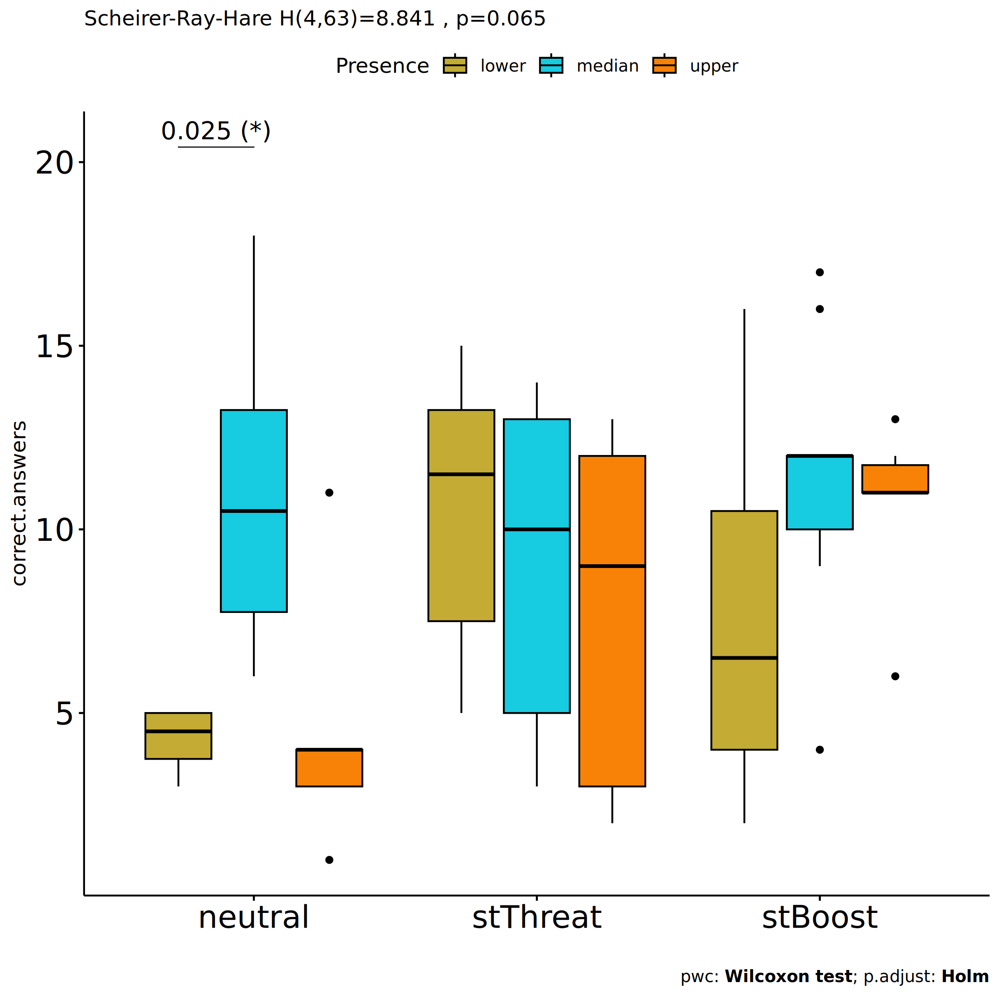
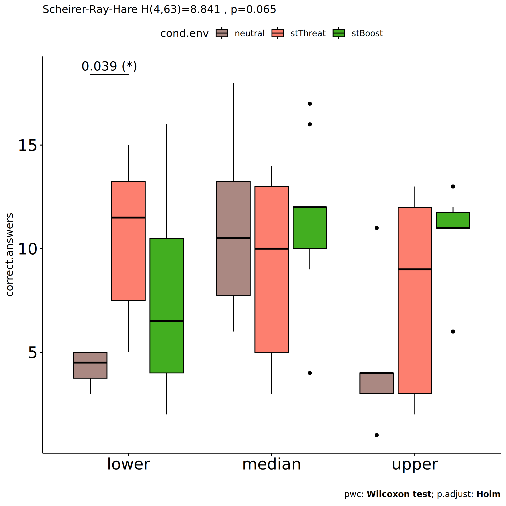

Non-Parametric ANOVA tests for for assess correct.answers in
environmental cond
================
Geiser C. Challco <geiser@alumni.usp.br>

- [Setting Initial Variables](#setting-initial-variables)
- [Descriptive Statistics of Initial
  Data](#descriptive-statistics-of-initial-data)
- [One-way factor analysis for: *dv ~
  cond.env*](#one-way-factor-analysis-for-dv--condenv)
  - [Kruskal and Wilcoxon PairWise comparisons for: *correct.answers ~
    cond.env*](#kruskal-and-wilcoxon-pairwise-comparisons-for-correctanswers--condenv)
- [Two-way factor analysis for: *dv ~
  cond.env:Meaning*](#two-way-factor-analysis-for-dv--condenvmeaning)
  - [Scheirer and Wilcoxon PairWise comparisons for: *correct.answers ~
    cond.env:Meaning*](#scheirer-and-wilcoxon-pairwise-comparisons-for-correctanswers--condenvmeaning)
- [Two-way factor analysis for: *dv ~
  cond.env:Presence*](#two-way-factor-analysis-for-dv--condenvpresence)
  - [Scheirer and Wilcoxon PairWise comparisons for: *correct.answers ~
    cond.env:Presence*](#scheirer-and-wilcoxon-pairwise-comparisons-for-correctanswers--condenvpresence)
- [Two-way factor analysis for: *dv ~
  cond.env:Search*](#two-way-factor-analysis-for-dv--condenvsearch)
  - [Scheirer and Wilcoxon PairWise comparisons for: *correct.answers ~
    cond.env:Search*](#scheirer-and-wilcoxon-pairwise-comparisons-for-correctanswers--condenvsearch)

# Setting Initial Variables

``` r
dv = "correct.answers"

fatores2 <- c("gender","Meaning","Presence","Search")
lfatores2 <- as.list(fatores2)
names(lfatores2) <- fatores2

fatores1 <- c("cond.env", fatores2)
lfatores1 <- as.list(fatores1)
names(lfatores1) <- fatores1

lfatores <- c(lfatores1)

color <- list()
color[["env"]] = c("#a2b6c3","#1054b1","#fc2c8c")
color[["cond"]] = c("#aa8882","#fd7f6f","#42ae20")
color[["cond.env"]] = c("#aa8882","#fd7f6f","#42ae20")
color[["gender"]] = c("#FF007F","#4D4DFF")
color[["Meaning"]] = c("#c4ab34","#17cbe1","#f88208")
color[["Presence"]] = c("#c4ab34","#17cbe1","#f88208")
color[["Search"]] = c("#c4ab34","#17cbe1","#f88208")

color[["gender.Meaning"]] = c("#feb1d8","#b1b1fe","#FF007F","#4D4DFF","#dc006d","#3737ff")
color[["gender.Presence"]] = c("#feb1d8","#b1b1fe","#FF007F","#4D4DFF","#dc006d","#3737ff")
color[["gender.Search"]] = c("#feb1d8","#b1b1fe","#FF007F","#4D4DFF","#dc006d","#3737ff")


level <- list()
level[["env"]] = c("neutral","stM","stF")
level[["cond"]] = c("neutral","stThreat","stBoost")
level[["cond.env"]] = c("neutral","stThreat","stBoost")
level[["gender"]] = c("F","M")
level[["Meaning"]] = c("lower","median","upper")
level[["Presence"]] = c("lower","median","upper")
level[["Search"]] = c("lower","median","upper")

level[["gender.Meaning"]] = c("F.lower","M.lower","F.median","M.median","F.upper","M.upper")
level[["gender.Presence"]] = c("F.lower","M.lower","F.median","M.median","F.upper","M.upper")
level[["gender.Search"]] = c("F.lower","M.lower","F.median","M.median","F.upper","M.upper")


gdat <- read_excel("../data/data.xlsx", sheet = "results")
gdat <- gdat[!is.na(gdat[[dv]]),]


dat <- gdat
dat$cond.env <- factor(dat[["cond.env"]], level[["cond.env"]])
for (coln in c(names(lfatores))) {
  if (length(level[[coln]]) > 0)
    plevel = level[[coln]][level[[coln]] %in% unique(dat[[coln]])]
  else
    plevel = unique(dat[[coln]])[!is.na(unique(dat[[coln]]))]
  
  dat[[coln]] <- factor(dat[[coln]], plevel)
}

dat <- dat[,c("userId", names(lfatores), dv)]

for (f in c("cond.env", names(lfatores))) {
  if (is.null(color[[f]]) && length(unique(dat[[f]])) > 0) 
      color[[f]] <- distinctColorPalette(length(unique(dat[[f]])))
}

for (f in c(fatores2)) {
  if (is.null(color[[paste0("cond.env:",f)]]) && length(unique(dat[[f]])) > 0)
    color[[paste0("cond.env:",f)]] <- distinctColorPalette(
      length(unique(dat[["cond.env"]]))*length(unique(dat[[f]])))
}

ldat <- list()
laov <- list()
lpwc <- list()
lemms <- list()
```

# Descriptive Statistics of Initial Data

``` r
df <- get.descriptives(dat, c(dv), c("cond.env"),
                       symmetry.test = T, normality.test = F)
df <- plyr::rbind.fill(
  df, do.call(plyr::rbind.fill, lapply(lfatores2, FUN = function(f) {
    if (nrow(dat) > 0 && sum(!is.na(unique(dat[[f]]))) > 1)
      get.descriptives(dat, c(dv), c("cond.env", f), include.global = F,
                       symmetry.test = T, normality.test = F)
    }))
)
df <- df[,c("variable",fatores1[fatores1 %in% colnames(df)],
            colnames(df)[!colnames(df) %in% c(fatores1,"variable")])]
```

| variable | cond.env | gender | Meaning | Presence | Search | n | mean | median | min | max | sd | se | ci | iqr | symmetry | skewness | kurtosis |
|:---|:---|:---|:---|:---|:---|---:|---:|---:|---:|---:|---:|---:|---:|---:|:---|---:|---:|
| correct.answers | neutral |  |  |  |  | 17 | 7.588 | 6.0 | 1 | 18 | 4.912 | 1.191 | 2.526 | 7.00 | NO | 0.7369255 | -0.6116019 |
| correct.answers | stThreat |  |  |  |  | 34 | 8.794 | 10.0 | 2 | 15 | 4.340 | 0.744 | 1.514 | 7.75 | YES | -0.3133190 | -1.4808578 |
| correct.answers | stBoost |  |  |  |  | 21 | 10.143 | 11.0 | 2 | 17 | 4.127 | 0.900 | 1.878 | 3.00 | YES | -0.3612079 | -0.7587557 |
| correct.answers | neutral | F |  |  |  | 4 | 7.500 | 7.5 | 3 | 12 | 4.655 | 2.327 | 7.407 | 7.50 | YES | 0.0000000 | -2.4034172 |
| correct.answers | neutral | M |  |  |  | 13 | 7.615 | 6.0 | 1 | 18 | 5.173 | 1.435 | 3.126 | 6.00 | NO | 0.8204723 | -0.5973587 |
| correct.answers | stThreat | F |  |  |  | 8 | 11.250 | 11.0 | 9 | 15 | 1.832 | 0.648 | 1.532 | 2.00 | NO | 0.7772965 | -0.4612028 |
| correct.answers | stThreat | M |  |  |  | 26 | 8.038 | 7.5 | 2 | 14 | 4.626 | 0.907 | 1.868 | 10.00 | YES | 0.0090425 | -1.7562904 |
| correct.answers | stBoost | F |  |  |  | 4 | 9.500 | 11.5 | 2 | 13 | 5.066 | 2.533 | 8.061 | 3.50 | NO | -0.6921310 | -1.7255756 |
| correct.answers | stBoost | M |  |  |  | 17 | 10.294 | 11.0 | 4 | 17 | 4.043 | 0.981 | 2.079 | 3.00 | YES | -0.1265700 | -0.9695385 |
| correct.answers | neutral |  | lower |  |  | 3 | 4.667 | 5.0 | 4 | 5 | 0.577 | 0.333 | 1.434 | 0.50 | few data | 0.0000000 | 0.0000000 |
| correct.answers | neutral |  | median |  |  | 7 | 7.714 | 7.0 | 1 | 18 | 5.823 | 2.201 | 5.385 | 7.00 | YES | 0.4895515 | -1.2535151 |
| correct.answers | neutral |  | upper |  |  | 7 | 8.714 | 8.0 | 3 | 17 | 4.957 | 1.874 | 4.584 | 6.50 | YES | 0.3571801 | -1.4686841 |
| correct.answers | stThreat |  | lower |  |  | 10 | 10.600 | 12.5 | 3 | 15 | 4.452 | 1.408 | 3.185 | 5.00 | NO | -0.7946263 | -1.1089223 |
| correct.answers | stThreat |  | median |  |  | 9 | 10.111 | 10.0 | 6 | 14 | 3.140 | 1.047 | 2.414 | 6.00 | YES | -0.1984548 | -1.8051095 |
| correct.answers | stThreat |  | upper |  |  | 15 | 6.800 | 5.0 | 2 | 13 | 4.280 | 1.105 | 2.370 | 8.00 | YES | 0.1539240 | -1.8376108 |
| correct.answers | stBoost |  | lower |  |  | 5 | 5.400 | 4.0 | 2 | 11 | 3.435 | 1.536 | 4.265 | 2.00 | NO | 0.6465630 | -1.3842344 |
| correct.answers | stBoost |  | median |  |  | 13 | 11.923 | 12.0 | 4 | 17 | 3.378 | 0.937 | 2.041 | 2.00 | NO | -0.5256824 | 0.1001637 |
| correct.answers | stBoost |  | upper |  |  | 3 | 10.333 | 11.0 | 9 | 11 | 1.155 | 0.667 | 2.868 | 1.00 | few data | 0.0000000 | 0.0000000 |
| correct.answers | neutral |  |  | lower |  | 4 | 4.250 | 4.5 | 3 | 5 | 0.957 | 0.479 | 1.523 | 1.25 | few data | 0.0000000 | 0.0000000 |
| correct.answers | neutral |  |  | median |  | 8 | 11.125 | 10.5 | 6 | 18 | 4.422 | 1.563 | 3.697 | 5.50 | YES | 0.4216403 | -1.5280403 |
| correct.answers | neutral |  |  | upper |  | 5 | 4.600 | 4.0 | 1 | 11 | 3.782 | 1.691 | 4.695 | 1.00 | NO | 0.7802361 | -1.1881794 |
| correct.answers | stThreat |  |  | lower |  | 8 | 10.500 | 11.5 | 5 | 15 | 3.742 | 1.323 | 3.128 | 5.75 | YES | -0.2863513 | -1.7445791 |
| correct.answers | stThreat |  |  | median |  | 13 | 8.769 | 10.0 | 3 | 14 | 4.285 | 1.188 | 2.589 | 8.00 | YES | -0.1939320 | -1.6873731 |
| correct.answers | stThreat |  |  | upper |  | 13 | 7.769 | 9.0 | 2 | 13 | 4.711 | 1.307 | 2.847 | 9.00 | YES | -0.1798807 | -1.9178877 |
| correct.answers | stBoost |  |  | lower |  | 6 | 7.667 | 6.5 | 2 | 16 | 5.317 | 2.171 | 5.579 | 6.50 | YES | 0.3743537 | -1.6771501 |
| correct.answers | stBoost |  |  | median |  | 9 | 11.444 | 12.0 | 4 | 17 | 3.812 | 1.271 | 2.930 | 2.00 | YES | -0.3285854 | -0.6335856 |
| correct.answers | stBoost |  |  | upper |  | 6 | 10.667 | 11.0 | 6 | 13 | 2.422 | 0.989 | 2.542 | 0.75 | NO | -1.0139084 | -0.5443354 |
| correct.answers | neutral |  |  |  | lower | 8 | 8.250 | 7.5 | 3 | 17 | 4.803 | 1.698 | 4.016 | 6.25 | YES | 0.4813620 | -1.2869664 |
| correct.answers | neutral |  |  |  | median | 4 | 11.000 | 10.0 | 6 | 18 | 5.292 | 2.646 | 8.420 | 6.00 | YES | 0.3239695 | -2.0089286 |
| correct.answers | neutral |  |  |  | upper | 5 | 3.800 | 4.0 | 1 | 7 | 2.168 | 0.970 | 2.692 | 1.00 | YES | 0.2025643 | -1.4903938 |
| correct.answers | stThreat |  |  |  | lower | 8 | 7.875 | 7.0 | 2 | 15 | 4.734 | 1.674 | 3.958 | 7.00 | YES | 0.2095391 | -1.7059942 |
| correct.answers | stThreat |  |  |  | median | 17 | 9.882 | 12.0 | 3 | 14 | 4.167 | 1.011 | 2.142 | 7.00 | NO | -0.6684276 | -1.2948748 |
| correct.answers | stThreat |  |  |  | upper | 9 | 7.556 | 9.0 | 2 | 13 | 4.275 | 1.425 | 3.286 | 7.00 | YES | -0.2221692 | -1.7758729 |
| correct.answers | stBoost |  |  |  | lower | 3 | 9.667 | 11.0 | 2 | 16 | 7.095 | 4.096 | 17.624 | 7.00 | few data | 0.0000000 | 0.0000000 |
| correct.answers | stBoost |  |  |  | median | 13 | 9.615 | 10.0 | 4 | 17 | 4.273 | 1.185 | 2.582 | 6.00 | YES | 0.1149044 | -1.1856001 |
| correct.answers | stBoost |  |  |  | upper | 5 | 11.800 | 12.0 | 11 | 13 | 0.837 | 0.374 | 1.039 | 1.00 | few data | 0.0000000 | 0.0000000 |

# One-way factor analysis for: *dv ~ cond.env*

``` r
pdat = remove_group_data(dat[!is.na(dat[["cond.env"]]),], "correct.answers", "cond.env", n.limit = 3)

y.position.min <- abs(
  max(pdat[["correct.answers"]])
  - min(pdat[["correct.answers"]]))/20

lvars = as.list(c("correct.answers"))
names(lvars) = unlist(lvars)
```

## Kruskal and Wilcoxon PairWise comparisons for: *correct.answers ~ cond.env*

``` r
kt <- lapply(lvars, FUN = function(x) {
  kruskal_test(pdat, as.formula(paste0(x," ~ cond.env")))  
})

df <- do.call(rbind.fill, lapply(lvars, function(x) {
  add_significance(merge(
    kt[[x]], kruskal_effsize(pdat, as.formula(paste0(x," ~ cond.env"))),
    by = c(".y.","n"), suffixes = c("",".ez")))
}))

df <- df[,c(".y.","n","df","statistic","p","p.signif","effsize","magnitude")]
```

| .y.             |   n |  df | statistic |     p | p.signif |   effsize | magnitude |
|:----------------|----:|----:|----------:|------:|:---------|----------:|:----------|
| correct.answers |  72 |   2 |  3.000278 | 0.223 | ns       | 0.0144968 | small     |

``` r
pwc <- lapply(lvars, FUN = function(x) {
  pairwise_wilcox_test(pdat, as.formula(paste0(x," ~ cond.env")), detailed = T)  
})

df <- do.call(rbind.fill, pwc)
```

| estimate | .y. | group1 | group2 | n1 | n2 | statistic | p | conf.low | conf.high | method | alternative | p.adj | p.adj.signif |
|---:|:---|:---|:---|---:|---:|---:|---:|---:|---:|:---|:---|---:|:---|
| -1.9999623 | correct.answers | neutral | stThreat | 17 | 34 | 237.0 | 0.302 | -4.999982 | 1.0000259 | Wilcoxon | two.sided | 0.604 | ns |
| -3.0000030 | correct.answers | neutral | stBoost | 17 | 21 | 117.0 | 0.072 | -6.000009 | 0.0000462 | Wilcoxon | two.sided | 0.214 | ns |
| -0.9999782 | correct.answers | stThreat | stBoost | 34 | 21 | 311.5 | 0.433 | -3.999953 | 1.0000206 | Wilcoxon | two.sided | 0.604 | ns |

``` r
plots <- lapply(lvars, FUN = function(y) {
  stat.test <- pwc[[y]] %>% add_xy_position(x = "cond.env")
  stat.test$y.position <- stat.test$y.position + y.position.min
  ggboxplot(pdat, x = "cond.env", y = y, fill = "cond.env",
            palette = color[["cond.env"]]) +
    stat_pvalue_manual(stat.test, tip.length = 0, hide.ns = T, label.size = 5,
                       label="{ p.adj } ({ p.adj.signif })") + xlab("")
})
```

``` r
plots[["correct.answers"]] +
  labs(subtitle = get_test_label(kt[["correct.answers"]], detailed = T),
       caption = get_pwc_label(pwc[["correct.answers"]])) +
  ylab("correct.answers")  +
  theme(strip.text = element_text(size = 16),
        axis.text = element_text(size = 18))
```

<!-- -->

# Two-way factor analysis for: *dv ~ cond.env:Meaning*

``` r
pdat = remove_group_data(
  dat[!is.na(dat[["cond.env"]]) & !is.na(dat[["Meaning"]]),],
  "correct.answers", c("cond.env","Meaning"), n.limit = 3)

y.position.min <- abs(max(pdat[["correct.answers"]]) - min(pdat[["correct.answers"]]))/20

lvars = as.list(c("correct.answers"))
names(lvars) = unlist(lvars)
```

## Scheirer and Wilcoxon PairWise comparisons for: *correct.answers ~ cond.env:Meaning*

``` r
sch <- lapply(lvars, FUN = function(x) {
  scheirer.test(pdat, x, c("cond.env","Meaning"), as.table = T) 
})
df <- do.call(rbind.fill, sch)
```

| var | Effect | Df | Sum Sq | H | p.value | p.value.signif |
|:---|:---|---:|---:|---:|---:|:---|
| correct.answers | cond.env | 2 | 956.9088 | 2.201323 | 0.3326510 | ns |
| correct.answers | Meaning | 2 | 1830.0942 | 4.210044 | 0.1218430 | ns |
| correct.answers | cond.env:Meaning | 4 | 4754.8069 | 10.938205 | 0.0272674 | \* |
| correct.answers | Residuals | 63 | 22974.3864 |  |  |  |

``` r
pwc <- lapply(lvars, FUN = function(x) {
  list(
    cond.env = tryCatch(pairwise_wilcox_test(group_by(pdat, Meaning),
                                 as.formula(paste0(x," ~ cond.env")), detailed = T)
                         , error = function(e) NULL),
    Meaning = tryCatch(pairwise_wilcox_test(group_by(pdat, cond.env),
                                 as.formula(paste0(x," ~ Meaning")), detailed = T)
                         , error = function(e) NULL)
  )
})

df <- do.call(rbind.fill, lapply(pwc, FUN =  function(x) {
  do.call(rbind.fill, x)
}))

ivs = c()
if ("cond.env" %in% colnames(df)) ivs = c(ivs, "cond.env")
if ("Meaning" %in% colnames(df)) ivs = c(ivs, "Meaning")
df <- df[,c(".y.",ivs,"group1","group2","n1","n2","estimate",
            "statistic","p.adj","p.adj.signif")]
```

| .y. | cond.env | Meaning | group1 | group2 | n1 | n2 | estimate | statistic | p.adj | p.adj.signif |
|:---|:---|:---|:---|:---|---:|---:|---:|---:|---:|:---|
| correct.answers |  | lower | neutral | stThreat | 3 | 10 | -7.9999484 | 6.0 | 0.298 | ns |
| correct.answers |  | lower | neutral | stBoost | 3 | 5 | 0.0000567 | 8.0 | 1.000 | ns |
| correct.answers |  | lower | stThreat | stBoost | 10 | 5 | 6.9999226 | 40.5 | 0.195 | ns |
| correct.answers |  | median | neutral | stThreat | 7 | 9 | -2.9999670 | 20.5 | 0.528 | ns |
| correct.answers |  | median | neutral | stBoost | 7 | 13 | -5.0000225 | 21.0 | 0.167 | ns |
| correct.answers |  | median | stThreat | stBoost | 9 | 13 | -1.9999914 | 44.0 | 0.528 | ns |
| correct.answers |  | upper | neutral | stThreat | 7 | 15 | 1.0000275 | 65.5 | 1.000 | ns |
| correct.answers |  | upper | neutral | stBoost | 7 | 3 | -2.9999848 | 8.0 | 1.000 | ns |
| correct.answers |  | upper | stThreat | stBoost | 15 | 3 | -4.0000430 | 14.0 | 1.000 | ns |
| correct.answers | neutral |  | lower | median | 3 | 7 | -2.0000014 | 8.5 | 1.000 | ns |
| correct.answers | neutral |  | lower | upper | 3 | 7 | -3.0000012 | 5.5 | 0.906 | ns |
| correct.answers | neutral |  | median | upper | 7 | 7 | -1.0000726 | 20.5 | 1.000 | ns |
| correct.answers | stThreat |  | lower | median | 10 | 9 | 0.9999260 | 53.5 | 0.510 | ns |
| correct.answers | stThreat |  | lower | upper | 10 | 15 | 3.0000488 | 115.0 | 0.082 | ns |
| correct.answers | stThreat |  | median | upper | 9 | 15 | 3.0000048 | 101.0 | 0.096 | ns |
| correct.answers | stBoost |  | lower | median | 5 | 13 | -7.0000239 | 6.0 | 0.029 | \* |
| correct.answers | stBoost |  | lower | upper | 5 | 3 | -5.0000189 | 2.0 | 0.248 | ns |
| correct.answers | stBoost |  | median | upper | 13 | 3 | 1.0000324 | 29.5 | 0.248 | ns |

``` r
plots <- lapply(lvars, FUN = function(y) {
  livs = list("cond.env", "Meaning")
  names(livs) = unlist(livs)
  lapply(livs, FUN = function(x) {
    iv2 = setdiff(names(livs), x)
    if (!is.null(pwc[[y]][[iv2]])) {
      stat.test <- pwc[[y]][[iv2]] %>% add_xy_position(x = x, fun = "max")
      sidx = which(stat.test$p.adj.signif != "ns")
      stat.test$y.position[sidx] <- stat.test$y.position[sidx] + y.position.min * (1:length(sidx))
      
      ggboxplot(pdat, x = x, y = y, fill = iv2, palette = color[[iv2]]) +
        stat_pvalue_manual(stat.test, tip.length = 0, hide.ns = T, label.size = 5,
                           label="{ p.adj } ({ p.adj.signif })") + xlab("")
    }
  })
})
```

``` r
psch = sch[["correct.answers"]]
idx = which(psch$Effect == "cond.env:Meaning") 

dof = floor(as.double(psch$Df[idx]))
dof.res = floor(as.double(psch$Df[which(psch$Effect == "Residuals")]))
statistic = round(as.double(psch$H[idx]), 3)
p = round(as.double(psch[["p.value"]][idx]), 3)
pval = ifelse(p < 0.001,paste0(" , p<0.001"),paste0(" , p=",p))

if (!is.null(plots[["correct.answers"]][["cond.env"]]))
  plots[["correct.answers"]][["cond.env"]] +
    labs(subtitle = paste0("Scheirer-Ray-Hare H(", dof, ",", 
          dof.res, ")=", statistic, pval),
         caption = get_pwc_label(pwc[["correct.answers"]][["Meaning"]])) +
    ylab("correct.answers") +
  theme(strip.text = element_text(size = 16),
        axis.text = element_text(size = 18))
```

<!-- -->

``` r
psch = sch[["correct.answers"]]
idx = which(psch$Effect == "cond.env:Meaning") 

dof = floor(as.double(psch$Df[idx]))
dof.res = floor(as.double(psch$Df[which(psch$Effect == "Residuals")]))
statistic = round(as.double(psch$H[idx]), 3)
p = round(as.double(psch[["p.value"]][idx]), 3)
pval = ifelse(p < 0.001,paste0(" , p<0.001"),paste0(" , p=",p))

if (!is.null(plots[["correct.answers"]][["Meaning"]]))
  plots[["correct.answers"]][["Meaning"]] +
    labs(subtitle = paste0("Scheirer-Ray-Hare H(", dof, ",", 
          dof.res, ")=", statistic, pval),
         caption = get_pwc_label(pwc[["correct.answers"]][["cond.env"]])) +
    ylab("correct.answers") +
  theme(strip.text = element_text(size = 16),
        axis.text = element_text(size = 18))
```

<!-- -->

# Two-way factor analysis for: *dv ~ cond.env:Presence*

``` r
pdat = remove_group_data(
  dat[!is.na(dat[["cond.env"]]) & !is.na(dat[["Presence"]]),],
  "correct.answers", c("cond.env","Presence"), n.limit = 3)

y.position.min <- abs(max(pdat[["correct.answers"]]) - min(pdat[["correct.answers"]]))/20

lvars = as.list(c("correct.answers"))
names(lvars) = unlist(lvars)
```

## Scheirer and Wilcoxon PairWise comparisons for: *correct.answers ~ cond.env:Presence*

``` r
sch <- lapply(lvars, FUN = function(x) {
  scheirer.test(pdat, x, c("cond.env","Presence"), as.table = T) 
})
df <- do.call(rbind.fill, sch)
```

| var | Effect | Df | Sum Sq | H | p.value | p.value.signif |
|:---|:---|---:|---:|---:|---:|:---|
| correct.answers | cond.env | 2 | 1397.167 | 3.214116 | 0.2004765 | ns |
| correct.answers | Presence | 2 | 1593.052 | 3.664740 | 0.1600339 | ns |
| correct.answers | cond.env:Presence | 4 | 3843.007 | 8.840654 | 0.0652082 | ns |
| correct.answers | Residuals | 63 | 24123.228 |  |  |  |

``` r
pwc <- lapply(lvars, FUN = function(x) {
  list(
    cond.env = tryCatch(pairwise_wilcox_test(group_by(pdat, Presence),
                                 as.formula(paste0(x," ~ cond.env")), detailed = T)
                         , error = function(e) NULL),
    Presence = tryCatch(pairwise_wilcox_test(group_by(pdat, cond.env),
                                 as.formula(paste0(x," ~ Presence")), detailed = T)
                         , error = function(e) NULL)
  )
})

df <- do.call(rbind.fill, lapply(pwc, FUN =  function(x) {
  do.call(rbind.fill, x)
}))

ivs = c()
if ("cond.env" %in% colnames(df)) ivs = c(ivs, "cond.env")
if ("Presence" %in% colnames(df)) ivs = c(ivs, "Presence")
df <- df[,c(".y.",ivs,"group1","group2","n1","n2","estimate",
            "statistic","p.adj","p.adj.signif")]
```

| .y. | cond.env | Presence | group1 | group2 | n1 | n2 | estimate | statistic | p.adj | p.adj.signif |
|:---|:---|:---|:---|:---|---:|---:|---:|---:|---:|:---|
| correct.answers |  | lower | neutral | stThreat | 4 | 8 | -7.0000363 | 1.0 | 0.039 | \* |
| correct.answers |  | lower | neutral | stBoost | 4 | 6 | -3.6492747 | 9.0 | 0.588 | ns |
| correct.answers |  | lower | stThreat | stBoost | 8 | 6 | 3.0000190 | 33.5 | 0.488 | ns |
| correct.answers |  | median | neutral | stThreat | 8 | 13 | 2.6080375 | 65.0 | 0.726 | ns |
| correct.answers |  | median | neutral | stBoost | 8 | 9 | -0.9999724 | 32.0 | 0.734 | ns |
| correct.answers |  | median | stThreat | stBoost | 13 | 9 | -2.0000848 | 40.0 | 0.681 | ns |
| correct.answers |  | upper | neutral | stThreat | 5 | 13 | -2.0000040 | 21.5 | 0.594 | ns |
| correct.answers |  | upper | neutral | stBoost | 5 | 6 | -7.0000296 | 2.5 | 0.074 | ns |
| correct.answers |  | upper | stThreat | stBoost | 13 | 6 | -2.0000164 | 29.0 | 0.594 | ns |
| correct.answers | neutral |  | lower | median | 4 | 8 | -6.0000566 | 0.0 | 0.025 | \* |
| correct.answers | neutral |  | lower | upper | 4 | 5 | 0.9999775 | 12.5 | 0.615 | ns |
| correct.answers | neutral |  | median | upper | 8 | 5 | 6.2952930 | 35.5 | 0.055 | ns |
| correct.answers | stThreat |  | lower | median | 8 | 13 | 1.9999838 | 65.5 | 0.688 | ns |
| correct.answers | stThreat |  | lower | upper | 8 | 13 | 2.5465620 | 71.0 | 0.531 | ns |
| correct.answers | stThreat |  | median | upper | 13 | 13 | 1.0000000 | 100.0 | 0.688 | ns |
| correct.answers | stBoost |  | lower | median | 6 | 9 | -4.9999353 | 13.5 | 0.366 | ns |
| correct.answers | stBoost |  | lower | upper | 6 | 6 | -2.5262590 | 9.5 | 0.382 | ns |
| correct.answers | stBoost |  | median | upper | 9 | 6 | 0.2201308 | 30.0 | 0.764 | ns |

``` r
plots <- lapply(lvars, FUN = function(y) {
  livs = list("cond.env", "Presence")
  names(livs) = unlist(livs)
  lapply(livs, FUN = function(x) {
    iv2 = setdiff(names(livs), x)
    if (!is.null(pwc[[y]][[iv2]])) {
      stat.test <- pwc[[y]][[iv2]] %>% add_xy_position(x = x, fun = "max")
      sidx = which(stat.test$p.adj.signif != "ns")
      stat.test$y.position[sidx] <- stat.test$y.position[sidx] + y.position.min * (1:length(sidx))
      
      ggboxplot(pdat, x = x, y = y, fill = iv2, palette = color[[iv2]]) +
        stat_pvalue_manual(stat.test, tip.length = 0, hide.ns = T, label.size = 5,
                           label="{ p.adj } ({ p.adj.signif })") + xlab("")
    }
  })
})
```

``` r
psch = sch[["correct.answers"]]
idx = which(psch$Effect == "cond.env:Presence") 

dof = floor(as.double(psch$Df[idx]))
dof.res = floor(as.double(psch$Df[which(psch$Effect == "Residuals")]))
statistic = round(as.double(psch$H[idx]), 3)
p = round(as.double(psch[["p.value"]][idx]), 3)
pval = ifelse(p < 0.001,paste0(" , p<0.001"),paste0(" , p=",p))

if (!is.null(plots[["correct.answers"]][["cond.env"]]))
  plots[["correct.answers"]][["cond.env"]] +
    labs(subtitle = paste0("Scheirer-Ray-Hare H(", dof, ",", 
          dof.res, ")=", statistic, pval),
         caption = get_pwc_label(pwc[["correct.answers"]][["Presence"]])) +
    ylab("correct.answers") +
  theme(strip.text = element_text(size = 16),
        axis.text = element_text(size = 18))
```

<!-- -->

``` r
psch = sch[["correct.answers"]]
idx = which(psch$Effect == "cond.env:Presence") 

dof = floor(as.double(psch$Df[idx]))
dof.res = floor(as.double(psch$Df[which(psch$Effect == "Residuals")]))
statistic = round(as.double(psch$H[idx]), 3)
p = round(as.double(psch[["p.value"]][idx]), 3)
pval = ifelse(p < 0.001,paste0(" , p<0.001"),paste0(" , p=",p))

if (!is.null(plots[["correct.answers"]][["Presence"]]))
  plots[["correct.answers"]][["Presence"]] +
    labs(subtitle = paste0("Scheirer-Ray-Hare H(", dof, ",", 
          dof.res, ")=", statistic, pval),
         caption = get_pwc_label(pwc[["correct.answers"]][["cond.env"]])) +
    ylab("correct.answers") +
  theme(strip.text = element_text(size = 16),
        axis.text = element_text(size = 18))
```

<!-- -->

# Two-way factor analysis for: *dv ~ cond.env:Search*

``` r
pdat = remove_group_data(
  dat[!is.na(dat[["cond.env"]]) & !is.na(dat[["Search"]]),],
  "correct.answers", c("cond.env","Search"), n.limit = 3)

y.position.min <- abs(max(pdat[["correct.answers"]]) - min(pdat[["correct.answers"]]))/20

lvars = as.list(c("correct.answers"))
names(lvars) = unlist(lvars)
```

## Scheirer and Wilcoxon PairWise comparisons for: *correct.answers ~ cond.env:Search*

``` r
sch <- lapply(lvars, FUN = function(x) {
  scheirer.test(pdat, x, c("cond.env","Search"), as.table = T) 
})
df <- do.call(rbind.fill, sch)
```

| var | Effect | Df | Sum Sq | H | p.value | p.value.signif |
|:---|:---|---:|---:|---:|---:|:---|
| correct.answers | cond.env | 2 | 749.2797 | 1.723682 | 0.4223837 | ns |
| correct.answers | Search | 2 | 1108.0351 | 2.548982 | 0.2795733 | ns |
| correct.answers | cond.env:Search | 4 | 2976.3556 | 6.846963 | 0.1441999 | ns |
| correct.answers | Residuals | 63 | 25474.8968 |  |  |  |

``` r
pwc <- lapply(lvars, FUN = function(x) {
  list(
    cond.env = tryCatch(pairwise_wilcox_test(group_by(pdat, Search),
                                 as.formula(paste0(x," ~ cond.env")), detailed = T)
                         , error = function(e) NULL),
    Search = tryCatch(pairwise_wilcox_test(group_by(pdat, cond.env),
                                 as.formula(paste0(x," ~ Search")), detailed = T)
                         , error = function(e) NULL)
  )
})

df <- do.call(rbind.fill, lapply(pwc, FUN =  function(x) {
  do.call(rbind.fill, x)
}))

ivs = c()
if ("cond.env" %in% colnames(df)) ivs = c(ivs, "cond.env")
if ("Search" %in% colnames(df)) ivs = c(ivs, "Search")
df <- df[,c(".y.",ivs,"group1","group2","n1","n2","estimate",
            "statistic","p.adj","p.adj.signif")]
```

| .y. | cond.env | Search | group1 | group2 | n1 | n2 | estimate | statistic | p.adj | p.adj.signif |
|:---|:---|:---|:---|:---|---:|---:|---:|---:|---:|:---|
| correct.answers |  | lower | neutral | stThreat | 8 | 8 | 0.0000881 | 32.5 | 1.000 | ns |
| correct.answers |  | lower | neutral | stBoost | 8 | 3 | -0.4751656 | 11.0 | 1.000 | ns |
| correct.answers |  | lower | stThreat | stBoost | 8 | 3 | -1.6801249 | 10.0 | 1.000 | ns |
| correct.answers |  | median | neutral | stThreat | 4 | 17 | 0.0588111 | 36.0 | 1.000 | ns |
| correct.answers |  | median | neutral | stBoost | 4 | 13 | 1.7306092 | 30.5 | 1.000 | ns |
| correct.answers |  | median | stThreat | stBoost | 17 | 13 | 0.9999667 | 123.5 | 1.000 | ns |
| correct.answers |  | upper | neutral | stThreat | 5 | 9 | -4.9999535 | 12.0 | 0.180 | ns |
| correct.answers |  | upper | neutral | stBoost | 5 | 5 | -8.0000306 | 0.0 | 0.034 | \* |
| correct.answers |  | upper | stThreat | stBoost | 9 | 5 | -3.0000100 | 7.5 | 0.102 | ns |
| correct.answers | neutral |  | lower | median | 8 | 4 | -2.8437197 | 9.0 | 0.268 | ns |
| correct.answers | neutral |  | lower | upper | 8 | 5 | 3.9999894 | 32.5 | 0.152 | ns |
| correct.answers | neutral |  | median | upper | 4 | 5 | 5.9987727 | 19.0 | 0.109 | ns |
| correct.answers | stThreat |  | lower | median | 8 | 17 | -1.9999964 | 51.0 | 0.666 | ns |
| correct.answers | stThreat |  | lower | upper | 8 | 9 | 0.1753422 | 38.0 | 0.885 | ns |
| correct.answers | stThreat |  | median | upper | 17 | 9 | 2.0000942 | 107.0 | 0.312 | ns |
| correct.answers | stBoost |  | lower | median | 3 | 13 | -0.0000229 | 19.5 | 1.000 | ns |
| correct.answers | stBoost |  | lower | upper | 3 | 5 | -0.9999555 | 6.0 | 1.000 | ns |
| correct.answers | stBoost |  | median | upper | 13 | 5 | -1.9999325 | 18.0 | 0.486 | ns |

``` r
plots <- lapply(lvars, FUN = function(y) {
  livs = list("cond.env", "Search")
  names(livs) = unlist(livs)
  lapply(livs, FUN = function(x) {
    iv2 = setdiff(names(livs), x)
    if (!is.null(pwc[[y]][[iv2]])) {
      stat.test <- pwc[[y]][[iv2]] %>% add_xy_position(x = x, fun = "max")
      sidx = which(stat.test$p.adj.signif != "ns")
      stat.test$y.position[sidx] <- stat.test$y.position[sidx] + y.position.min * (1:length(sidx))
      
      ggboxplot(pdat, x = x, y = y, fill = iv2, palette = color[[iv2]]) +
        stat_pvalue_manual(stat.test, tip.length = 0, hide.ns = T, label.size = 5,
                           label="{ p.adj } ({ p.adj.signif })") + xlab("")
    }
  })
})
```

``` r
psch = sch[["correct.answers"]]
idx = which(psch$Effect == "cond.env:Search") 

dof = floor(as.double(psch$Df[idx]))
dof.res = floor(as.double(psch$Df[which(psch$Effect == "Residuals")]))
statistic = round(as.double(psch$H[idx]), 3)
p = round(as.double(psch[["p.value"]][idx]), 3)
pval = ifelse(p < 0.001,paste0(" , p<0.001"),paste0(" , p=",p))

if (!is.null(plots[["correct.answers"]][["cond.env"]]))
  plots[["correct.answers"]][["cond.env"]] +
    labs(subtitle = paste0("Scheirer-Ray-Hare H(", dof, ",", 
          dof.res, ")=", statistic, pval),
         caption = get_pwc_label(pwc[["correct.answers"]][["Search"]])) +
    ylab("correct.answers") +
  theme(strip.text = element_text(size = 16),
        axis.text = element_text(size = 18))
```

<!-- -->

``` r
psch = sch[["correct.answers"]]
idx = which(psch$Effect == "cond.env:Search") 

dof = floor(as.double(psch$Df[idx]))
dof.res = floor(as.double(psch$Df[which(psch$Effect == "Residuals")]))
statistic = round(as.double(psch$H[idx]), 3)
p = round(as.double(psch[["p.value"]][idx]), 3)
pval = ifelse(p < 0.001,paste0(" , p<0.001"),paste0(" , p=",p))

if (!is.null(plots[["correct.answers"]][["Search"]]))
  plots[["correct.answers"]][["Search"]] +
    labs(subtitle = paste0("Scheirer-Ray-Hare H(", dof, ",", 
          dof.res, ")=", statistic, pval),
         caption = get_pwc_label(pwc[["correct.answers"]][["cond.env"]])) +
    ylab("correct.answers") +
  theme(strip.text = element_text(size = 16),
        axis.text = element_text(size = 18))
```

<!-- -->
