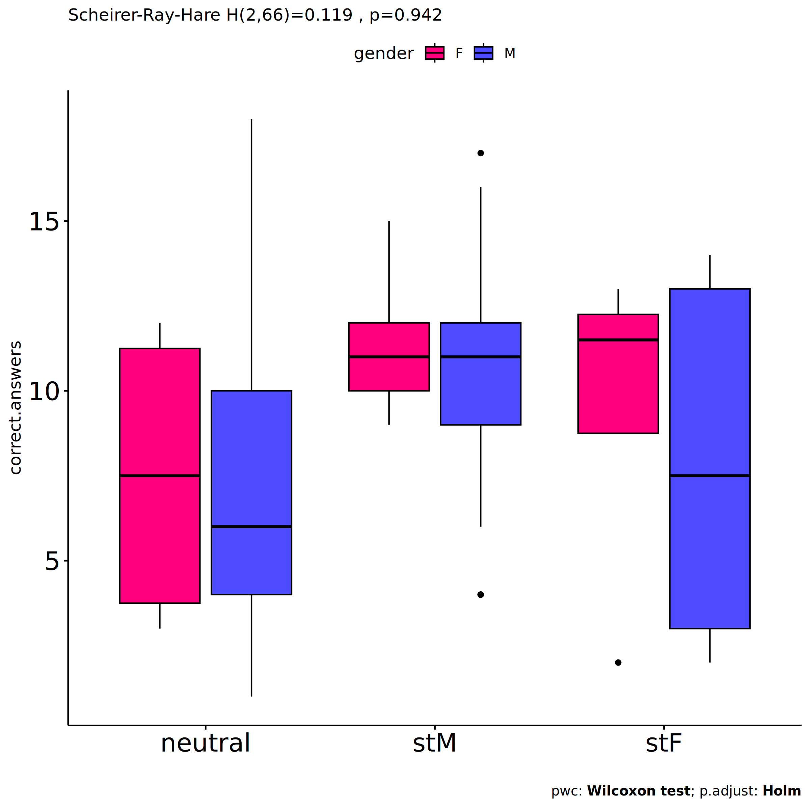

Non-Parametric ANOVA tests for for assess correct.answers based on
environment and gender
================
Geiser C. Challco <geiser@alumni.usp.br>

- [Setting Initial Variables](#setting-initial-variables)
- [Descriptive Statistics of Initial
  Data](#descriptive-statistics-of-initial-data)
- [One-way factor analysis for: *dv ~
  env*](#one-way-factor-analysis-for-dv--env)
  - [Kruskal and Wilcoxon PairWise comparisons for: *correct.answers ~
    env*](#kruskal-and-wilcoxon-pairwise-comparisons-for-correctanswers--env)
- [Two-way factor analysis for: *dv ~
  env:gender*](#two-way-factor-analysis-for-dv--envgender)
  - [Scheirer and Wilcoxon PairWise comparisons for: *correct.answers ~
    env:gender*](#scheirer-and-wilcoxon-pairwise-comparisons-for-correctanswers--envgender)
- [Two-way factor analysis for: *dv ~
  env:gender.Meaning*](#two-way-factor-analysis-for-dv--envgendermeaning)
  - [Scheirer and Wilcoxon PairWise comparisons for: *correct.answers ~
    env:gender.Meaning*](#scheirer-and-wilcoxon-pairwise-comparisons-for-correctanswers--envgendermeaning)
- [Two-way factor analysis for: *dv ~
  env:gender.Presence*](#two-way-factor-analysis-for-dv--envgenderpresence)
  - [Scheirer and Wilcoxon PairWise comparisons for: *correct.answers ~
    env:gender.Presence*](#scheirer-and-wilcoxon-pairwise-comparisons-for-correctanswers--envgenderpresence)
- [Two-way factor analysis for: *dv ~
  env:gender.Search*](#two-way-factor-analysis-for-dv--envgendersearch)
  - [Scheirer and Wilcoxon PairWise comparisons for: *correct.answers ~
    env:gender.Search*](#scheirer-and-wilcoxon-pairwise-comparisons-for-correctanswers--envgendersearch)

# Setting Initial Variables

``` r
dv = "correct.answers"

fatores2 <- c("gender","gender.Meaning","gender.Presence","gender.Search")
lfatores2 <- as.list(fatores2)
names(lfatores2) <- fatores2

fatores1 <- c("env", fatores2)
lfatores1 <- as.list(fatores1)
names(lfatores1) <- fatores1

lfatores <- c(lfatores1)

color <- list()
color[["env"]] = c("#a2b6c3","#1054b1","#fc2c8c")
color[["cond"]] = c("#aa8882","#fd7f6f","#42ae20")
color[["cond.env"]] = c("#aa8882","#fd7f6f","#42ae20")
color[["gender"]] = c("#FF007F","#4D4DFF")
color[["Meaning"]] = c("#c4ab34","#17cbe1","#f88208")
color[["Presence"]] = c("#c4ab34","#17cbe1","#f88208")
color[["Search"]] = c("#c4ab34","#17cbe1","#f88208")

color[["gender.Meaning"]] = c("#feb1d8","#b1b1fe","#FF007F","#4D4DFF","#dc006d","#3737ff")
color[["gender.Presence"]] = c("#feb1d8","#b1b1fe","#FF007F","#4D4DFF","#dc006d","#3737ff")
color[["gender.Search"]] = c("#feb1d8","#b1b1fe","#FF007F","#4D4DFF","#dc006d","#3737ff")


level <- list()
level[["env"]] = c("neutral","stM","stF")
level[["cond"]] = c("neutral","stThreat","stBoost")
level[["cond.env"]] = c("neutral","stThreat","stBoost")
level[["gender"]] = c("F","M")
level[["Meaning"]] = c("lower","median","upper")
level[["Presence"]] = c("lower","median","upper")
level[["Search"]] = c("lower","median","upper")

level[["gender.Meaning"]] = c("F.lower","M.lower","F.median","M.median","F.upper","M.upper")
level[["gender.Presence"]] = c("F.lower","M.lower","F.median","M.median","F.upper","M.upper")
level[["gender.Search"]] = c("F.lower","M.lower","F.median","M.median","F.upper","M.upper")


gdat <- read_excel("../data/data.xlsx", sheet = "results")
gdat <- gdat[!is.na(gdat[[dv]]),]


dat <- gdat
dat$env <- factor(dat[["env"]], level[["env"]])
for (coln in c(names(lfatores))) {
  if (length(level[[coln]]) > 0)
    plevel = level[[coln]][level[[coln]] %in% unique(dat[[coln]])]
  else
    plevel = unique(dat[[coln]])[!is.na(unique(dat[[coln]]))]
  
  dat[[coln]] <- factor(dat[[coln]], plevel)
}

dat <- dat[,c("userId", names(lfatores), dv)]

for (f in c("env", names(lfatores))) {
  if (is.null(color[[f]]) && length(unique(dat[[f]])) > 0) 
      color[[f]] <- distinctColorPalette(length(unique(dat[[f]])))
}

for (f in c(fatores2)) {
  if (is.null(color[[paste0("env:",f)]]) && length(unique(dat[[f]])) > 0)
    color[[paste0("env:",f)]] <- distinctColorPalette(
      length(unique(dat[["env"]]))*length(unique(dat[[f]])))
}

ldat <- list()
laov <- list()
lpwc <- list()
lemms <- list()
```

# Descriptive Statistics of Initial Data

``` r
df <- get.descriptives(dat, c(dv), c("env"),
                       symmetry.test = T, normality.test = F)
df <- plyr::rbind.fill(
  df, do.call(plyr::rbind.fill, lapply(lfatores2, FUN = function(f) {
    if (nrow(dat) > 0 && sum(!is.na(unique(dat[[f]]))) > 1)
      get.descriptives(dat, c(dv), c("env", f), include.global = F,
                       symmetry.test = T, normality.test = F)
    }))
)
```

    ## Warning: There were 3 warnings in `mutate()`.
    ## The first warning was:
    ## ℹ In argument: `ci = abs(stats::qt(alpha/2, .data$n - 1) * .data$se)`.
    ## Caused by warning:
    ## ! There was 1 warning in `mutate()`.
    ## ℹ In argument: `ci = abs(stats::qt(alpha/2, .data$n - 1) * .data$se)`.
    ## Caused by warning in `stats::qt()`:
    ## ! NaNs produced
    ## ℹ Run `dplyr::last_dplyr_warnings()` to see the 2 remaining warnings.

    ## Warning: There were 4 warnings in `mutate()`.
    ## The first warning was:
    ## ℹ In argument: `ci = abs(stats::qt(alpha/2, .data$n - 1) * .data$se)`.
    ## Caused by warning:
    ## ! There was 1 warning in `mutate()`.
    ## ℹ In argument: `ci = abs(stats::qt(alpha/2, .data$n - 1) * .data$se)`.
    ## Caused by warning in `stats::qt()`:
    ## ! NaNs produced
    ## ℹ Run `dplyr::last_dplyr_warnings()` to see the 3 remaining warnings.

    ## Warning: There were 5 warnings in `mutate()`.
    ## The first warning was:
    ## ℹ In argument: `ci = abs(stats::qt(alpha/2, .data$n - 1) * .data$se)`.
    ## Caused by warning:
    ## ! There was 1 warning in `mutate()`.
    ## ℹ In argument: `ci = abs(stats::qt(alpha/2, .data$n - 1) * .data$se)`.
    ## Caused by warning in `stats::qt()`:
    ## ! NaNs produced
    ## ℹ Run `dplyr::last_dplyr_warnings()` to see the 4 remaining warnings.

``` r
df <- df[,c("variable",fatores1[fatores1 %in% colnames(df)],
            colnames(df)[!colnames(df) %in% c(fatores1,"variable")])]
```

| variable | env | gender | gender.Meaning | gender.Presence | gender.Search | n | mean | median | min | max | sd | se | ci | iqr | symmetry | skewness | kurtosis |
|:---|:---|:---|:---|:---|:---|---:|---:|---:|---:|---:|---:|---:|---:|---:|:---|---:|---:|
| correct.answers | neutral |  |  |  |  | 17 | 7.588 | 6.0 | 1 | 18 | 4.912 | 1.191 | 2.526 | 7.00 | NO | 0.7369255 | -0.6116019 |
| correct.answers | stM |  |  |  |  | 25 | 10.600 | 11.0 | 4 | 17 | 3.476 | 0.695 | 1.435 | 3.00 | YES | -0.2822657 | -0.2788363 |
| correct.answers | stF |  |  |  |  | 30 | 8.233 | 8.5 | 2 | 14 | 4.621 | 0.844 | 1.726 | 10.00 | YES | -0.1178425 | -1.7433536 |
| correct.answers | neutral | F |  |  |  | 4 | 7.500 | 7.5 | 3 | 12 | 4.655 | 2.327 | 7.407 | 7.50 | YES | 0.0000000 | -2.4034172 |
| correct.answers | neutral | M |  |  |  | 13 | 7.615 | 6.0 | 1 | 18 | 5.173 | 1.435 | 3.126 | 6.00 | NO | 0.8204723 | -0.5973587 |
| correct.answers | stM | F |  |  |  | 8 | 11.250 | 11.0 | 9 | 15 | 1.832 | 0.648 | 1.532 | 2.00 | NO | 0.7772965 | -0.4612028 |
| correct.answers | stM | M |  |  |  | 17 | 10.294 | 11.0 | 4 | 17 | 4.043 | 0.981 | 2.079 | 3.00 | YES | -0.1265700 | -0.9695385 |
| correct.answers | stF | F |  |  |  | 4 | 9.500 | 11.5 | 2 | 13 | 5.066 | 2.533 | 8.061 | 3.50 | NO | -0.6921310 | -1.7255756 |
| correct.answers | stF | M |  |  |  | 26 | 8.038 | 7.5 | 2 | 14 | 4.626 | 0.907 | 1.868 | 10.00 | YES | 0.0090425 | -1.7562904 |
| correct.answers | neutral |  | F.lower |  |  | 1 | 4.000 | 4.0 | 4 | 4 |  |  |  | 0.00 | few data | 0.0000000 | 0.0000000 |
| correct.answers | neutral |  | M.lower |  |  | 2 | 5.000 | 5.0 | 5 | 5 | 0.000 | 0.000 | 0.000 | 0.00 | few data | 0.0000000 | 0.0000000 |
| correct.answers | neutral |  | F.median |  |  | 1 | 3.000 | 3.0 | 3 | 3 |  |  |  | 0.00 | few data | 0.0000000 | 0.0000000 |
| correct.answers | neutral |  | M.median |  |  | 6 | 8.500 | 8.5 | 1 | 18 | 5.958 | 2.432 | 6.253 | 6.00 | YES | 0.2836669 | -1.4436454 |
| correct.answers | neutral |  | F.upper |  |  | 2 | 11.500 | 11.5 | 11 | 12 | 0.707 | 0.500 | 6.353 | 0.50 | few data | 0.0000000 | 0.0000000 |
| correct.answers | neutral |  | M.upper |  |  | 5 | 7.600 | 6.0 | 3 | 17 | 5.595 | 2.502 | 6.947 | 4.00 | NO | 0.7795686 | -1.2790932 |
| correct.answers | stM |  | F.lower |  |  | 2 | 13.500 | 13.5 | 12 | 15 | 2.121 | 1.500 | 19.059 | 1.50 | few data | 0.0000000 | 0.0000000 |
| correct.answers | stM |  | M.lower |  |  | 4 | 6.250 | 5.0 | 4 | 11 | 3.304 | 1.652 | 5.257 | 3.25 | few data | 0.0000000 | 0.0000000 |
| correct.answers | stM |  | F.median |  |  | 3 | 10.667 | 10.0 | 10 | 12 | 1.155 | 0.667 | 2.868 | 1.00 | few data | 0.0000000 | 0.0000000 |
| correct.answers | stM |  | M.median |  |  | 10 | 11.900 | 12.0 | 4 | 17 | 3.872 | 1.224 | 2.770 | 4.75 | YES | -0.4385991 | -0.6760709 |
| correct.answers | stM |  | F.upper |  |  | 3 | 10.333 | 11.0 | 9 | 11 | 1.155 | 0.667 | 2.868 | 1.00 | few data | 0.0000000 | 0.0000000 |
| correct.answers | stM |  | M.upper |  |  | 3 | 10.333 | 11.0 | 9 | 11 | 1.155 | 0.667 | 2.868 | 1.00 | few data | 0.0000000 | 0.0000000 |
| correct.answers | stF |  | F.lower |  |  | 1 | 2.000 | 2.0 | 2 | 2 |  |  |  | 0.00 | few data | 0.0000000 | 0.0000000 |
| correct.answers | stF |  | M.lower |  |  | 8 | 9.875 | 12.0 | 3 | 14 | 4.673 | 1.652 | 3.907 | 6.50 | NO | -0.5556218 | -1.6236006 |
| correct.answers | stF |  | F.median |  |  | 3 | 12.000 | 12.0 | 11 | 13 | 1.000 | 0.577 | 2.484 | 1.00 | few data | 0.0000000 | 0.0000000 |
| correct.answers | stF |  | M.median |  |  | 6 | 9.833 | 10.0 | 6 | 14 | 3.869 | 1.579 | 4.060 | 6.75 | YES | 0.0012793 | -2.2568345 |
| correct.answers | stF |  | M.upper |  |  | 12 | 5.917 | 4.0 | 2 | 13 | 4.337 | 1.252 | 2.756 | 7.00 | NO | 0.5911465 | -1.5230355 |
| correct.answers | neutral |  |  | F.lower |  | 2 | 3.500 | 3.5 | 3 | 4 | 0.707 | 0.500 | 6.353 | 0.50 | few data | 0.0000000 | 0.0000000 |
| correct.answers | neutral |  |  | M.lower |  | 2 | 5.000 | 5.0 | 5 | 5 | 0.000 | 0.000 | 0.000 | 0.00 | few data | 0.0000000 | 0.0000000 |
| correct.answers | neutral |  |  | F.median |  | 1 | 12.000 | 12.0 | 12 | 12 |  |  |  | 0.00 | few data | 0.0000000 | 0.0000000 |
| correct.answers | neutral |  |  | M.median |  | 7 | 11.000 | 10.0 | 6 | 18 | 4.761 | 1.799 | 4.403 | 6.50 | YES | 0.4527376 | -1.7042758 |
| correct.answers | neutral |  |  | F.upper |  | 1 | 11.000 | 11.0 | 11 | 11 |  |  |  | 0.00 | few data | 0.0000000 | 0.0000000 |
| correct.answers | neutral |  |  | M.upper |  | 4 | 3.000 | 3.5 | 1 | 4 | 1.414 | 0.707 | 2.250 | 1.50 | few data | 0.0000000 | 0.0000000 |
| correct.answers | stM |  |  | F.lower |  | 2 | 13.500 | 13.5 | 12 | 15 | 2.121 | 1.500 | 19.059 | 1.50 | few data | 0.0000000 | 0.0000000 |
| correct.answers | stM |  |  | M.lower |  | 5 | 8.800 | 9.0 | 4 | 16 | 5.070 | 2.267 | 6.295 | 7.00 | YES | 0.2497878 | -1.8576675 |
| correct.answers | stM |  |  | F.median |  | 3 | 10.333 | 10.0 | 10 | 11 | 0.577 | 0.333 | 1.434 | 0.50 | few data | 0.0000000 | 0.0000000 |
| correct.answers | stM |  |  | M.median |  | 8 | 11.500 | 12.0 | 4 | 17 | 4.071 | 1.439 | 3.403 | 3.25 | YES | -0.3390948 | -0.9364085 |
| correct.answers | stM |  |  | F.upper |  | 3 | 10.667 | 11.0 | 9 | 12 | 1.528 | 0.882 | 3.795 | 1.50 | few data | 0.0000000 | 0.0000000 |
| correct.answers | stM |  |  | M.upper |  | 4 | 9.750 | 11.0 | 6 | 11 | 2.500 | 1.250 | 3.978 | 1.25 | few data | 0.0000000 | 0.0000000 |
| correct.answers | stF |  |  | F.lower |  | 1 | 2.000 | 2.0 | 2 | 2 |  |  |  | 0.00 | few data | 0.0000000 | 0.0000000 |
| correct.answers | stF |  |  | M.lower |  | 6 | 9.500 | 9.5 | 5 | 14 | 3.728 | 1.522 | 3.913 | 6.00 | YES | 0.0000000 | -2.0249168 |
| correct.answers | stF |  |  | F.median |  | 1 | 11.000 | 11.0 | 11 | 11 |  |  |  | 0.00 | few data | 0.0000000 | 0.0000000 |
| correct.answers | stF |  |  | M.median |  | 10 | 8.300 | 7.5 | 3 | 14 | 4.832 | 1.528 | 3.456 | 9.50 | YES | 0.0741547 | -1.9722062 |
| correct.answers | stF |  |  | F.upper |  | 2 | 12.500 | 12.5 | 12 | 13 | 0.707 | 0.500 | 6.353 | 0.50 | few data | 0.0000000 | 0.0000000 |
| correct.answers | stF |  |  | M.upper |  | 10 | 6.900 | 5.0 | 2 | 13 | 5.043 | 1.595 | 3.608 | 9.75 | YES | 0.1931017 | -2.0238396 |
| correct.answers | neutral |  |  |  | F.lower | 3 | 6.000 | 4.0 | 3 | 11 | 4.359 | 2.517 | 10.828 | 4.00 | few data | 0.0000000 | 0.0000000 |
| correct.answers | neutral |  |  |  | M.lower | 5 | 9.600 | 10.0 | 5 | 17 | 4.980 | 2.227 | 6.183 | 6.00 | YES | 0.3455139 | -1.7324350 |
| correct.answers | neutral |  |  |  | F.median | 1 | 12.000 | 12.0 | 12 | 12 |  |  |  | 0.00 | few data | 0.0000000 | 0.0000000 |
| correct.answers | neutral |  |  |  | M.median | 3 | 10.667 | 8.0 | 6 | 18 | 6.429 | 3.712 | 15.971 | 6.00 | few data | 0.0000000 | 0.0000000 |
| correct.answers | neutral |  |  |  | M.upper | 5 | 3.800 | 4.0 | 1 | 7 | 2.168 | 0.970 | 2.692 | 1.00 | YES | 0.2025643 | -1.4903938 |
| correct.answers | stM |  |  |  | F.lower | 1 | 15.000 | 15.0 | 15 | 15 |  |  |  | 0.00 | few data | 0.0000000 | 0.0000000 |
| correct.answers | stM |  |  |  | M.lower | 1 | 16.000 | 16.0 | 16 | 16 |  |  |  | 0.00 | few data | 0.0000000 | 0.0000000 |
| correct.answers | stM |  |  |  | F.median | 4 | 11.500 | 11.5 | 11 | 12 | 0.577 | 0.289 | 0.919 | 1.00 | few data | 0.0000000 | 0.0000000 |
| correct.answers | stM |  |  |  | M.median | 12 | 9.417 | 9.5 | 4 | 17 | 4.400 | 1.270 | 2.795 | 5.75 | YES | 0.2250582 | -1.2291496 |
| correct.answers | stM |  |  |  | F.upper | 3 | 9.667 | 10.0 | 9 | 10 | 0.577 | 0.333 | 1.434 | 0.50 | few data | 0.0000000 | 0.0000000 |
| correct.answers | stM |  |  |  | M.upper | 4 | 11.500 | 11.5 | 11 | 12 | 0.577 | 0.289 | 0.919 | 1.00 | few data | 0.0000000 | 0.0000000 |
| correct.answers | stF |  |  |  | F.lower | 2 | 6.500 | 6.5 | 2 | 11 | 6.364 | 4.500 | 57.178 | 4.50 | few data | 0.0000000 | 0.0000000 |
| correct.answers | stF |  |  |  | M.lower | 7 | 6.857 | 6.0 | 2 | 13 | 4.059 | 1.534 | 3.754 | 5.50 | YES | 0.2678378 | -1.6788386 |
| correct.answers | stF |  |  |  | F.median | 1 | 12.000 | 12.0 | 12 | 12 |  |  |  | 0.00 | few data | 0.0000000 | 0.0000000 |
| correct.answers | stF |  |  |  | M.median | 13 | 9.385 | 12.0 | 3 | 14 | 4.682 | 1.299 | 2.829 | 8.00 | YES | -0.3366907 | -1.8146064 |
| correct.answers | stF |  |  |  | F.upper | 1 | 13.000 | 13.0 | 13 | 13 |  |  |  | 0.00 | few data | 0.0000000 | 0.0000000 |
| correct.answers | stF |  |  |  | M.upper | 6 | 6.500 | 5.0 | 2 | 13 | 5.010 | 2.045 | 5.258 | 8.50 | YES | 0.2862806 | -2.0290167 |

# One-way factor analysis for: *dv ~ env*

``` r
pdat = remove_group_data(dat[!is.na(dat[["env"]]),], "correct.answers", "env", n.limit = 3)

y.position.min <- abs(
  max(pdat[["correct.answers"]])
  - min(pdat[["correct.answers"]]))/20

lvars = as.list(c("correct.answers"))
names(lvars) = unlist(lvars)
```

## Kruskal and Wilcoxon PairWise comparisons for: *correct.answers ~ env*

``` r
kt <- lapply(lvars, FUN = function(x) {
  kruskal_test(pdat, as.formula(paste0(x," ~ env")))  
})

df <- do.call(rbind.fill, lapply(lvars, function(x) {
  add_significance(merge(
    kt[[x]], kruskal_effsize(pdat, as.formula(paste0(x," ~ env"))),
    by = c(".y.","n"), suffixes = c("",".ez")))
}))

df <- df[,c(".y.","n","df","statistic","p","p.signif","effsize","magnitude")]
```

| .y.             |   n |  df | statistic |     p | p.signif |   effsize | magnitude |
|:----------------|----:|----:|----------:|------:|:---------|----------:|:----------|
| correct.answers |  72 |   2 |  4.490239 | 0.106 | ns       | 0.0360904 | small     |

``` r
pwc <- lapply(lvars, FUN = function(x) {
  pairwise_wilcox_test(pdat, as.formula(paste0(x," ~ env")), detailed = T)  
})

df <- do.call(rbind.fill, pwc)
```

| estimate | .y. | group1 | group2 | n1 | n2 | statistic | p | conf.low | conf.high | method | alternative | p.adj | p.adj.signif |
|---:|:---|:---|:---|---:|---:|---:|---:|---:|---:|:---|:---|---:|:---|
| -4.0000187 | correct.answers | neutral | stM | 17 | 25 | 124.5 | 0.024 | -6.0000220 | -0.0000223 | Wilcoxon | two.sided | 0.072 | ns |
| -0.9999521 | correct.answers | neutral | stF | 17 | 30 | 229.5 | 0.578 | -4.0000162 | 2.0000112 | Wilcoxon | two.sided | 0.578 | ns |
| 2.0000075 | correct.answers | stM | stF | 25 | 30 | 453.0 | 0.188 | -0.9999484 | 5.0000002 | Wilcoxon | two.sided | 0.376 | ns |

``` r
plots <- lapply(lvars, FUN = function(y) {
  stat.test <- pwc[[y]] %>% add_xy_position(x = "env")
  stat.test$y.position <- stat.test$y.position + y.position.min
  ggboxplot(pdat, x = "env", y = y, fill = "env",
            palette = color[["env"]]) +
    stat_pvalue_manual(stat.test, tip.length = 0, hide.ns = T, label.size = 5,
                       label="{ p.adj } ({ p.adj.signif })") + xlab("")
})
```

``` r
plots[["correct.answers"]] +
  labs(subtitle = get_test_label(kt[["correct.answers"]], detailed = T),
       caption = get_pwc_label(pwc[["correct.answers"]])) +
  ylab("correct.answers")  +
  theme(strip.text = element_text(size = 16),
        axis.text = element_text(size = 18))
```

<!-- -->

# Two-way factor analysis for: *dv ~ env:gender*

``` r
pdat = remove_group_data(
  dat[!is.na(dat[["env"]]) & !is.na(dat[["gender"]]),],
  "correct.answers", c("env","gender"), n.limit = 3)

y.position.min <- abs(max(pdat[["correct.answers"]]) - min(pdat[["correct.answers"]]))/20

lvars = as.list(c("correct.answers"))
names(lvars) = unlist(lvars)
```

## Scheirer and Wilcoxon PairWise comparisons for: *correct.answers ~ env:gender*

``` r
sch <- lapply(lvars, FUN = function(x) {
  scheirer.test(pdat, x, c("env","gender"), as.table = T) 
})
df <- do.call(rbind.fill, sch)
```

| var             | Effect     |  Df |      Sum Sq |         H |   p.value | p.value.signif |
|:----------------|:-----------|----:|------------:|----------:|----------:|:---------------|
| correct.answers | env        |   2 |  1791.72426 | 4.1217756 | 0.1273409 | ns             |
| correct.answers | gender     |   1 |   158.76735 | 0.3652367 | 0.5456122 | ns             |
| correct.answers | env:gender |   2 |    51.87543 | 0.1193369 | 0.9420768 | ns             |
| correct.answers | Residuals  |  66 | 28700.96281 |           |           |                |

``` r
pwc <- lapply(lvars, FUN = function(x) {
  list(
    env = tryCatch(pairwise_wilcox_test(group_by(pdat, gender),
                                 as.formula(paste0(x," ~ env")), detailed = T)
                         , error = function(e) NULL),
    gender = tryCatch(pairwise_wilcox_test(group_by(pdat, env),
                                 as.formula(paste0(x," ~ gender")), detailed = T)
                         , error = function(e) NULL)
  )
})

df <- do.call(rbind.fill, lapply(pwc, FUN =  function(x) {
  do.call(rbind.fill, x)
}))

ivs = c()
if ("env" %in% colnames(df)) ivs = c(ivs, "env")
if ("gender" %in% colnames(df)) ivs = c(ivs, "gender")
df <- df[,c(".y.",ivs,"group1","group2","n1","n2","estimate",
            "statistic","p.adj","p.adj.signif")]
```

| .y. | env | gender | group1 | group2 | n1 | n2 | estimate | statistic | p.adj | p.adj.signif |
|:---|:---|:---|:---|:---|---:|---:|---:|---:|---:|:---|
| correct.answers |  | F | neutral | stM | 4 | 8 | -4.5000000 | 10.0 | 1.000 | ns |
| correct.answers |  | F | neutral | stF | 4 | 4 | -1.0000220 | 6.0 | 1.000 | ns |
| correct.answers |  | F | stM | stF | 8 | 4 | -0.0000667 | 15.0 | 1.000 | ns |
| correct.answers |  | M | neutral | stM | 13 | 17 | -3.9999802 | 69.5 | 0.265 | ns |
| correct.answers |  | M | neutral | stF | 13 | 26 | -0.9999569 | 159.0 | 0.776 | ns |
| correct.answers |  | M | stM | stF | 17 | 26 | 2.0000355 | 270.0 | 0.454 | ns |
| correct.answers | neutral |  | F | M | 4 | 13 | -0.0000596 | 26.0 | 1.000 | ns |
| correct.answers | stM |  | F | M | 8 | 17 | 0.0000669 | 75.0 | 0.701 | ns |
| correct.answers | stF |  | F | M | 4 | 26 | 0.0000124 | 54.5 | 0.902 | ns |

``` r
plots <- lapply(lvars, FUN = function(y) {
  livs = list("env", "gender")
  names(livs) = unlist(livs)
  lapply(livs, FUN = function(x) {
    iv2 = setdiff(names(livs), x)
    if (!is.null(pwc[[y]][[iv2]])) {
      stat.test <- pwc[[y]][[iv2]] %>% add_xy_position(x = x, fun = "max")
      sidx = which(stat.test$p.adj.signif != "ns")
      stat.test$y.position[sidx] <- stat.test$y.position[sidx] + y.position.min * (1:length(sidx))
      
      ggboxplot(pdat, x = x, y = y, fill = iv2, palette = color[[iv2]]) +
        stat_pvalue_manual(stat.test, tip.length = 0, hide.ns = T, label.size = 5,
                           label="{ p.adj } ({ p.adj.signif })") + xlab("")
    }
  })
})
```

``` r
psch = sch[["correct.answers"]]
idx = which(psch$Effect == "env:gender") 

dof = floor(as.double(psch$Df[idx]))
dof.res = floor(as.double(psch$Df[which(psch$Effect == "Residuals")]))
statistic = round(as.double(psch$H[idx]), 3)
p = round(as.double(psch[["p.value"]][idx]), 3)
pval = ifelse(p < 0.001,paste0(" , p<0.001"),paste0(" , p=",p))

if (!is.null(plots[["correct.answers"]][["env"]]))
  plots[["correct.answers"]][["env"]] +
    labs(subtitle = paste0("Scheirer-Ray-Hare H(", dof, ",", 
          dof.res, ")=", statistic, pval),
         caption = get_pwc_label(pwc[["correct.answers"]][["gender"]])) +
    ylab("correct.answers") +
  theme(strip.text = element_text(size = 16),
        axis.text = element_text(size = 18))
```

<!-- -->

``` r
psch = sch[["correct.answers"]]
idx = which(psch$Effect == "env:gender") 

dof = floor(as.double(psch$Df[idx]))
dof.res = floor(as.double(psch$Df[which(psch$Effect == "Residuals")]))
statistic = round(as.double(psch$H[idx]), 3)
p = round(as.double(psch[["p.value"]][idx]), 3)
pval = ifelse(p < 0.001,paste0(" , p<0.001"),paste0(" , p=",p))

if (!is.null(plots[["correct.answers"]][["gender"]]))
  plots[["correct.answers"]][["gender"]] +
    labs(subtitle = paste0("Scheirer-Ray-Hare H(", dof, ",", 
          dof.res, ")=", statistic, pval),
         caption = get_pwc_label(pwc[["correct.answers"]][["env"]])) +
    ylab("correct.answers") +
  theme(strip.text = element_text(size = 16),
        axis.text = element_text(size = 18))
```

<!-- -->

# Two-way factor analysis for: *dv ~ env:gender.Meaning*

``` r
pdat = remove_group_data(
  dat[!is.na(dat[["env"]]) & !is.na(dat[["gender.Meaning"]]),],
  "correct.answers", c("env","gender.Meaning"), n.limit = 3)
```

    ## Warning: There were 3 warnings in `mutate()`.
    ## The first warning was:
    ## ℹ In argument: `ci = abs(stats::qt(alpha/2, .data$n - 1) * .data$se)`.
    ## Caused by warning:
    ## ! There was 1 warning in `mutate()`.
    ## ℹ In argument: `ci = abs(stats::qt(alpha/2, .data$n - 1) * .data$se)`.
    ## Caused by warning in `stats::qt()`:
    ## ! NaNs produced
    ## ℹ Run `dplyr::last_dplyr_warnings()` to see the 2 remaining warnings.

``` r
y.position.min <- abs(max(pdat[["correct.answers"]]) - min(pdat[["correct.answers"]]))/20

lvars = as.list(c("correct.answers"))
names(lvars) = unlist(lvars)
```

## Scheirer and Wilcoxon PairWise comparisons for: *correct.answers ~ env:gender.Meaning*

``` r
sch <- lapply(lvars, FUN = function(x) {
  scheirer.test(pdat, x, c("env","gender.Meaning"), as.table = T) 
})
df <- do.call(rbind.fill, sch)
```

| var | Effect | Df | Sum Sq | H | p.value | p.value.signif |
|:---|:---|---:|---:|---:|---:|:---|
| correct.answers | env | 2 | 268.862 | 0.8061634 | 0.6682575 | ns |
| correct.answers | gender.Meaning | 4 | 2196.409 | 6.5857756 | 0.1594654 | ns |
| correct.answers | env:gender.Meaning | 4 | 1913.650 | 5.7379431 | 0.2195923 | ns |
| correct.answers | Residuals | 52 | 15861.835 |  |  |  |

``` r
pwc <- lapply(lvars, FUN = function(x) {
  list(
    env = tryCatch(pairwise_wilcox_test(group_by(pdat, gender.Meaning),
                                 as.formula(paste0(x," ~ env")), detailed = T)
                         , error = function(e) NULL),
    gender.Meaning = tryCatch(pairwise_wilcox_test(group_by(pdat, env),
                                 as.formula(paste0(x," ~ gender.Meaning")), detailed = T)
                         , error = function(e) NULL)
  )
})

df <- do.call(rbind.fill, lapply(pwc, FUN =  function(x) {
  do.call(rbind.fill, x)
}))

ivs = c()
if ("env" %in% colnames(df)) ivs = c(ivs, "env")
if ("gender.Meaning" %in% colnames(df)) ivs = c(ivs, "gender.Meaning")
df <- df[,c(".y.",ivs,"group1","group2","n1","n2","estimate",
            "statistic","p.adj","p.adj.signif")]
```

| .y. | env | group1 | group2 | n1 | n2 | estimate | statistic | p.adj | p.adj.signif |
|:---|:---|:---|:---|---:|---:|---:|---:|---:|:---|
| correct.answers | neutral | M.median | M.upper | 6 | 5 | 1.0000550 | 17.5 | 0.714 | ns |
| correct.answers | stM | M.lower | F.median | 4 | 3 | -5.9999425 | 2.0 | 1.000 | ns |
| correct.answers | stM | M.lower | M.median | 4 | 10 | -6.0000909 | 5.5 | 0.453 | ns |
| correct.answers | stM | M.lower | F.upper | 4 | 3 | -4.9999678 | 2.0 | 1.000 | ns |
| correct.answers | stM | M.lower | M.upper | 4 | 3 | -4.9999678 | 2.0 | 1.000 | ns |
| correct.answers | stM | F.median | M.median | 3 | 10 | -1.2247733 | 10.5 | 1.000 | ns |
| correct.answers | stM | F.median | F.upper | 3 | 3 | 0.9999768 | 5.0 | 1.000 | ns |
| correct.answers | stM | F.median | M.upper | 3 | 3 | 0.9999768 | 5.0 | 1.000 | ns |
| correct.answers | stM | M.median | F.upper | 10 | 3 | 1.0000333 | 21.5 | 1.000 | ns |
| correct.answers | stM | M.median | M.upper | 10 | 3 | 1.0000333 | 21.5 | 1.000 | ns |
| correct.answers | stM | F.upper | M.upper | 3 | 3 | 0.0000000 | 4.5 | 1.000 | ns |
| correct.answers | stF | M.lower | F.median | 8 | 3 | -0.0000030 | 11.5 | 1.000 | ns |
| correct.answers | stF | M.lower | M.median | 8 | 6 | 0.0000740 | 25.0 | 1.000 | ns |
| correct.answers | stF | M.lower | M.upper | 8 | 12 | 4.2015248 | 73.0 | 0.279 | ns |
| correct.answers | stF | F.median | M.median | 3 | 6 | 2.1299800 | 10.0 | 1.000 | ns |
| correct.answers | stF | F.median | M.upper | 3 | 12 | 7.9999930 | 30.5 | 0.318 | ns |
| correct.answers | stF | M.median | M.upper | 6 | 12 | 3.9999302 | 59.0 | 0.202 | ns |

``` r
plots <- lapply(lvars, FUN = function(y) {
  livs = list("env", "gender.Meaning")
  names(livs) = unlist(livs)
  lapply(livs, FUN = function(x) {
    iv2 = setdiff(names(livs), x)
    if (!is.null(pwc[[y]][[iv2]])) {
      stat.test <- pwc[[y]][[iv2]] %>% add_xy_position(x = x, fun = "max")
      sidx = which(stat.test$p.adj.signif != "ns")
      stat.test$y.position[sidx] <- stat.test$y.position[sidx] + y.position.min * (1:length(sidx))
      
      ggboxplot(pdat, x = x, y = y, fill = iv2, palette = color[[iv2]]) +
        stat_pvalue_manual(stat.test, tip.length = 0, hide.ns = T, label.size = 5,
                           label="{ p.adj } ({ p.adj.signif })") + xlab("")
    }
  })
})
```

``` r
psch = sch[["correct.answers"]]
idx = which(psch$Effect == "env:gender.Meaning") 

dof = floor(as.double(psch$Df[idx]))
dof.res = floor(as.double(psch$Df[which(psch$Effect == "Residuals")]))
statistic = round(as.double(psch$H[idx]), 3)
p = round(as.double(psch[["p.value"]][idx]), 3)
pval = ifelse(p < 0.001,paste0(" , p<0.001"),paste0(" , p=",p))

if (!is.null(plots[["correct.answers"]][["env"]]))
  plots[["correct.answers"]][["env"]] +
    labs(subtitle = paste0("Scheirer-Ray-Hare H(", dof, ",", 
          dof.res, ")=", statistic, pval),
         caption = get_pwc_label(pwc[["correct.answers"]][["gender.Meaning"]])) +
    ylab("correct.answers") +
  theme(strip.text = element_text(size = 16),
        axis.text = element_text(size = 18))
```

<!-- -->

``` r
psch = sch[["correct.answers"]]
idx = which(psch$Effect == "env:gender.Meaning") 

dof = floor(as.double(psch$Df[idx]))
dof.res = floor(as.double(psch$Df[which(psch$Effect == "Residuals")]))
statistic = round(as.double(psch$H[idx]), 3)
p = round(as.double(psch[["p.value"]][idx]), 3)
pval = ifelse(p < 0.001,paste0(" , p<0.001"),paste0(" , p=",p))

if (!is.null(plots[["correct.answers"]][["gender.Meaning"]]))
  plots[["correct.answers"]][["gender.Meaning"]] +
    labs(subtitle = paste0("Scheirer-Ray-Hare H(", dof, ",", 
          dof.res, ")=", statistic, pval),
         caption = get_pwc_label(pwc[["correct.answers"]][["env"]])) +
    ylab("correct.answers") +
  theme(strip.text = element_text(size = 16),
        axis.text = element_text(size = 18))
```

# Two-way factor analysis for: *dv ~ env:gender.Presence*

``` r
pdat = remove_group_data(
  dat[!is.na(dat[["env"]]) & !is.na(dat[["gender.Presence"]]),],
  "correct.answers", c("env","gender.Presence"), n.limit = 3)
```

    ## Warning: There were 4 warnings in `mutate()`.
    ## The first warning was:
    ## ℹ In argument: `ci = abs(stats::qt(alpha/2, .data$n - 1) * .data$se)`.
    ## Caused by warning:
    ## ! There was 1 warning in `mutate()`.
    ## ℹ In argument: `ci = abs(stats::qt(alpha/2, .data$n - 1) * .data$se)`.
    ## Caused by warning in `stats::qt()`:
    ## ! NaNs produced
    ## ℹ Run `dplyr::last_dplyr_warnings()` to see the 3 remaining warnings.

``` r
y.position.min <- abs(max(pdat[["correct.answers"]]) - min(pdat[["correct.answers"]]))/20

lvars = as.list(c("correct.answers"))
names(lvars) = unlist(lvars)
```

## Scheirer and Wilcoxon PairWise comparisons for: *correct.answers ~ env:gender.Presence*

``` r
sch <- lapply(lvars, FUN = function(x) {
  scheirer.test(pdat, x, c("env","gender.Presence"), as.table = T) 
})
df <- do.call(rbind.fill, sch)
```

| var | Effect | Df | Sum Sq | H | p.value | p.value.signif |
|:---|:---|---:|---:|---:|---:|:---|
| correct.answers | env | 2 | 559.9294 | 1.848003 | 0.3969275 | ns |
| correct.answers | gender.Presence | 4 | 1504.5613 | 4.965688 | 0.2908363 | ns |
| correct.answers | env:gender.Presence | 3 | 1237.5193 | 4.084336 | 0.2525002 | ns |
| correct.answers | Residuals | 50 | 14276.2932 |  |  |  |

``` r
pwc <- lapply(lvars, FUN = function(x) {
  list(
    env = tryCatch(pairwise_wilcox_test(group_by(pdat, gender.Presence),
                                 as.formula(paste0(x," ~ env")), detailed = T)
                         , error = function(e) NULL),
    gender.Presence = tryCatch(pairwise_wilcox_test(group_by(pdat, env),
                                 as.formula(paste0(x," ~ gender.Presence")), detailed = T)
                         , error = function(e) NULL)
  )
})

df <- do.call(rbind.fill, lapply(pwc, FUN =  function(x) {
  do.call(rbind.fill, x)
}))

ivs = c()
if ("env" %in% colnames(df)) ivs = c(ivs, "env")
if ("gender.Presence" %in% colnames(df)) ivs = c(ivs, "gender.Presence")
df <- df[,c(".y.",ivs,"group1","group2","n1","n2","estimate",
            "statistic","p.adj","p.adj.signif")]
```

| .y. | env | group1 | group2 | n1 | n2 | estimate | statistic | p.adj | p.adj.signif |
|:---|:---|:---|:---|---:|---:|---:|---:|---:|:---|
| correct.answers | neutral | M.median | M.upper | 7 | 4 | 6.9999574 | 28.0 | 0.011 | \* |
| correct.answers | stM | M.lower | F.median | 5 | 3 | -1.0000164 | 5.5 | 1.000 | ns |
| correct.answers | stM | M.lower | M.median | 5 | 8 | -2.9999787 | 12.0 | 1.000 | ns |
| correct.answers | stM | M.lower | F.upper | 5 | 3 | -1.9999458 | 5.0 | 1.000 | ns |
| correct.answers | stM | M.lower | M.upper | 5 | 4 | -1.9999990 | 7.5 | 1.000 | ns |
| correct.answers | stM | F.median | M.median | 3 | 8 | -1.6012174 | 8.0 | 1.000 | ns |
| correct.answers | stM | F.median | F.upper | 3 | 3 | -0.9999936 | 3.5 | 1.000 | ns |
| correct.answers | stM | F.median | M.upper | 3 | 4 | -0.3620819 | 4.5 | 1.000 | ns |
| correct.answers | stM | M.median | F.upper | 8 | 3 | 0.9999690 | 15.0 | 1.000 | ns |
| correct.answers | stM | M.median | M.upper | 8 | 4 | 1.0000038 | 22.0 | 1.000 | ns |
| correct.answers | stM | F.upper | M.upper | 3 | 4 | 0.2755582 | 7.5 | 1.000 | ns |
| correct.answers | stF | M.lower | M.median | 6 | 10 | 1.0000138 | 35.0 | 0.705 | ns |
| correct.answers | stF | M.lower | M.upper | 6 | 10 | 2.9999814 | 41.0 | 0.705 | ns |
| correct.answers | stF | M.median | M.upper | 10 | 10 | 1.0000000 | 66.0 | 0.705 | ns |

``` r
plots <- lapply(lvars, FUN = function(y) {
  livs = list("env", "gender.Presence")
  names(livs) = unlist(livs)
  lapply(livs, FUN = function(x) {
    iv2 = setdiff(names(livs), x)
    if (!is.null(pwc[[y]][[iv2]])) {
      stat.test <- pwc[[y]][[iv2]] %>% add_xy_position(x = x, fun = "max")
      sidx = which(stat.test$p.adj.signif != "ns")
      stat.test$y.position[sidx] <- stat.test$y.position[sidx] + y.position.min * (1:length(sidx))
      
      ggboxplot(pdat, x = x, y = y, fill = iv2, palette = color[[iv2]]) +
        stat_pvalue_manual(stat.test, tip.length = 0, hide.ns = T, label.size = 5,
                           label="{ p.adj } ({ p.adj.signif })") + xlab("")
    }
  })
})
```

``` r
psch = sch[["correct.answers"]]
idx = which(psch$Effect == "env:gender.Presence") 

dof = floor(as.double(psch$Df[idx]))
dof.res = floor(as.double(psch$Df[which(psch$Effect == "Residuals")]))
statistic = round(as.double(psch$H[idx]), 3)
p = round(as.double(psch[["p.value"]][idx]), 3)
pval = ifelse(p < 0.001,paste0(" , p<0.001"),paste0(" , p=",p))

if (!is.null(plots[["correct.answers"]][["env"]]))
  plots[["correct.answers"]][["env"]] +
    labs(subtitle = paste0("Scheirer-Ray-Hare H(", dof, ",", 
          dof.res, ")=", statistic, pval),
         caption = get_pwc_label(pwc[["correct.answers"]][["gender.Presence"]])) +
    ylab("correct.answers") +
  theme(strip.text = element_text(size = 16),
        axis.text = element_text(size = 18))
```

<!-- -->

``` r
psch = sch[["correct.answers"]]
idx = which(psch$Effect == "env:gender.Presence") 

dof = floor(as.double(psch$Df[idx]))
dof.res = floor(as.double(psch$Df[which(psch$Effect == "Residuals")]))
statistic = round(as.double(psch$H[idx]), 3)
p = round(as.double(psch[["p.value"]][idx]), 3)
pval = ifelse(p < 0.001,paste0(" , p<0.001"),paste0(" , p=",p))

if (!is.null(plots[["correct.answers"]][["gender.Presence"]]))
  plots[["correct.answers"]][["gender.Presence"]] +
    labs(subtitle = paste0("Scheirer-Ray-Hare H(", dof, ",", 
          dof.res, ")=", statistic, pval),
         caption = get_pwc_label(pwc[["correct.answers"]][["env"]])) +
    ylab("correct.answers") +
  theme(strip.text = element_text(size = 16),
        axis.text = element_text(size = 18))
```

# Two-way factor analysis for: *dv ~ env:gender.Search*

``` r
pdat = remove_group_data(
  dat[!is.na(dat[["env"]]) & !is.na(dat[["gender.Search"]]),],
  "correct.answers", c("env","gender.Search"), n.limit = 3)
```

    ## Warning: There were 5 warnings in `mutate()`.
    ## The first warning was:
    ## ℹ In argument: `ci = abs(stats::qt(alpha/2, .data$n - 1) * .data$se)`.
    ## Caused by warning:
    ## ! There was 1 warning in `mutate()`.
    ## ℹ In argument: `ci = abs(stats::qt(alpha/2, .data$n - 1) * .data$se)`.
    ## Caused by warning in `stats::qt()`:
    ## ! NaNs produced
    ## ℹ Run `dplyr::last_dplyr_warnings()` to see the 4 remaining warnings.

``` r
y.position.min <- abs(max(pdat[["correct.answers"]]) - min(pdat[["correct.answers"]]))/20

lvars = as.list(c("correct.answers"))
names(lvars) = unlist(lvars)
```

## Scheirer and Wilcoxon PairWise comparisons for: *correct.answers ~ env:gender.Search*

``` r
sch <- lapply(lvars, FUN = function(x) {
  scheirer.test(pdat, x, c("env","gender.Search"), as.table = T) 
})
df <- do.call(rbind.fill, sch)
```

| var | Effect | Df | Sum Sq | H | p.value | p.value.signif |
|:---|:---|---:|---:|---:|---:|:---|
| correct.answers | env | 2 | 381.6773 | 1.075573 | 0.5840395 | ns |
| correct.answers | gender.Search | 5 | 1192.2947 | 3.359907 | 0.6446831 | ns |
| correct.answers | env:gender.Search | 3 | 2454.3892 | 6.916512 | 0.0746070 | ns |
| correct.answers | Residuals | 54 | 17558.1895 |  |  |  |

``` r
pwc <- lapply(lvars, FUN = function(x) {
  list(
    env = tryCatch(pairwise_wilcox_test(group_by(pdat, gender.Search),
                                 as.formula(paste0(x," ~ env")), detailed = T)
                         , error = function(e) NULL),
    gender.Search = tryCatch(pairwise_wilcox_test(group_by(pdat, env),
                                 as.formula(paste0(x," ~ gender.Search")), detailed = T)
                         , error = function(e) NULL)
  )
})

df <- do.call(rbind.fill, lapply(pwc, FUN =  function(x) {
  do.call(rbind.fill, x)
}))

ivs = c()
if ("env" %in% colnames(df)) ivs = c(ivs, "env")
if ("gender.Search" %in% colnames(df)) ivs = c(ivs, "gender.Search")
df <- df[,c(".y.",ivs,"group1","group2","n1","n2","estimate",
            "statistic","p.adj","p.adj.signif")]
```

| .y. | env | group1 | group2 | n1 | n2 | estimate | statistic | p.adj | p.adj.signif |
|:---|:---|:---|:---|---:|---:|---:|---:|---:|:---|
| correct.answers | neutral | F.lower | M.lower | 3 | 5 | -2.0000491 | 3.5 | 1.000 | ns |
| correct.answers | neutral | F.lower | M.median | 3 | 3 | -4.0000000 | 2.0 | 1.000 | ns |
| correct.answers | neutral | F.lower | M.upper | 3 | 5 | 0.9999505 | 9.5 | 1.000 | ns |
| correct.answers | neutral | M.lower | M.median | 5 | 3 | -0.9999439 | 6.0 | 1.000 | ns |
| correct.answers | neutral | M.lower | M.upper | 5 | 5 | 5.9999753 | 23.0 | 0.214 | ns |
| correct.answers | neutral | M.median | M.upper | 3 | 5 | 4.9999564 | 14.0 | 0.360 | ns |
| correct.answers | stM | F.median | M.median | 4 | 12 | 1.9999921 | 35.0 | 0.788 | ns |
| correct.answers | stM | F.median | F.upper | 4 | 3 | 1.9999856 | 12.0 | 0.274 | ns |
| correct.answers | stM | F.median | M.upper | 4 | 4 | 0.0000000 | 8.0 | 1.000 | ns |
| correct.answers | stM | M.median | F.upper | 12 | 3 | -0.0000698 | 18.0 | 1.000 | ns |
| correct.answers | stM | M.median | M.upper | 12 | 4 | -1.9999921 | 13.0 | 0.788 | ns |
| correct.answers | stM | F.upper | M.upper | 3 | 4 | -1.9999856 | 0.0 | 0.274 | ns |
| correct.answers | stF | M.lower | M.median | 7 | 13 | -2.0000795 | 29.0 | 0.400 | ns |
| correct.answers | stF | M.lower | M.upper | 7 | 6 | 0.1205690 | 23.0 | 0.829 | ns |
| correct.answers | stF | M.median | M.upper | 13 | 6 | 1.9999755 | 56.5 | 0.393 | ns |

``` r
plots <- lapply(lvars, FUN = function(y) {
  livs = list("env", "gender.Search")
  names(livs) = unlist(livs)
  lapply(livs, FUN = function(x) {
    iv2 = setdiff(names(livs), x)
    if (!is.null(pwc[[y]][[iv2]])) {
      stat.test <- pwc[[y]][[iv2]] %>% add_xy_position(x = x, fun = "max")
      sidx = which(stat.test$p.adj.signif != "ns")
      stat.test$y.position[sidx] <- stat.test$y.position[sidx] + y.position.min * (1:length(sidx))
      
      ggboxplot(pdat, x = x, y = y, fill = iv2, palette = color[[iv2]]) +
        stat_pvalue_manual(stat.test, tip.length = 0, hide.ns = T, label.size = 5,
                           label="{ p.adj } ({ p.adj.signif })") + xlab("")
    }
  })
})
```

``` r
psch = sch[["correct.answers"]]
idx = which(psch$Effect == "env:gender.Search") 

dof = floor(as.double(psch$Df[idx]))
dof.res = floor(as.double(psch$Df[which(psch$Effect == "Residuals")]))
statistic = round(as.double(psch$H[idx]), 3)
p = round(as.double(psch[["p.value"]][idx]), 3)
pval = ifelse(p < 0.001,paste0(" , p<0.001"),paste0(" , p=",p))

if (!is.null(plots[["correct.answers"]][["env"]]))
  plots[["correct.answers"]][["env"]] +
    labs(subtitle = paste0("Scheirer-Ray-Hare H(", dof, ",", 
          dof.res, ")=", statistic, pval),
         caption = get_pwc_label(pwc[["correct.answers"]][["gender.Search"]])) +
    ylab("correct.answers") +
  theme(strip.text = element_text(size = 16),
        axis.text = element_text(size = 18))
```

<!-- -->

``` r
psch = sch[["correct.answers"]]
idx = which(psch$Effect == "env:gender.Search") 

dof = floor(as.double(psch$Df[idx]))
dof.res = floor(as.double(psch$Df[which(psch$Effect == "Residuals")]))
statistic = round(as.double(psch$H[idx]), 3)
p = round(as.double(psch[["p.value"]][idx]), 3)
pval = ifelse(p < 0.001,paste0(" , p<0.001"),paste0(" , p=",p))

if (!is.null(plots[["correct.answers"]][["gender.Search"]]))
  plots[["correct.answers"]][["gender.Search"]] +
    labs(subtitle = paste0("Scheirer-Ray-Hare H(", dof, ",", 
          dof.res, ")=", statistic, pval),
         caption = get_pwc_label(pwc[["correct.answers"]][["env"]])) +
    ylab("correct.answers") +
  theme(strip.text = element_text(size = 16),
        axis.text = element_text(size = 18))
```
